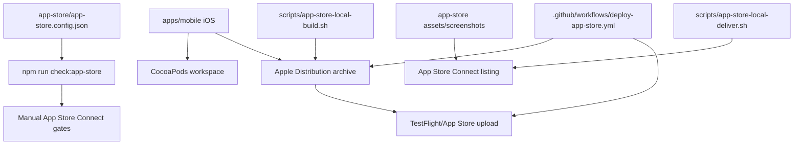

# App Store 등록 정보

## Source Of Truth

- 설정 파일: `app-store/app-store.config.json`
- 이미지 폴더: `app-store/assets`, `app-store/screenshots`
- 검증 명령:

```bash
npm run check:app-store
```

## 현재 판정

현재 App Store 등록 및 론칭 준비는 `blocked`다. `apps/mobile` iOS 프로젝트, unsigned Release build, GitHub Actions TestFlight 업로드 workflow, 로컬 build/archive/upload 스크립트, Fastlane deliver 기반 metadata/screenshot 업로드 스크립트, `v0.1.5` App Store Connect 업로드는 준비 또는 완료됐지만, 아직 운영 퍼즐 데이터 연결, App Store Connect 등록값 확정, 스크린샷, TestFlight build selection, App Store Connect 수동 gate가 완료되지 않았다.



## 현재 확정값

| 항목                       | 값                                                                    |
| -------------------------- | --------------------------------------------------------------------- |
| 기본 언어                  | `ko-KR`                                                               |
| 앱 유형                    | `game`                                                                |
| 가격                       | `free`                                                                |
| 고객 문의 이메일           | `cs@seorilabs.com`                                                    |
| Bundle ID                  | `com.seorilabs.crosswordpuzzle`                                       |
| SKU                        | `crossword-puzzle-app`                                                |
| 광고                       | `yes`. `apps/mobile`에 AdMob native adapter 연결                      |
| 추적/ATT                   | 현재 native mobile 기준 `no` 후보                                     |
| Game Center                | `no`                                                                  |
| CocoaPods                  | `bundle exec pod install` 완료                                        |
| unsigned iOS Release build | `CODE_SIGNING_ALLOWED=NO build` 통과                                  |
| TestFlight CI              | `.github/workflows/deploy-app-store.yml` 준비 및 `v0.1.5` 업로드 성공 |
| 로컬 iOS build             | `npm run app-store:build:local` 준비                                  |
| 로컬 metadata 등록         | `npm run app-store:deliver:upload` 준비                               |
| App Store profile          | `AppStore Crossword Puzzle Profile` secret 등록                       |
| 최신 업로드 빌드           | `v0.1.5` / build `1005` / run `27087313726`                           |

## 확정 필요

| 항목               | 후보/메모                                                                                               |
| ------------------ | ------------------------------------------------------------------------------------------------------- |
| Support URL        | 후보 `https://www.seorilabs.com/support`. 실제 페이지 존재와 앱별 문의 동선 확인 필요                   |
| Privacy Policy URL | 후보 `https://www.seorilabs.com/privacy`. RNFirebase Analytics/Remote Config 사용 여부와 일치 확인 필요 |
| App Privacy        | RNFirebase Analytics/Remote Config와 AdMob SDK 기준으로 App Store Connect 답변 재확인 필요              |
| Age Rating         | 낱말 퍼즐 게임 기준 설문 완료 필요                                                                      |
| Content Rights     | 힌트 자체 작성, 단어 후보 출처/라이선스 검수 완료 후 답변 확정                                          |
| Export Compliance  | 표준 OS/HTTPS 외 비표준 암호화 없음 후보. `Info.plist` 반영 및 콘솔 답변 필요                           |
| DSA/trader         | EU 배포/조직 계정/수익화 정책 기준 확인 필요                                                            |
| Review contact     | 이름/전화번호 확정 필요                                                                                 |
| TestFlight         | build processing 확인, 내부 테스트 그룹/빌드 선택 필요                                                  |

## 로컬 등록/빌드 명령

GitHub Actions minutes가 소진되어도 로컬에서 같은 흐름을 실행할 수 있다.

```bash
npm run app-store:build:local
npm run app-store:deliver:prepare
```

signed archive:

```bash
APPLE_TEAM_ID="HCDUXX4Z3X" \
IOS_PROVISIONING_PROFILE_NAME="AppStore Crossword Puzzle Profile" \
npm run app-store:build:local -- --archive --tag v1.0.0
```

metadata/screenshot upload:

```bash
source "$HOME/.config/seorilabs/app-store-connect.env"
npm run app-store:metadata:upload
```

App Store 앱 이름은 iOS용으로 `가로세로 퍼즐`을 사용한다. `--use-suggested-urls`는 `supportUrl`, `privacyPolicyUrl`, `marketingUrl` 후보를 실제 등록값으로 쓰기로 확정한 경우에만 사용한다.

## 2026-06-09 AdMob 콘솔 ID

현재 `react-native-google-mobile-ads` adapter에 연결되어 있다. 개발/QA 빌드는 Google test ad unit을 사용하고, release 빌드는 adapter QA 후 아래 운영 ID를 사용한다. 1차 출시는 개인화 광고를 끄고 비개인화 광고 요청으로 운영한다.

| 항목                        | 값                                       |
| --------------------------- | ---------------------------------------- |
| iOS AdMob app ID            | `ca-app-pub-2444587584524186~4715406099` |
| `ios_rewarded_hint`         | `ca-app-pub-2444587584524186/6151776694` |
| `ios_interstitial_result`   | `ca-app-pub-2444587584524186/3402324424` |
| `ios_rewarded_bonus_puzzle` | `ca-app-pub-2444587584524186/2089242756` |

`GADApplicationIdentifier`와 `SKAdNetworkItems`는 `app.json`의 `react-native-google-mobile-ads` 설정을 CocoaPods build phase가 빌드 산출물 `Info.plist`에 주입한다. AdMob 개인화 광고, IDFA, cross-app ad measurement를 켜면 App Store Connect Tracking 답변, ATT/UMP 동선, `NSUserTrackingUsageDescription`도 같이 구현한다.

## App Privacy 답변 가이드

현재 `apps/mobile` binary는 RNFirebase Analytics/Remote Config를 포함하므로 `No Data Collected` 전제로 제출하면 안 된다. iOS Analytics는 `$RNFirebaseAnalyticsWithoutAdIdSupport = true`로 IDFA 없는 variant를 사용하지만, Firebase app instance/installation 및 Remote Config 관련 데이터 고지는 실제 App Store Connect 입력 전에 확인해야 한다. 향후 Firebase Hosting request log 보관/분석, Crashlytics/Performance, AdMob, App Check, 인증, 결제, Game Center, 리더보드, 서버 저장, 고객지원 폼, 사용자 생성 콘텐츠를 붙이면 답변 범위가 더 넓어진다.

최종 제출 binary 기준 추천 답변은 `Data Collected`다. AdMob 개인화 광고, IDFA, cross-app ad measurement를 켜면 `Tracking`도 `Yes`로 답하고 ATT/UMP 동선을 구현한다. App Store Connect에 실제 입력하기 전까지 `appPrivacyAnswers` gate는 `확정 필요`로 유지한다.

근거:

- Apple은 앱과 통합한 third-party partner가 수집하는 데이터까지 답변해야 한다고 안내한다.
- Apple 기준 `Collect`는 기기 밖으로 전송되어 개발자 또는 third-party partner가 실시간 요청 처리에 필요한 시간보다 오래 접근 가능한 상태가 되는 것을 뜻한다.
- Google Mobile Ads SDK는 IP address, crash logs, performance data, device ID, advertising data, user interaction을 수집할 수 있다고 안내한다.
- Firebase Authentication은 user authentication identifiers, email, phone, display name, federated provider contact info, Game Center ID 등을 수집할 수 있다.
- Firebase Crashlytics는 crash stack trace, application state, device/OS information, custom keys/logs/user IDs, Analytics breadcrumb를 수집할 수 있다.
- Firebase Remote Config는 country code, language code, time zone, OS version, Firebase Apple app ID, bundle ID 등을 수집할 수 있다.
- Firebase Performance는 IP address, app performance metrics, CPU/memory usage, device/OS/application information을 수집할 수 있다.
- Firebase Hosting request log를 Cloud Logging에 연결하면 source IP, request URL, user agent, city 같은 요청 데이터가 기록될 수 있다.

추천 답변:

| App Store Connect 항목         | 답변                                                                                                     |
| ------------------------------ | -------------------------------------------------------------------------------------------------------- |
| 이 앱에서 데이터를 수집합니까? | `예` / `Data Collected`                                                                                  |
| Tracking                       | AdMob 개인화 광고, IDFA, cross-app ad measurement 사용 시 `예`                                           |
| Privacy Choices URL            | `확정 필요`. 로그인/서버 저장/UGC/고객지원 폼을 붙이면 데이터 삭제/문의 경로를 공개 URL로 두는 것을 권장 |

데이터 수집 항목별 입력값:

`조건부 예`는 최종 binary에서 해당 기능을 실제로 붙이면 선택한다. 선택적 피드백/고객지원 데이터가 Apple의 선택적 공개 조건을 모두 만족하면 공개하지 않을 수 있지만, 이 앱은 계정/UGC/서버 저장/고객지원 결합을 계획하므로 보수적으로 공개하는 기준을 둔다.

| 분류             | 항목                    | 선택        | 목적                                  | 사용자 연결                                     | 추적                                               | 메모                                                                                                |
| ---------------- | ----------------------- | ----------- | ------------------------------------- | ----------------------------------------------- | -------------------------------------------------- | --------------------------------------------------------------------------------------------------- |
| 연락처 정보      | 이름                    | `예`        | 앱 기능, 제품 개인화                  | `예`                                            | 광고/마케팅 partner와 공유하면 `예`                | 인증 프로필, Game Center 표시명, 고객지원, UGC 프로필 이름                                          |
| 연락처 정보      | 이메일 주소             | `예`        | 앱 기능, 고객지원                     | `예`                                            | 광고/마케팅 partner와 공유하면 `예`                | Firebase Auth 이메일 로그인, 고객지원 회신, 계정 복구                                               |
| 연락처 정보      | 전화번호                | `조건부 예` | 앱 기능, 고객지원                     | `예`                                            | `아니요`                                           | 전화번호 인증 또는 고객지원 전화번호를 받으면 선택                                                  |
| 연락처 정보      | 주소                    | `아니요`    | 해당 없음                             | 해당 없음                                       | `아니요`                                           | DSA/trader 사업자 주소 공개는 사용자 주소 수집과 별개                                               |
| 연락처 정보      | 기타 사용자 연락처 정보 | `조건부 예` | 앱 기능, 고객지원                     | `예`                                            | `아니요`                                           | 외부 연락 가능한 SNS handle, messenger ID 등을 받으면 선택                                          |
| 건강 및 피트니스 | 건강                    | `아니요`    | 해당 없음                             | 해당 없음                                       | `아니요`                                           | HealthKit/의료/건강 데이터 없음                                                                     |
| 건강 및 피트니스 | 피트니스                | `아니요`    | 해당 없음                             | 해당 없음                                       | `아니요`                                           | 운동/피트니스 데이터 없음                                                                           |
| 재무 정보        | 지불 정보               | `아니요`    | 해당 없음                             | 해당 없음                                       | `아니요`                                           | Apple IAP만 쓰고 개발자가 카드/계좌 정보에 접근하지 않는 전제                                       |
| 재무 정보        | 신용 정보               | `아니요`    | 해당 없음                             | 해당 없음                                       | `아니요`                                           | 신용 점수/신용 정보 없음                                                                            |
| 재무 정보        | 기타 재무 정보          | `아니요`    | 해당 없음                             | 해당 없음                                       | `아니요`                                           | 소득/자산/부채 등 재무 정보 없음                                                                    |
| 위치             | 정확한 위치             | `아니요`    | 해당 없음                             | 해당 없음                                       | `아니요`                                           | GPS/정밀 위치 권한을 요청하지 않는 전제                                                             |
| 위치             | 대략적인 위치           | `예`        | 타사 광고, 분석, 앱 기능              | 기기/사용자 식별자와 결합되면 `예`              | AdMob 타겟팅/광고 측정에 쓰면 `예`                 | AdMob IP 기반 위치 추정, Firebase Hosting request log의 city/source IP 후보                         |
| 민감 정보        | 민감 정보               | `아니요`    | 해당 없음                             | 해당 없음                                       | `아니요`                                           | 인종, 종교, 정치 성향, 생체 데이터 등 민감 정보 없음                                                |
| 연락처           | 연락처                  | `아니요`    | 해당 없음                             | 해당 없음                                       | `아니요`                                           | 주소록/소셜 그래프 접근 없음                                                                        |
| 사용자 콘텐츠    | 이메일 또는 문자 메시지 | `아니요`    | 해당 없음                             | 해당 없음                                       | `아니요`                                           | 사용자 간 메시지/채팅을 붙이면 재검토                                                               |
| 사용자 콘텐츠    | 사진 또는 비디오        | `조건부 예` | 앱 기능, 고객지원                     | `예`                                            | `아니요`                                           | 고객지원 첨부 또는 UGC 이미지/영상 업로드를 허용하면 선택                                           |
| 사용자 콘텐츠    | 오디오 데이터           | `아니요`    | 해당 없음                             | 해당 없음                                       | `아니요`                                           | 음성 녹음/오디오 업로드 없음                                                                        |
| 사용자 콘텐츠    | 게임 플레이 콘텐츠      | `예`        | 앱 기능, 분석, 제품 개인화            | `예`                                            | `아니요`                                           | 서버 저장 진행 상태, 퍼즐 완료 기록, 리더보드, Game Center, 게임 내 UGC                             |
| 사용자 콘텐츠    | 고객 지원               | `예`        | 앱 기능, 고객지원                     | `예`                                            | `아니요`                                           | 고객지원 요청 본문, 문의 처리 기록                                                                  |
| 사용자 콘텐츠    | 기타 사용자 콘텐츠      | `예`        | 앱 기능, 분석, 제품 개인화            | `예`                                            | `아니요`                                           | UGC, 자유 입력 텍스트, 커뮤니티/공유 콘텐츠                                                         |
| 방문 기록        | 방문 기록               | `아니요`    | 해당 없음                             | 해당 없음                                       | `아니요`                                           | 앱 외부 웹사이트 탐색 기록 없음. open web/WebView를 붙이면 재검토                                   |
| 검색 기록        | 검색 기록               | `아니요`    | 해당 없음                             | 해당 없음                                       | `아니요`                                           | 앱 내 검색어를 서버/Analytics로 보내면 선택                                                         |
| 식별자           | 사용자 ID               | `예`        | 앱 기능, 분석, 제품 개인화            | `예`                                            | 광고 네트워크와 결합하면 `예`                      | Firebase UID, 계정 ID, Game Center ID, 리더보드 사용자 ID                                           |
| 식별자           | 기기 ID                 | `예`        | 타사 광고, 분석, 앱 기능              | `예`                                            | AdMob 개인화 광고, IDFA, 교차 앱 광고 측정 시 `예` | IDFA, Firebase installation/app instance ID, AdMob device identifiers                               |
| 구입 항목        | 구입 항목               | `예`        | 앱 기능, 분석, 제품 개인화            | `예`                                            | 광고/마케팅 partner와 공유하지 않으면 `아니요`     | IAP purchase history, entitlement, purchase tendency                                                |
| 사용 데이터      | 제품 상호 작용          | `예`        | 타사 광고, 분석, 제품 개인화, 앱 기능 | 식별자와 결합되면 `예`                          | 타겟 광고/광고 측정에 쓰면 `예`                    | 앱 실행, 탭, 퍼즐 시작/완료, 힌트 사용, 리더보드 활동                                               |
| 사용 데이터      | 광고 데이터             | `예`        | 타사 광고, 분석                       | `예`                                            | `예`                                               | AdMob 노출/클릭/광고 응답/광고 측정 데이터                                                          |
| 사용 데이터      | 기타 사용 데이터        | `예`        | 분석, 제품 개인화, 앱 기능            | 식별자와 결합되면 `예`                          | 광고 측정에 쓰면 `예`                              | 완료율, 세션, Remote Config/Analytics 기반 활동 데이터                                              |
| 진단             | 충돌 데이터             | `예`        | 분석, 앱 기능                         | Crashlytics user ID 또는 식별자와 결합되면 `예` | 광고 목적으로 사용하지 않으면 `아니요`             | Crashlytics crash logs                                                                              |
| 진단             | 실적 데이터             | `예`        | 분석, 앱 기능, 타사 광고              | 식별자와 결합되면 `예`                          | AdMob 광고 성능/측정에 쓰이면 `예`                 | Firebase Performance, AdMob performance data, launch time, hang rate                                |
| 진단             | 기타 진단 데이터        | `예`        | 분석, 앱 기능                         | 식별자와 결합되면 `예`                          | 광고 목적으로 사용하지 않으면 `아니요`             | custom keys/logs, device/OS/app diagnostics                                                         |
| 주변 환경        | 환경 스캐닝             | `아니요`    | 해당 없음                             | 해당 없음                                       | `아니요`                                           | AR/공간 스캔 기능 없음                                                                              |
| 신체             | 손                      | `아니요`    | 해당 없음                             | 해당 없음                                       | `아니요`                                           | 손 구조/움직임 데이터 없음                                                                          |
| 신체             | 머리                    | `아니요`    | 해당 없음                             | 해당 없음                                       | `아니요`                                           | 머리 움직임 데이터 없음                                                                             |
| 기타 데이터      | 기타 데이터             | `예`        | 분석, 앱 기능, 보안                   | 설정에 따라 다름                                | 광고/마케팅 partner와 공유하지 않으면 `아니요`     | App Check, Firebase user agent, Hosting request metadata 등 위 항목으로 명확히 분류되지 않는 데이터 |

주의:

- 결제 카드 번호 등 `Payment Info`는 Apple IAP만 쓰고 개발자가 결제수단 정보에 접근하지 않으면 보통 수집으로 보지 않는다. 대신 entitlement/purchase record를 저장하면 `Purchase History`는 답한다.
- AdMob을 붙여도 비개인화/문맥 광고만 쓰고 IDFA/교차 앱 측정을 끄면 `Tracking=No` 경로가 가능할 수 있다. 이 경우 SDK 설정과 App Store Connect 답변을 별도로 검증해야 한다.
- Tracking 또는 IDFA를 켜면 `NSUserTrackingUsageDescription`, `AppTrackingTransparency`, UMP/동의 동선을 구현한다.
- App Privacy 답변은 `PrivacyInfo.xcprivacy`를 대체하지 않는다. RNFirebase Analytics/Remote Config와 AdMob SDK 기준으로 privacy manifest와 App Store Connect 답변을 다시 맞춘다.

참고:

- Apple App Privacy Details: https://developer.apple.com/app-store/app-privacy-details/
- Google Mobile Ads App Store data disclosure: https://developers.google.com/admob/ios/privacy/data-disclosure
- Google Mobile Ads IDFA/ATT: https://developers.google.com/admob/ios/privacy/idfa
- Firebase Apple App Store data disclosure: https://firebase.google.com/docs/ios/app-store-data-collection
- Firebase Hosting request logs: https://firebase.google.com/docs/hosting/web-request-logs-and-metrics

## 연령등급 설문 답변 가이드

현재 `apps/mobile` App Store 앱 기준 추천 답변이다. App Store Connect에 실제 입력하기 전까지 `ageRatingQuestionnaire` gate는 `확정 필요`로 유지한다.

전제:

- 현재 native mobile 앱에는 제한 없는 웹 브라우징, 사용자 생성 콘텐츠, 앱 내 채팅, 건강/의료 콘텐츠, 폭력, 무기, 도박, 랜덤 박스, 사용자 간 순위/보상 시합이 없다.
- 현재 native mobile 앱에는 AdMob 광고 SDK가 있으므로 광고 항목은 `예` 기준으로 재검토한다. UGC, 웹 접근, 채팅, 리더보드/이벤트 경쟁, 보상 경쟁, 건강 콘텐츠, 무기/폭력, 도박/랜덤 아이템을 추가하면 설문을 다시 답해야 한다.

최종 iOS 앱에 AdMob, 사용자 생성 콘텐츠, 리더보드/경쟁, 서버 저장, 결제, Game Center, 고객지원 폼, 인증을 붙이면 아래 4+ 후보 답변을 그대로 쓰면 안 된다. 최소한 다음 항목은 재답변한다.

| 항목               | 최종 기능 추가 시 답변                                              |
| ------------------ | ------------------------------------------------------------------- |
| 광고               | AdMob 또는 유료 홍보가 있으면 `예`                                  |
| 사용자 생성 콘텐츠 | UGC가 있으면 `예`                                                   |
| 시합               | 리더보드/이벤트가 순위, 보상, 개인 목표 경쟁이면 `드문` 또는 `빈번` |
| 유해 콘텐츠 차단   | UGC moderation/report/block 같은 제어 기능을 제공하면 `예` 권장     |
| 나이 확인          | 별도 연령 제한 콘텐츠/서비스가 없으면 보통 `아니요`                 |
| 계산된 등급        | 기능 추가 후 App Store Connect에서 재계산. `4+` 보장 불가           |

추천 답변:

| 항목                                                     | 답변        |
| -------------------------------------------------------- | ----------- |
| 유해 콘텐츠 차단                                         | `아니요`    |
| 나이 확인                                                | `아니요`    |
| 제한되지 않은 웹 액세스                                  | `아니요`    |
| 사용자 생성 콘텐츠                                       | `아니요`    |
| 메시지 및 채팅                                           | `아니요`    |
| 광고                                                     | `예`        |
| 욕설 또는 노골적인 유머                                  | `없음`      |
| 잔혹/공포 테마                                           | `없음`      |
| 음주, 흡연 또는 약물 사용                                | `없음`      |
| 의료 또는 치료 정보                                      | `없음`      |
| 건강 또는 웰빙 주제                                      | `아니요`    |
| 성적이거나 선정적인 테마                                 | `없음`      |
| 성적인 내용 또는 노출                                    | `없음`      |
| 노골적인 성적 내용 및 노출                               | `없음`      |
| 만화 또는 비현실적인 폭력                                | `없음`      |
| 적나라한 폭력                                            | `없음`      |
| 잇따른 폭력의 생생한 묘사 또는 가학성을 띤 사실적인 폭력 | `없음`      |
| 총 또는 기타 무기                                        | `없음`      |
| 가상 도박                                                | `없음`      |
| 시합                                                     | `없음`      |
| 도박                                                     | `아니요`    |
| 랜덤 박스                                                | `아니요`    |
| 계산된 등급                                              | `4+` 후보   |
| 연령 카테고리 및 재정의                                  | `해당 없음` |
| 연령 적합성 URL                                          | 비워둠      |

## 등록 문구

앱 이름:

```text
가로세로 낱말 퍼즐
```

부제:

```text
매일 한 판 한글 퍼즐
```

프로모션 문구:

```text
오늘의 한글 낱말을 가로세로로 맞히고 기록을 남겨보세요.
```

키워드:

```text
가로세로,낱말,퍼즐,퀴즈,단어,한글,두뇌,매일,crossword,word
```

최초 출시노트:

```text
가로세로 낱말 퍼즐을 처음 출시합니다.

날짜별 한글 낱말 퍼즐, 힌트 기능, 기기 내 기록 저장을 사용할 수 있습니다.
```

상세 설명은 `app-store/app-store.config.json`의 `storeListing.description.ko-KR`를 기준으로 한다.

## 이미지

| 용도               | 파일                                                                       | 상태                               |
| ------------------ | -------------------------------------------------------------------------- | ---------------------------------- |
| Store icon         | `app-store/assets/icon-1024.png`                                           | 생성됨, 디자인 QA 필요             |
| Xcode AppIcon      | `apps/mobile/ios/CrosswordPuzzleMobile/Images.xcassets/AppIcon.appiconset` | iPhone/iPad/marketing PNG 생성됨   |
| iPhone screenshots | `app-store/screenshots/iphone/*.png`                                       | 3장 생성됨, 1320 x 2868            |
| iPad screenshots   | `app-store/screenshots/ipad/*.png`                                         | 3장 생성됨, 2064 x 2752            |

## 주의

- App Store Connect upload는 build accepted/processing까지의 의미이며, 버전 빌드 선택과 최종 심사 제출은 별도 gate다.
- iPad를 계속 지원하면 iPad screenshot과 iPad AppIcon slot까지 준비해야 한다. iPad를 출시 대상에서 뺄 경우 Xcode `TARGETED_DEVICE_FAMILY`부터 바꿔야 한다.
- RNFirebase Analytics/Remote Config와 AdMob SDK를 붙였으므로 `PrivacyInfo.xcprivacy`, App Store Connect privacy 답변, ATT/IDFA 정책을 다시 확인해야 한다. 현재 iOS Analytics는 IDFA 없는 variant이며, AdMob은 비개인화 광고 요청으로 호출한다.
- 2026-04-28 이후 App Store Connect 업로드는 Xcode 26/iOS 26 SDK 이상이 필요하므로 workflow는 `macos-26` runner와 SDK major check를 사용한다.
- 2026-06-07 `v0.1.5` / build `1005` 업로드 run `27087313726`, job `79945275484`는 성공했다.
