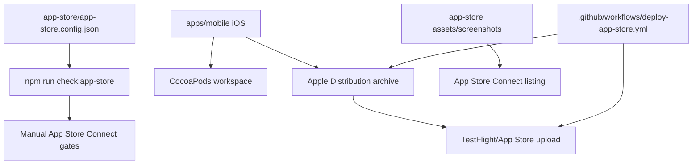

# App Store 등록 정보

## Source Of Truth

- 설정 파일: `app-store/app-store.config.json`
- 이미지 폴더: `app-store/assets`, `app-store/screenshots`
- 검증 명령:

```bash
npm run check:app-store
```

## 현재 판정

현재 App Store 등록 및 론칭 준비는 `blocked`다. `apps/mobile` iOS 프로젝트, unsigned Release build, GitHub Actions TestFlight 업로드 workflow, `v0.1.5` App Store Connect 업로드는 완료됐지만, 아직 운영 퍼즐 데이터 연결, App Store Connect 등록값 확정, 스크린샷, TestFlight build selection, App Store Connect 수동 gate가 완료되지 않았다.



## 현재 확정값

| 항목 | 값 |
| --- | --- |
| 기본 언어 | `ko-KR` |
| 앱 유형 | `game` |
| 가격 | `free` |
| 고객 문의 이메일 | `cs@seorilabs.com` |
| Bundle ID | `com.seorilabs.crosswordpuzzle` |
| SKU | `crossword-puzzle-app` |
| 광고 | `no` |
| 추적/ATT | 현재 native mobile 기준 `no` 후보 |
| Game Center | `no` |
| CocoaPods | `bundle exec pod install` 완료 |
| unsigned iOS Release build | `CODE_SIGNING_ALLOWED=NO build` 통과 |
| TestFlight CI | `.github/workflows/deploy-app-store.yml` 준비 및 `v0.1.5` 업로드 성공 |
| App Store profile | `AppStore Crossword Puzzle Profile` secret 등록 |
| 최신 업로드 빌드 | `v0.1.5` / build `1005` / run `27087313726` |

## 확정 필요

| 항목 | 후보/메모 |
| --- | --- |
| Support URL | 후보 `https://www.seorilabs.com/support`. 실제 페이지 존재와 앱별 문의 동선 확인 필요 |
| Privacy Policy URL | 후보 `https://www.seorilabs.com/privacy`. 현재 앱의 로컬 저장/향후 Firebase 사용 여부와 일치 확인 필요 |
| App Privacy | 현재 native mobile은 로그인/결제/서버 저장/광고 SDK 없음. 운영 포팅 뒤 재확인 필요 |
| Age Rating | 낱말 퍼즐 게임 기준 설문 완료 필요 |
| Content Rights | 힌트 자체 작성, 단어 후보 출처/라이선스 검수 완료 후 답변 확정 |
| Export Compliance | 표준 OS/HTTPS 외 비표준 암호화 없음 후보. `Info.plist` 반영 및 콘솔 답변 필요 |
| DSA/trader | EU 배포/조직 계정/수익화 정책 기준 확인 필요 |
| Review contact | 이름/전화번호 확정 필요 |
| TestFlight | build processing 확인, 내부 테스트 그룹/빌드 선택 필요 |

## App Privacy 답변 가이드

현재 업로드된 `apps/mobile` binary만 보면 `No Data Collected` 후보였지만, 최종 iOS 앱에 Firebase Hosting request log 보관/분석, native Firebase Analytics/Remote Config/Crashlytics/Performance, AdMob, App Check, 인증, 결제, Game Center, 리더보드, 서버 저장, 고객지원 폼, 사용자 생성 콘텐츠를 모두 붙이면 `No Data Collected`는 더 이상 맞지 않다.

최종 제출 binary 기준 추천 답변은 `Data Collected`다. AdMob 개인화 광고, IDFA, cross-app ad measurement를 켜면 `Tracking`도 `Yes`로 답하고 ATT/UMP 동선을 구현한다. App Store Connect에 실제 입력하기 전까지 `appPrivacyAnswers` gate는 `확정 필요`로 유지한다.

근거:

- Apple은 앱과 통합한 third-party partner가 수집하는 데이터까지 답변해야 한다고 안내한다.
- Apple 기준 `Collect`는 기기 밖으로 전송되어 개발자 또는 third-party partner가 실시간 요청 처리에 필요한 시간보다 오래 접근 가능한 상태가 되는 것을 뜻한다.
- Google Mobile Ads SDK는 IP address, crash logs, performance data, device ID, advertising data, user interaction을 수집할 수 있다고 안내한다.
- Firebase Authentication은 user authentication identifiers, email, phone, display name, federated provider contact info, Game Center ID 등을 수집할 수 있다.
- Firebase Crashlytics는 crash stack trace, application state, device/OS information, custom keys/logs/user IDs, Analytics breadcrumb를 수집할 수 있다.
- Firebase Remote Config는 country code, language code, time zone, OS version, Firebase Apple app ID, bundle ID 등을 수집할 수 있다.
- Firebase Performance는 IP address, app performance metrics, CPU/memory usage, device/OS/application information을 수집할 수 있다.
- Firebase Hosting request log를 Cloud Logging에 연결하면 source IP, request URL, user agent, city 같은 요청 데이터가 기록될 수 있다.

추천 답변:

| App Store Connect 항목 | 답변 |
| --- | --- |
| 이 앱에서 데이터를 수집합니까? | `예` / `Data Collected` |
| Tracking | AdMob 개인화 광고, IDFA, cross-app ad measurement 사용 시 `예` |
| Privacy Choices URL | `확정 필요`. 로그인/서버 저장/UGC/고객지원 폼을 붙이면 데이터 삭제/문의 경로를 공개 URL로 두는 것을 권장 |

추천 데이터 유형:

| 데이터 유형 | 목적 | 사용자 연결 | 추적 |
| --- | --- | --- | --- |
| Name, Email Address, Phone Number, Other User Contact Info | App Functionality | `Yes` | 광고/마케팅 partner와 공유하지 않으면 `No` |
| Coarse Location | Third-Party Advertising, Analytics, App Functionality | device/user identifier와 결합되면 `Yes` | AdMob 타겟팅/측정에 쓰면 `Yes` |
| Gameplay Content, Customer Support Data, Other User Content | App Functionality, Analytics, Product Personalization | `Yes` | 광고/마케팅 partner와 공유하지 않으면 `No` |
| User ID, Device ID | Third-Party Advertising, Analytics, App Functionality | `Yes` | AdMob 개인화/IDFA/교차 앱 측정 시 `Yes` |
| Purchase History | App Functionality, Analytics | `Yes` | 광고/마케팅 partner와 공유하지 않으면 `No` |
| Product Interaction, Advertising Data, Other Usage Data | Third-Party Advertising, Analytics, Product Personalization, App Functionality | identifier와 결합되면 `Yes` | 타겟 광고/광고 측정에 쓰면 `Yes` |
| Crash Data, Performance Data, Other Diagnostic Data | Analytics, App Functionality | identifier 또는 Crashlytics user ID와 결합되면 `Yes` | 광고/마케팅 partner와 공유하지 않으면 `No` |
| Other Data Types | Analytics, App Functionality | App Check/Firebase user agent/request log 설정에 따라 다름 | 광고/마케팅 partner와 공유하지 않으면 `No` |

주의:

- 결제 카드 번호 등 `Payment Info`는 Apple IAP만 쓰고 개발자가 결제수단 정보에 접근하지 않으면 보통 수집으로 보지 않는다. 대신 entitlement/purchase record를 저장하면 `Purchase History`는 답한다.
- AdMob을 붙여도 비개인화/문맥 광고만 쓰고 IDFA/교차 앱 측정을 끄면 `Tracking=No` 경로가 가능할 수 있다. 이 경우 SDK 설정과 App Store Connect 답변을 별도로 검증해야 한다.
- Tracking 또는 IDFA를 켜면 `NSUserTrackingUsageDescription`, `AppTrackingTransparency`, UMP/동의 동선을 구현한다.
- App Privacy 답변은 `PrivacyInfo.xcprivacy`를 대체하지 않는다. native Firebase/AdMob/App Check SDK를 붙인 뒤 privacy manifest와 App Store Connect 답변을 다시 맞춘다.

참고:

- Apple App Privacy Details: https://developer.apple.com/app-store/app-privacy-details/
- Google Mobile Ads App Store data disclosure: https://developers.google.com/admob/ios/privacy/data-disclosure
- Google Mobile Ads IDFA/ATT: https://developers.google.com/admob/ios/privacy/idfa
- Firebase Apple App Store data disclosure: https://firebase.google.com/docs/ios/app-store-data-collection
- Firebase Hosting request logs: https://firebase.google.com/docs/hosting/web-request-logs-and-metrics

## 연령등급 설문 답변 가이드

현재 `apps/mobile` App Store 앱 기준 추천 답변이다. App Store Connect에 실제 입력하기 전까지 `ageRatingQuestionnaire` gate는 `확정 필요`로 유지한다.

전제:

- 현재 native mobile 앱에는 제한 없는 웹 브라우징, 사용자 생성 콘텐츠, 앱 내 채팅, 광고 SDK, 건강/의료 콘텐츠, 폭력, 무기, 도박, 랜덤 박스, 사용자 간 순위/보상 시합이 없다.
- 향후 AdMob/광고, UGC, 웹 접근, 채팅, 리더보드/이벤트 경쟁, 보상 경쟁, 건강 콘텐츠, 무기/폭력, 도박/랜덤 아이템을 추가하면 설문을 다시 답해야 한다.

최종 iOS 앱에 AdMob, 사용자 생성 콘텐츠, 리더보드/경쟁, 서버 저장, 결제, Game Center, 고객지원 폼, 인증을 붙이면 아래 4+ 후보 답변을 그대로 쓰면 안 된다. 최소한 다음 항목은 재답변한다.

| 항목 | 최종 기능 추가 시 답변 |
| --- | --- |
| 광고 | AdMob 또는 유료 홍보가 있으면 `예` |
| 사용자 생성 콘텐츠 | UGC가 있으면 `예` |
| 시합 | 리더보드/이벤트가 순위, 보상, 개인 목표 경쟁이면 `드문` 또는 `빈번` |
| 유해 콘텐츠 차단 | UGC moderation/report/block 같은 제어 기능을 제공하면 `예` 권장 |
| 나이 확인 | 별도 연령 제한 콘텐츠/서비스가 없으면 보통 `아니요` |
| 계산된 등급 | 기능 추가 후 App Store Connect에서 재계산. `4+` 보장 불가 |

추천 답변:

| 항목 | 답변 |
| --- | --- |
| 유해 콘텐츠 차단 | `아니요` |
| 나이 확인 | `아니요` |
| 제한되지 않은 웹 액세스 | `아니요` |
| 사용자 생성 콘텐츠 | `아니요` |
| 메시지 및 채팅 | `아니요` |
| 광고 | `아니요` |
| 욕설 또는 노골적인 유머 | `없음` |
| 잔혹/공포 테마 | `없음` |
| 음주, 흡연 또는 약물 사용 | `없음` |
| 의료 또는 치료 정보 | `없음` |
| 건강 또는 웰빙 주제 | `아니요` |
| 성적이거나 선정적인 테마 | `없음` |
| 성적인 내용 또는 노출 | `없음` |
| 노골적인 성적 내용 및 노출 | `없음` |
| 만화 또는 비현실적인 폭력 | `없음` |
| 적나라한 폭력 | `없음` |
| 잇따른 폭력의 생생한 묘사 또는 가학성을 띤 사실적인 폭력 | `없음` |
| 총 또는 기타 무기 | `없음` |
| 가상 도박 | `없음` |
| 시합 | `없음` |
| 도박 | `아니요` |
| 랜덤 박스 | `아니요` |
| 계산된 등급 | `4+` 후보 |
| 연령 카테고리 및 재정의 | `해당 없음` |
| 연령 적합성 URL | 비워둠 |

## 등록 문구

앱 이름:

```text
가로세로 낱말 퍼즐
```

부제:

```text
매일 한 판 한글 퍼즐
```

프로모션 문구:

```text
오늘의 한글 낱말을 가로세로로 맞히고 기록을 남겨보세요.
```

키워드:

```text
가로세로,낱말,퍼즐,퀴즈,단어,한글,두뇌,매일,crossword,word
```

상세 설명은 `app-store/app-store.config.json`의 `storeListing.description.ko-KR`를 기준으로 한다.

## 이미지

| 용도 | 파일 | 상태 |
| --- | --- | --- |
| Store icon | `app-store/assets/icon-1024.png` | 생성됨, 디자인 QA 필요 |
| Xcode AppIcon | `apps/mobile/ios/CrosswordPuzzleMobile/Images.xcassets/AppIcon.appiconset` | iPhone/iPad/marketing PNG 생성됨 |
| iPhone screenshots | `app-store/screenshots/iphone/*.png` | 실제 iOS 화면 캡처 필요 |
| iPad screenshots | `app-store/screenshots/ipad/*.png` | 현재 iPad 지원값 `1,2`라 필요 |

## 주의

- App Store Connect upload는 build accepted/processing까지의 의미이며, 버전 빌드 선택과 최종 심사 제출은 별도 gate다.
- iPad를 계속 지원하면 iPad screenshot과 iPad AppIcon slot까지 준비해야 한다. iPad를 출시 대상에서 뺄 경우 Xcode `TARGETED_DEVICE_FAMILY`부터 바꿔야 한다.
- 향후 Firebase Analytics/AdMob을 `apps/mobile`에 붙이면 `PrivacyInfo.xcprivacy`, App Store Connect privacy 답변, ATT/IDFA 정책을 다시 갱신해야 한다.
- 2026-04-28 이후 App Store Connect 업로드는 Xcode 26/iOS 26 SDK 이상이 필요하므로 workflow는 `macos-26` runner와 SDK major check를 사용한다.
- 2026-06-07 `v0.1.5` / build `1005` 업로드 run `27087313726`, job `79945275484`는 성공했다.
