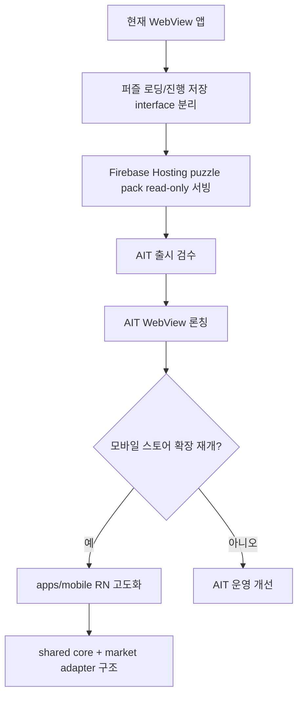
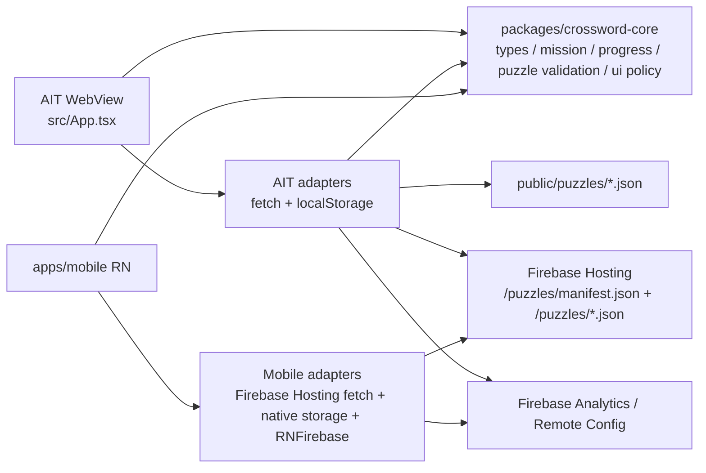
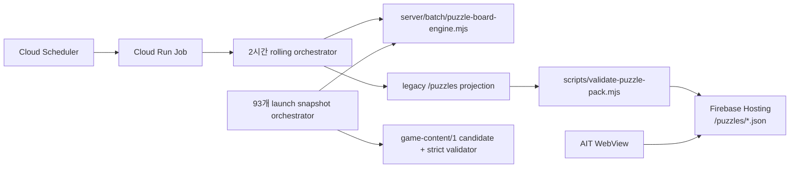

# 아키텍처

## 현재 결정

- `crossword-puzzle`의 1차 론칭 목표는 AppsInToss WebView다.
- Google Play / App Store는 React Native `apps/mobile` 타깃으로 같은 제품 정책을 유지한다.
- AIT WebView 구현은 유지하고, 공통 퍼즐 모델, 상태 로직, 출시 동기화에 필요한 UI 정책을 `packages/crossword-core`에서 먼저 공유한다.
- 운영용 puzzle pack은 Cloud Run Job이 생성하고 Firebase Hosting에서 JSON으로 서빙한다.
- AIT 앱의 퍼즐 데이터는 Firebase SDK를 쓰지 않고, Firebase Hosting의 공개 JSON만 `fetch`하는 `PuzzleRepository`로 읽는다.
- AIT 앱은 출시 운영을 위해 Firebase Web SDK 기반 Analytics / Remote Config를 선택적으로 초기화한다. Firebase env 값이 없으면 no-op으로 동작한다.
- Android/iOS 앱은 RNFirebase native Analytics / Remote Config를 사용한다. `google-services.json`과 `GoogleService-Info.plist`는 커밋하지 않고 CI secret에서 복구한다.
- Firebase Auth / Firestore / Storage는 지금 바로 넣지 않고, `PuzzleRepository` / `ProgressRepository` 어댑터로 붙일 수 있게 경계를 유지한다.
- 광고는 AIT WebView adapter에서 AppsInToss 광고 API를 호출하고, Android/iOS는 `apps/mobile`의 AdMob native adapter를 사용한다.
- 사용자 기본 동선은 홈 → 퍼즐 풀기 → 결과/기록이다. 하단 탭은 두지 않고, 상단 날짜 카드와 홈 CTA/화면 상단 액션으로만 이동한다. 기존 생성 보드 검수 화면은 개발 환경의 `/dev/simulator` 전용 경로로 둔다.

## 단계별 설계

| 단계                          | 목표                                                 | 현재 반영                                                                                                                                         | 다음 작업                                                                                      |
| ----------------------------- | ---------------------------------------------------- | ------------------------------------------------------------------------------------------------------------------------------------------------- | ---------------------------------------------------------------------------------------------- |
| A. 현재 WebView 앱            | AppsInToss WebView 출시 경로 유지                    | `src`, `granite.config.ts`, `.github/workflows/deploy-apps-in-toss.yml`                                                                           | AIT 빌드/등록 검증 유지                                                                        |
| B. interface 분리             | 퍼즐 로딩, 진행 저장, 날짜별 미션 저장을 UI에서 분리 | `packages/crossword-core/src/repositories.ts`, `mission.ts`, `src/adapters/*`                                                                     | UI가 repository 구현체를 직접 알지 않게 factory 정리                                           |
| C. Firebase Hosting read-only | puzzle pack을 원격에서 공개 읽기 전용으로 서빙       | `src/adapters/staticPuzzleRepository.ts`, `server/batch/publish-puzzle-pack.mjs`                                                                  | 운영 빌드에 `VITE_PUZZLE_PACK_BASE_URL` 주입, CORS 헤더 확인                                   |
| D. AIT 출시 검수              | AppsInToss 등록 정보, 빌드, QA blocker 해소          | `docs/apps-in-toss-registration.md`, release image assets, AIT 광고 adapter, Firebase Analytics/Remote Config adapter                             | 콘솔 필드 확정, 아이콘 HTTPS URL 반영, 힌트 라이선스/자체 작성 검수, Firebase Web app env 확정 |
| E. AIT WebView 론칭           | 현재 WebView 앱을 먼저 출시                          | `public/puzzles` + `localStorage`                                                                                                                 | 검수 제출, 출시 후 운영 지표 확인                                                              |
| F. apps/mobile RN             | Google Play/App Store용 RN shell 유지                | RN 0.85.3, Android/iOS 네이티브 프로젝트, 공통 core + Firebase Hosting puzzle pack 로딩, RNFirebase Analytics/Remote Config, AdMob native adapter | release QA, AdMob test unit/device QA, store signing 유지                                      |
| G. shared core + adapter      | 시장별 SDK 차이를 adapter로 흡수                     | `packages/crossword-core`, `src/adapters`, `apps/mobile/*Client.ts`                                                                               | 계정/동기화가 필요해질 때 Firebase Auth/Firestore adapter 추가                                 |

## 런타임 구조

## Puzzle pack 운영 배치

- 보드 topology 생성의 단일 source는 `server/batch/puzzle-board-engine.mjs`다. 기존 2시간 Job과 `ko-KR` 출시 snapshot builder가 retry·seed·품질 trace를 이 엔진으로 공유한다.
- 운영 Job은 dynamic seed와 `--append --keep=84`를 사용해 최근 7일 rolling pack을 만든다. 출시 snapshot은 승인된 route plan·reviewed wordbank·고정 seed로 90개를 생성하고 첫 실행 3개와 합쳐 immutable candidate 93개를 검증한다.
- 출시 snapshot은 generator commit/config hash별로 `tmp/launch-content-checkpoints`에 검증된 순서 prefix를 원자적으로 기록한다. `--max-new-boards=N`으로 작업량을 나눠도 같은 명령을 다시 실행하면 전역 answer cooldown 상태를 복원해 이어서 생성한다.
- rolling manifest와 출시 snapshot은 보존 기간과 schema가 다르지만 별도 격자 생성기를 두지 않는다. `current.json` 활성화와 운영 배포는 candidate 생성과 분리한다.
- `npm run batch:puzzles`는 JSON pack을 생성한다. 운영 Job은 `--append --keep=84`로 최근 84개만 유지한다.
- `npm run job:puzzle-pack`은 생성, 슬롯 검증, Firebase publish를 순서대로 실행하는 Cloud Run Job entrypoint다.
- `npm run publish:puzzles`는 `public` root를 Firebase Hosting에 배포한다.
- 자세한 설정은 `docs/puzzle-pack-cloud-run.md`를 기준으로 한다.

## 퍼즐 공개/보너스 정책

- 원격 배치는 2시간 주기로 유지할 수 있지만, 사용자 기본 공개는 KST 기준 하루 1개다.
- 같은 날짜에 여러 퍼즐이 있으면 해당 날짜의 첫 발행분을 무료 퍼즐로 고정하고, 추가 발행분은 보너스 후보로만 쓴다.
- `하나 더 풀기`는 새 퍼즐 생성권이 아니라 manifest에 이미 들어온 미풀이 퍼즐 접근권이다. 보상형 광고 완료 이벤트가 확인된 뒤에만 당일 보너스 `puzzleId`를 로컬에 저장한다.
- 퍼즐을 시작하거나 완료하면 퍼즐 JSON 스냅샷을 기기에 저장한다. 원격 retention에서 빠진 퍼즐도 기록 화면에서 로컬 사본으로 열 수 있지만, 앱 데이터 삭제/기기 변경/저장공간 정리 시 사라질 수 있다.
- 무료 퍼즐 선택, 보너스 후보 선택, 기본 시도 횟수와 기본 힌트 수는 `packages/crossword-core/src/uiPolicy.ts`를 source of truth로 둔다. AIT WebView와 `apps/mobile`은 렌더링/광고 어댑터만 다르게 구현하고 같은 정책 함수를 import해야 한다.

## 경계

| 영역                | 위치                          | 책임                                                                                                                   | 금지                                            |
| ------------------- | ----------------------------- | ---------------------------------------------------------------------------------------------------------------------- | ----------------------------------------------- |
| Core                | `packages/crossword-core/src` | 퍼즐 타입, 날짜별 manifest 요약, 진행 상태/미션 타입, 순수 helper, repository 계약                                     | React, DOM, AppsInToss, Supabase SDK, RN import |
| AIT WebView adapter | `src/adapters`                | `fetch` 기반 puzzle pack/날짜 목록 로딩, `localStorage` 진행/미션 저장, AIT 광고, Firebase Web Analytics/Remote Config | Firebase Admin credential, RN native module     |
| AIT UI              | `src/App.tsx`                 | 상단 날짜 카드, TDS UI, 입력, 화면 상태 연결                                                                           | 데이터 소스 세부 구현 직접 소유                 |
| Mobile              | `apps/mobile`                 | RN navigation, native storage, local puzzle archive, RNFirebase Analytics/Remote Config, store release                 | AIT WebView SDK import                          |
| Future backend      | `firebase`                    | Auth, Firestore, Storage, Functions/Run, rules/indexes                                                                 | 앱에 Admin SDK credential 포함                  |

## Firebase Hosting 연동 순서

1. Cloud Scheduler가 2시간마다 Cloud Run Job을 실행한다.
2. Cloud Run Job은 새 퍼즐 1개를 생성하고 기존 manifest에 append한다.
3. manifest는 최신순으로 정렬하고 최근 84개만 유지한다.
4. 각 퍼즐은 `packId`, `puzzleId`, `slotId`, `publishedAt`를 가진다. 앱의 로컬 진행 상태는 `puzzleId` 기준으로 저장한다.
5. `npm run publish:puzzles`가 Firebase Hosting에 `/puzzles/**`를 배포한다.
6. Hosting release config는 `/puzzles/**`에 `Cache-Control`과 `Access-Control-Allow-Origin`을 넣는다.
7. AIT 운영 빌드는 `VITE_PUZZLE_PACK_BASE_URL=https://crossword-puzzle-79ae0.web.app`와 Firebase Web app env를 주입한다.
8. `createStaticPuzzleRepository()`는 `<base>/puzzles/manifest.json`을 읽고, manifest 안의 `/puzzles/*.json` 경로도 같은 base URL로 해석한다.
9. 원격 로딩 실패 시 앱은 번들된 `/puzzles/manifest.json`으로 fallback하고, 그마저 실패할 때만 기존 `fallbackPuzzle`로 진입한다.

## Firebase backend 확장 순서

로그인 없는 상태에서는 진행 상태 sync를 넣지 않는다. 계정, 복구, 크로스 디바이스 sync가 필요해질 때 `ProgressRepository` / `DailyMissionRepository`의 Firebase 구현을 추가한다.

1. Auth 필요성을 제품 기능 기준으로 확정한다.
2. Firestore rules/indexes를 먼저 작성한다.
3. 진행 상태 DTO를 `packages/crossword-core` 계약에 맞춘다.
4. Android/iOS는 RNFirebase adapter로 붙이고, AIT는 Firebase JS SDK 직접 사용을 전제하지 않고 Cloud Run/Functions API를 먼저 검증한다.
5. 보안 결정은 Remote Config가 아니라 server-side rules/functions에서 처리한다.

초기에는 `user_progress`를 만들지 않는다. 현재 진행 상태는 기기 로컬 저장이 제품 동작과 개인정보 범위를 단순하게 유지한다. 퍼즐별 참여자/완료자/완료율은 사용자별 진행 저장이 아니라 Firebase Analytics `mission_start`와 `mission_complete` 이벤트의 지연 집계 JSON으로만 노출한다.

## 데이터 계약

- `PuzzleRepository.listPuzzleSummaries()`는 퍼즐 카드용 `PuzzleManifestItem[]`을 `publishedAt` 최신순으로 반환한다.
- `PuzzleManifestItem`은 `date`, `puzzleId`, `path`와 선택 필드 `packId`, `publishedAt`, `slotId`, `metrics`, `quality`, `difficulty`를 가진다.
- `PuzzleRepository.getPuzzleForDate(date)`는 선택한 날짜의 퍼즐을 반환하고, 현재 정적 어댑터는 정확히 일치하는 날짜가 없으면 해당 날짜 이전의 최신 퍼즐로 fallback한다.
- `PuzzleRepository.getPuzzleById(puzzleId)`는 같은 날짜에 여러 퍼즐이 있을 때 정확한 퍼즐을 반환한다.
- `DailyMissionState`는 `date + puzzleId` 조합으로 검증하고, 로컬 저장도 `date + puzzleId` key를 사용한다.
- `validatePuzzleSlots()`와 `npm run validate:puzzles`는 격자에서 읽히는 모든 2자 이상 가로/세로 슬롯이 entry와 정확히 매칭되는지 검증한다. 같은 시작 칸에서 가로/세로가 동시에 시작하는 것은 허용하지만, clue 번호는 같은 시작 번호를 공유해야 한다.

## apps/mobile 운영 원칙

- AIT 론칭 전에는 `apps/mobile`을 출시 blocker로 보지 않는다.
- Android/iOS는 `apps/mobile` 하나의 RN 타깃에서 관리한다.
- Google Play artifact는 `apps/mobile/android/app/build/outputs/bundle/release/app-release.aab`를 기준으로 한다.
- `packages/crossword-core`는 RN, Supabase, AppsInToss import를 계속 금지한다.
- AIT WebView는 `apps/mobile` 생성 후에도 제거하지 않는다.
- Android/iOS 모바일 UI는 AIT 제품 정책을 따른다. 홈/날짜 rail은 하루 1개 기본 공개 퍼즐만 노출하고, 추가 퍼즐은 플랫폼별 보상형 광고 어댑터가 붙은 뒤 보너스 해금으로 연다.
- 현재 `apps/mobile`은 `packages/crossword-core`, Firebase Hosting puzzle pack, AsyncStorage 기반 진행/미션/퍼즐 스냅샷 저장, AIT와 맞춘 최근 무료 퍼즐 rail, 기록 화면, 슬롯형 답안 입력/선택 단서 레이아웃, RNFirebase Analytics/Remote Config, AdMob native adapter를 연결했다. Google Play와 App Store는 이 같은 RN 타깃을 사용한다. 남은 동기화 대상은 광고 실기기 QA, App Store/Google Play signing 같은 platform release gate다.

## 검증 기준

- AIT WebView는 계속 `npm run lint`와 `npm run build`가 통과해야 한다.
- 릴리스 태그 생성 전 `npm run check:release-parity`와 `npm run check:mobile`이 같이 통과해야 한다.
- 3마켓 패리티 기준은 `docs/market-parity.md`와 `AGENTS.md`를 따른다.
- Core는 플랫폼 import가 없어야 한다.
- 모바일 타깃은 Firebase Hosting 공개 JSON을 우선 읽고, 원격 로딩 실패 시 번들된 `public/puzzles`로 fallback한다.
- 모바일 타깃이 있어도 root AppsInToss deploy workflow는 `.ait` 산출 경로를 유지한다.
- `/dev/simulator`는 `import.meta.env.DEV`에서만 노출한다.
- 퍼즐 pack 갱신 후 `npm run validate:puzzles`로 유령 슬롯, entry/격자 불일치, 중복 entry가 없는지 확인한다.
- AIT 광고는 `loadFullScreenAd -> showFullScreenAd` 순서를 지키고, 보상형 힌트는 `userEarnedReward` 이벤트가 온 뒤에만 지급한다.
