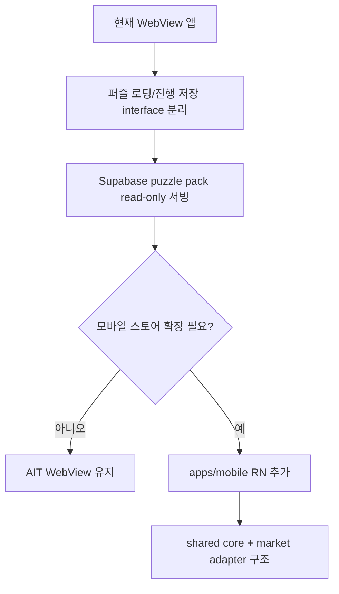
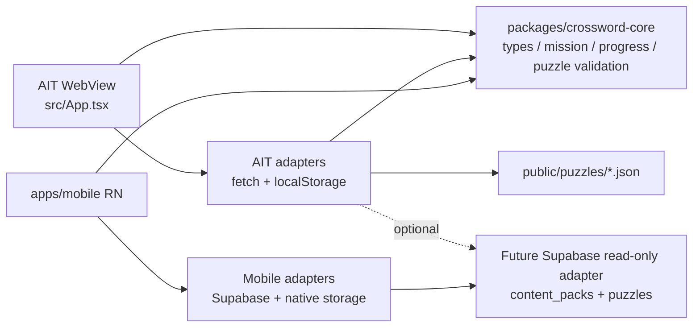

# 아키텍처

## 현재 결정

- `crossword-puzzle`의 현재 출시 타깃은 AppsInToss WebView다.
- Google Play / App Store 확장은 React Native `apps/mobile` 타깃으로 준비한다.
- AIT WebView 구현은 유지하고, 공통 퍼즐 모델과 상태 로직을 `packages/crossword-core`에서 먼저 공유한다.
- Supabase는 지금 바로 SDK를 넣지 않고, `PuzzleRepository` / `ProgressRepository` 어댑터로 붙일 수 있게 경계를 유지한다.
- 사용자 기본 동선은 홈 → 퍼즐 풀기 → 결과/기록이다. 하단 탭은 두지 않고, 상단 날짜 카드와 홈 CTA/화면 상단 액션으로만 이동한다. 기존 생성 보드 검수 화면은 개발 환경의 `/dev/simulator` 전용 경로로 둔다.

## 단계별 설계

| 단계                     | 목표                                                 | 현재 반영                                                                     | 다음 작업                                                                |
| ------------------------ | ---------------------------------------------------- | ----------------------------------------------------------------------------- | ------------------------------------------------------------------------ |
| A. 현재 WebView 앱       | AppsInToss WebView 출시 경로 유지                    | `src`, `granite.config.ts`, `.github/workflows/deploy-apps-in-toss.yml`       | AIT 빌드/등록 검증 유지                                                  |
| B. interface 분리        | 퍼즐 로딩, 진행 저장, 날짜별 미션 저장을 UI에서 분리 | `packages/crossword-core/src/repositories.ts`, `mission.ts`, `src/adapters/*` | UI가 repository 구현체를 직접 알지 않게 factory 정리                     |
| C. Supabase read-only    | puzzle pack을 원격에서 공개 읽기 전용으로 서빙       | `supabase/migrations/20260529000000_content_read_model.sql` 설계              | Supabase project 확정 후 migration 적용, `SupabasePuzzleRepository` 추가 |
| D. 확장 판단             | AIT 유지와 모바일 스토어 확장을 분기                 | `docs/google-play-release.md`, `play-store/google-play.config.json`           | packageName, Android 타깃 결정                                           |
| E. AIT 유지              | 모바일 스토어가 아직 필요 없으면 현재 WebView 운영   | `public/puzzles` + `localStorage`                                             | 로컬 pack 배포와 Supabase pack 중 하나 선택 가능하게 유지                |
| F. apps/mobile RN        | Google Play/App Store용 RN shell 추가                | RN 0.85.3 skeleton, Android/iOS 네이티브 프로젝트                             | 공통 core 연결, release signing secret 구성, 첫 AAB 빌드                 |
| G. shared core + adapter | 시장별 SDK 차이를 adapter로 흡수                     | `packages/crossword-core`                                                     | `packages/crossword-data` 또는 app-local Supabase adapter 추가 여부 결정 |

## 런타임 구조

## 경계

| 영역                | 위치                          | 책임                                                                               | 금지                                            |
| ------------------- | ----------------------------- | ---------------------------------------------------------------------------------- | ----------------------------------------------- |
| Core                | `packages/crossword-core/src` | 퍼즐 타입, 날짜별 manifest 요약, 진행 상태/미션 타입, 순수 helper, repository 계약 | React, DOM, AppsInToss, Supabase SDK, RN import |
| AIT WebView adapter | `src/adapters`                | `fetch` 기반 puzzle pack/날짜 목록 로딩, `localStorage` 진행/미션 저장             | Supabase service role, RN native module         |
| AIT UI              | `src/App.tsx`                 | 상단 날짜 카드, TDS UI, 입력, 화면 상태 연결                                       | 데이터 소스 세부 구현 직접 소유                 |
| Mobile              | `apps/mobile`                 | RN navigation, native storage, store release, Supabase/mobile adapter              | AIT WebView SDK import                          |
| Future backend      | `supabase`                    | migrations, RLS, Edge Functions                                                    | 앱에 service role key 포함                      |

## Supabase 전환 순서

1. Supabase project와 `app_id = crossword-puzzle` 운영 방식을 확정한다.
2. `supabase/migrations/20260529000000_content_read_model.sql`을 비운영 DB에 적용한다.
3. 기존 `public/puzzles/manifest.json`와 날짜별 puzzle JSON을 `content_packs.manifest`, `puzzles.payload`로 적재하는 import script를 만든다.
4. `PuzzleRepository`의 Supabase read-only 구현을 추가한다.
5. AIT WebView에서는 Supabase JS client를 바로 전제하지 않고, 먼저 `fetch` 가능한 REST/Edge Function 방식으로 검증한다.
6. 로그인 없는 상태에서는 진행 상태 sync를 넣지 않는다.
7. 계정, 복구, 크로스 디바이스 sync가 필요해질 때 `ProgressRepository` / `DailyMissionRepository`의 Supabase 구현을 추가한다.

## Supabase 데이터 모델

| 테이블          | 용도                                           | 공개 읽기 조건                                           | 쓰기               |
| --------------- | ---------------------------------------------- | -------------------------------------------------------- | ------------------ |
| `content_packs` | 앱별 puzzle pack manifest와 publish 상태       | `app_id = 'crossword-puzzle'`이고 `status = 'published'` | 서버/관리자 작업만 |
| `puzzles`       | 날짜별 puzzle payload JSON과 검색용 메타데이터 | 연결된 pack이 published                                  | 서버/관리자 작업만 |

초기에는 `user_progress`를 만들지 않는다. 현재 진행 상태는 기기 로컬 저장이 제품 동작과 개인정보 범위를 단순하게 유지한다.

## 데이터 계약

- `PuzzleRepository.listPuzzleSummaries()`는 날짜 카드용 `PuzzleManifestItem[]`을 최신 날짜순으로 반환한다.
- `PuzzleManifestItem`은 `date`, `puzzleId`, `path`와 선택 필드 `metrics`, `quality`, `difficulty`를 가진다.
- `PuzzleRepository.getPuzzleForDate(date)`는 선택한 날짜의 퍼즐을 반환하고, 현재 정적 어댑터는 정확히 일치하는 날짜가 없으면 해당 날짜 이전의 최신 퍼즐로 fallback한다.
- `DailyMissionState`는 `date + puzzleId` 조합으로 검증하고, 로컬 저장은 날짜별 미션과 퍼즐별 진행 상태를 분리한다.
- `validatePuzzleSlots()`와 `npm run validate:puzzles`는 격자에서 읽히는 모든 2자 이상 가로/세로 슬롯이 entry와 정확히 매칭되는지 검증한다. 같은 시작 칸에서 가로/세로가 동시에 시작하는 것은 허용하지만, clue 번호는 같은 시작 번호를 공유해야 한다.

## apps/mobile 운영 원칙

- Android/iOS는 `apps/mobile` 하나의 RN 타깃에서 관리한다.
- Google Play artifact는 `apps/mobile/android/app/build/outputs/bundle/release/app-release.aab`를 기준으로 한다.
- `packages/crossword-core`는 RN, Supabase, AppsInToss import를 계속 금지한다.
- AIT WebView는 `apps/mobile` 생성 후에도 제거하지 않는다.
- 현재 `apps/mobile`은 shell skeleton이다. 실제 퍼즐 UI 포팅은 `PuzzleRepository`, `ProgressRepository`, `DailyMissionRepository` adapter를 먼저 연결한 뒤 진행한다.

## 검증 기준

- AIT WebView는 계속 `npm run lint`와 `npm run build`가 통과해야 한다.
- Core는 플랫폼 import가 없어야 한다.
- 모바일 타깃이 있어도 root AppsInToss deploy workflow는 `.ait` 산출 경로를 유지한다.
- `/dev/simulator`는 `import.meta.env.DEV`에서만 노출한다.
- 퍼즐 pack 갱신 후 `npm run validate:puzzles`로 유령 슬롯, entry/격자 불일치, 중복 entry가 없는지 확인한다.
