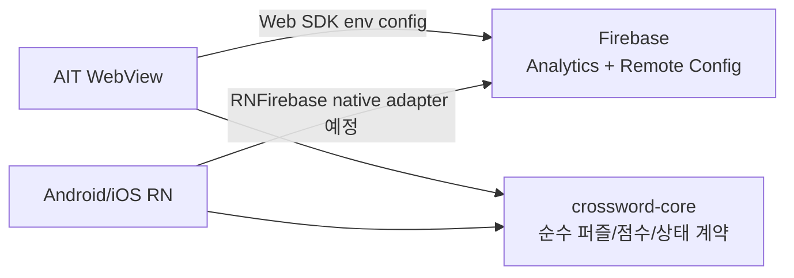

# Firebase Analytics / Remote Config

## 현재 목표

AIT 론칭을 먼저 준비하되, Firebase 운영값은 Android/iOS까지 같은 계약으로 확장할 수 있게 둔다.

## AIT WebView

AIT는 `firebase` Web SDK를 선택적으로 초기화한다. 다음 Vite 환경 변수가 없으면 Firebase를 초기화하지 않고 앱 기본값으로 동작한다.

| 변수                                | 용도                      |
| ----------------------------------- | ------------------------- |
| `VITE_FIREBASE_API_KEY`             | Firebase Web app API key  |
| `VITE_FIREBASE_AUTH_DOMAIN`         | Firebase Auth domain      |
| `VITE_FIREBASE_PROJECT_ID`          | Firebase project ID       |
| `VITE_FIREBASE_STORAGE_BUCKET`      | Storage bucket, 현재 선택 |
| `VITE_FIREBASE_MESSAGING_SENDER_ID` | sender ID                 |
| `VITE_FIREBASE_APP_ID`              | Firebase Web app ID       |
| `VITE_FIREBASE_MEASUREMENT_ID`      | Analytics measurement ID  |

GitHub Actions AIT 배포는 같은 값을 GitHub Variables에서 읽는다. 미설정이면 Firebase adapter는 no-op이다.

## Remote Config Keys

`remoteconfig.template.json`이 현재 운영 기본값의 source of truth다.

| Key                                |  기본값 | 설명                                     |
| ---------------------------------- | ------: | ---------------------------------------- |
| `default_hint_credits`             |     `3` | 퍼즐별 기본 무료 힌트 개수               |
| `rewarded_hint_credits`            |     `2` | 보상형 광고 1회 완료 시 지급할 힌트 개수 |
| `visible_puzzle_count`             |     `7` | 홈 날짜 캐러셀에 보여줄 최신 퍼즐 개수   |
| `puzzle_generation_interval_hours` |     `2` | 사용자 안내용 퍼즐 생성 주기             |
| `puzzle_keep_count`                |    `84` | 사용자 안내용 원격 퍼즐팩 보관 개수      |
| `completion_stats_enabled`         | `false` | 퍼즐별 완료자 수 UI 노출 여부            |
| `completion_stats_min_display_count` |  `10` | 정확한 완료자 수 표시 최소 집계 수       |
| `rewarded_hint_ads_enabled`        |  `true` | 힌트 보상형 광고 CTA 노출 여부           |
| `result_interstitial_ads_enabled`  |  `true` | 결과 화면 진입 후 전면 광고 노출 여부    |
| `leaderboard_enabled`              | `false` | 리더보드 UI 노출 여부                    |

Remote Config는 보안 결정이나 정답 검증의 source가 아니다. UI 노출 개수, 힌트 지급량, 광고 on/off 같은 운영 튜닝에만 사용한다.

## Analytics Events

AIT는 AppsInToss Analytics와 Firebase Analytics를 함께 호출한다. 샌드박스나 로컬 브라우저에서 일부 이벤트가 실제 콘솔에 쌓이지 않을 수 있으므로, QA는 런타임 로그와 라이브 콘솔을 분리해서 본다.

| Event                           | 시점                                 |
| ------------------------------- | ------------------------------------ |
| `screen_view`                   | 홈, 풀이, 결과, 기록 화면 진입       |
| `hint_reveal`                   | 힌트 1개 사용                        |
| `rewarded_hint_ad_request`      | 보상형 광고 요청                     |
| `rewarded_hint_ad_event`        | 보상형 광고 load/show 이벤트         |
| `rewarded_hint_ad_reward`       | `userEarnedReward` 수신 후 힌트 지급 |
| `mission_complete`              | 퍼즐 완료. 집계용 `puzzle_id`, `slot_id`, `pack_id`, `completed_at`, `remaining_attempts`, `hint_count` 포함 |
| `result_interstitial_ad_event`  | 결과 전면 광고 load/show 이벤트      |
| `result_interstitial_ad_result` | 결과 전면 광고 종료/실패             |

## Android / iOS

Android/iOS는 AIT WebView 코드와 같은 Web SDK를 공유하지 않는다. `apps/mobile`이 실제 퍼즐 UI를 포팅한 뒤 다음 native adapter를 붙인다.

- Android: `google-services.json`, `@react-native-firebase/app`, `@react-native-firebase/analytics`, `@react-native-firebase/remote-config`
- iOS: `GoogleService-Info.plist`, 같은 RNFirebase 모듈
- 공유 core에는 Firebase import를 넣지 않는다.
- 앱 개인정보/데이터 수집 고지에는 Analytics, 광고 식별자, 진단/사용 이벤트 수집 여부를 반영한다.

## 배포 전 확인

1. Firebase Console에서 Web app을 만들고 env 값을 GitHub Variables에 등록한다.
2. `firebase deploy --only remoteconfig --project crossword-puzzle-79ae0`로 템플릿을 반영한다.
3. AIT 라이브 환경에서 `screen_view`, `hint_reveal`, 광고 이벤트가 쌓이는지 확인한다.
4. 완료자 수 UI를 켜기 전 `docs/puzzle-completion-stats.md` 기준으로 집계 JSON을 배포하고 `completion_stats_enabled=true`로 전환한다.
5. Android/iOS는 native Firebase config 파일과 RNFirebase 모듈을 추가한 뒤 별도 빌드 검증한다.
