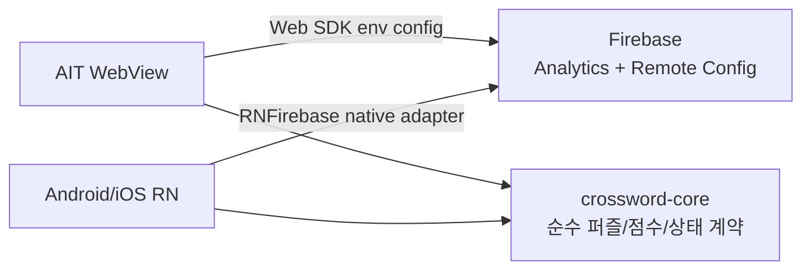

# Firebase Analytics / Remote Config

## 현재 목표

AIT 론칭을 먼저 준비하되, Firebase 운영값은 Android/iOS까지 같은 계약으로 확장할 수 있게 둔다.



## AIT WebView

AIT는 `firebase` Web SDK를 선택적으로 초기화한다. 다음 Vite 환경 변수가 없으면 Firebase를 초기화하지 않고 앱 기본값으로 동작한다.

| 변수                                | 용도                      |
| ----------------------------------- | ------------------------- |
| `VITE_FIREBASE_API_KEY`             | Firebase Web app API key  |
| `VITE_FIREBASE_AUTH_DOMAIN`         | Firebase Auth domain      |
| `VITE_FIREBASE_PROJECT_ID`          | Firebase project ID       |
| `VITE_FIREBASE_STORAGE_BUCKET`      | Storage bucket, 현재 선택 |
| `VITE_FIREBASE_MESSAGING_SENDER_ID` | sender ID                 |
| `VITE_FIREBASE_APP_ID`              | Firebase Web app ID       |
| `VITE_FIREBASE_MEASUREMENT_ID`      | Analytics measurement ID  |

GitHub Actions AIT 배포는 같은 값을 GitHub Variables에서 읽는다. 미설정이면 Firebase adapter는 no-op이다.

## Remote Config Keys

`remoteconfig.template.json`이 현재 운영 기본값의 source of truth다.

| Key                                  |  기본값 | 설명                                                      |
| ------------------------------------ | ------: | --------------------------------------------------------- |
| `daily_free_hint_credits`            |     `3` | KST 날짜별 공용 무료 힌트 개수                            |
| `default_hint_credits`               |     `3` | 구버전용 퍼즐별 기본 무료 힌트 개수                       |
| `rewarded_hint_credits`              |     `1` | 보상형 광고 1회 완료 시 지급할 힌트 개수                  |
| `visible_puzzle_count`               |     `7` | 홈 날짜 캐러셀에 보여줄 최신 퍼즐 개수                    |
| `puzzle_generation_interval_hours`   |     `1` | 사용자 안내용 난이도별 슬롯 간격                          |
| `puzzle_keep_count`                  |    `21` | 사용자 안내용 원격 퍼즐팩 보관 개수                       |
| `rewarded_hint_ads_enabled`          |  `true` | 힌트 보상형 광고 CTA 노출 여부                            |
| `result_interstitial_ads_enabled`    | `false` | 결과 화면 진입 후 전면 광고 노출 여부. 현재 기본 비활성   |
| `leaderboard_enabled`                |  `true` | 리더보드 UI 노출 여부. 승인/운영 문제 시 `false` 킬스위치 |
| `return_reminder_enabled`            |  `true` | AIT·Android·iOS 복귀 리마인더 동의 유도 여부              |
| `onboarding_difficulty_ramp_enabled` |  `true` | 첫 easy 완료 후 easy 1판 추가. `false`면 기존 추천 복원   |

힌트 잔액은 KST 날짜별 공용 지갑으로 저장한다. 쉬움·보통·어려움·지난 퍼즐과
재도전이 같은 무료 3개를 공유하며, 날짜가 바뀌면 무료분과 광고 보상분을 이월하지
않는다. 구버전의 퍼즐별 `hintCount`와 `earnedHintCredits`는 해당 날짜의 공용 지갑이
처음 만들어질 때 합산 이관해 업데이트 직후 중복 지급을 막는다.

`ios_app_store_review_ads_off` 조건은 iOS Firebase app `1:547625965706:ios:1b21e504c7895f959ef573`에만 적용한다. App Store 최초 심사 중 AdMob 앱 검토 전 `no-fill` 실패 CTA가 보이지 않도록 `rewarded_hint_ads_enabled`를 조건부 `false`로 둔다. AdMob 앱 상태가 `Ready`가 되면 이 조건부 값을 제거하거나 `true`로 되돌린다.

Remote Config는 보안 결정이나 정답 검증의 source가 아니다. UI 노출 개수, 힌트 지급량, 광고 on/off 같은 운영 튜닝에만 사용한다. 힌트 출처/라이선스 표시는 Remote Config 대상이 아니며 앱 안에서 항상 접근 가능한 정적 고지로 둔다.

## Analytics Events

AIT는 AppsInToss Analytics와 Firebase Analytics를 함께 호출한다. 샌드박스나 로컬 브라우저에서 일부 이벤트가 실제 콘솔에 쌓이지 않을 수 있으므로, QA는 런타임 로그와 라이브 콘솔을 분리해서 본다.

모든 커스텀 이벤트는 공통 sink에서 `app_market`, `runtime_platform`,
`release_version`을 강제로 덧붙인다. 값은 각각
`google_play|app_store|apps_in_toss`, `android|ios|web`, 실제 빌드 버전이다.
레거시 `market` 파라미터는 더 이상 발화하지 않는다. Firebase 자동 이벤트는 이 계약의
대상이 아니며 BigQuery 정규화 뷰에서만 보완한다.

| Event                            | 시점                                                                                                                                           |
| -------------------------------- | ---------------------------------------------------------------------------------------------------------------------------------------------- |
| `screen_view`                    | 홈, 풀이, 결과, 기록 화면 진입                                                                                                                 |
| `puzzle_select`                  | 홈/풀이/결과에서 다른 퍼즐 카드 선택                                                                                                           |
| `home_quick_start`               | 홈 사다리 단계·하단 CTA로 퍼즐 시작. `source=ladder_step_1\|ladder_step_2`, `ladder_step`, `step_status`, `status=loaded\|missing\|onboarding` |
| `mission_start`                  | 퍼즐별 첫 도전 시작                                                                                                                            |
| `attempt_start`                  | 첫 도전 또는 재도전 시작                                                                                                                       |
| `first_answer_input`             | 도전 중 첫 수동 입력                                                                                                                           |
| `hint_reveal`                    | 힌트 1개 사용                                                                                                                                  |
| `rewarded_hint_ad_request`       | 보상형 광고 요청                                                                                                                               |
| `rewarded_hint_ad_event`         | 보상형 광고 load/show 이벤트                                                                                                                   |
| `rewarded_hint_ad_reward`        | `userEarnedReward` 수신 후 힌트 지급                                                                                                           |
| `mission_complete`               | 퍼즐 완료. 완료자 집계 기준                                                                                                                    |
| `puzzle_abandon`                 | 시작 후 미완료로 보드 이탈(시도당 1회)                                                                                                         |
| `result_interstitial_ad_request` | 결과 전면 광고 요청. 현재 기본 비활성                                                                                                          |
| `result_interstitial_ad_event`   | 결과 전면 광고 load/show 이벤트. 현재 기본 비활성                                                                                              |
| `result_interstitial_ad_result`  | 결과 전면 광고 종료/실패. 현재 기본 비활성                                                                                                     |
| `return_reminder_preprompt`      | 완료 축하 화면의 복귀 알림 사전 안내 카드. `action=shown\|accept\|decline`, `channel`, `prompt_count`, `streak_days`                           |
| `return_reminder_prompt`         | 사전 안내 수락 뒤 시스템 동의·권한 요청 시작                                                                                                   |
| `return_reminder_schedule`       | RN 동의 사용자의 매 완료 D+1 로컬 알림 재예약 결과. `channel=local`, `outcome`, `reminder_date`                                                |
| `return_reminder_result`         | 동의 결과와 오류 코드·래퍼·실패 단계 기록                                                                                                      |
| `notification_opened`            | RN 로컬 복귀 알림 탭 후 오늘의 퍼즐 진입                                                                                                       |

집계용 이벤트는 공통으로 `puzzle_id`, `slot_id`, `pack_id`, `published_at`, `difficulty`, `grid_size`, `word_count`를 포함한다. 미션/시도 이벤트는 `attempt_number`, `remaining_attempts`, `hint_count`, `earned_hint_credits`를 추가한다. `mission_complete`는 `completed_at`, `elapsed_seconds`, `completed_word_count`도 포함한다.

`first_answer_input`은 `elapsed_seconds`로 첫 입력까지 걸린 시간(TTFI)을 싣는다. `puzzle_abandon`은 `last_screen`, `progress_percent`, `words_filled`, `total_words`, `elapsed_seconds`와 함께 `had_first_input`(첫 입력 발생 여부)를 포함한다. `had_first_input=false`인 이탈은 무입력(침묵) 이탈이며, 그 `elapsed_seconds`가 첫 입력 없이 머문 시간이므로 TTFI 상한 분포 및 침묵 이탈 구간 정량화에 사용한다.

`return_reminder_prompt`와 `return_reminder_result`는 `channel=ait|local`로 시장별 발송 경로를 구분한다. AIT만 실제 스마트발송 템플릿 출처인 `template_code_source=env|default`를 싣고, RN local은 이 파라미터를 생략한다. `return_reminder_result`는 `outcome`, `prompt_count`, `error_reason`, `error_code`에 `error_wrapper_code`와 `stage`를 추가한다. `stage`는 `preflight`, `sdk_callback`, `timeout` 중 하나다. `notification_opened`는 `channel=local`, `notification_kind=daily_puzzle`, 예약 대상 `reminder_date`를 싣는다.

## Android / iOS

Android/iOS는 AIT WebView 코드와 같은 Web SDK를 공유하지 않는다. `apps/mobile`은 RNFirebase native adapter를 사용한다.

- Android: `apps/mobile/android/app/google-services.json`, `@react-native-firebase/app`, `@react-native-firebase/analytics`, `@react-native-firebase/remote-config`, `com.google.gms:google-services:4.4.4`
- iOS: `apps/mobile/ios/CrosswordPuzzleMobile/GoogleService-Info.plist`, 같은 RNFirebase 모듈, `FirebaseApp.configure()`
- `google-services.json`과 `GoogleService-Info.plist`는 `.gitignore` 대상이다.
- CI는 `scripts/restore-mobile-firebase-config.mjs`로 native config를 복구한다.
- `apps/mobile`은 `react-native-google-mobile-ads` native adapter를 사용한다. 개발/QA 빌드는 Google test ad unit을 사용하고, release 빌드는 adapter QA 후 운영 광고 ID를 사용한다. 1차 출시에서는 개인화 광고를 끄고 `requestNonPersonalizedAdsOnly=true`로 요청하며, global request configuration에서 아동 대상/동의연령 미만 대상 플래그를 false로 명시하고 simulator/emulator를 test device로 allowlist한다.
- 공유 core에는 Firebase import를 넣지 않는다.
- 앱 개인정보/데이터 수집 고지에는 Analytics, 광고 식별자, 진단/사용 이벤트 수집 여부를 반영한다.
- iOS Analytics는 `$RNFirebaseAnalyticsWithoutAdIdSupport = true`로 IDFA 없는 variant를 사용한다.
- iOS Podfile은 RNFirebase와 RN 0.84+ prebuilt RNCore 조합의 compile error를 피하기 위해 `RCT_USE_RN_DEP=0`, `RCT_USE_PREBUILT_RNCORE=0`을 고정한다.
- `apps/mobile/firebase.json`은 Analytics ad/user data/personalization storage 기본값을 false로 둔다.

### Native config 복구

```bash
node scripts/restore-mobile-firebase-config.mjs --android --require
node scripts/restore-mobile-firebase-config.mjs --ios --require
```

| Secret                                          | Scope                   | 파일                                                             |
| ----------------------------------------------- | ----------------------- | ---------------------------------------------------------------- |
| `FIREBASE_ANDROID_GOOGLE_SERVICES_JSON_BASE64`  | repository              | `apps/mobile/android/app/google-services.json`                   |
| `FIREBASE_IOS_GOOGLE_SERVICE_INFO_PLIST_BASE64` | `app-store` environment | `apps/mobile/ios/CrosswordPuzzleMobile/GoogleService-Info.plist` |

## Native AdMob IDs

공개 원장은 `.github#167`, catalog logical ID는
`app/crossword-puzzle/admob/public-identifiers`다. 현재 유지 placement는
`rewardedHint` 하나뿐이며 호출되지 않던 결과 interstitial 구현과 제거된 보너스 퍼즐 ID는
운영 설정에서 제거했다. 개발·QA 빌드의 Google 테스트 ID 경로는 유지한다.

| Platform | App ID                                   | rewarded hint                            |
| -------- | ---------------------------------------- | ---------------------------------------- |
| Android  | `ca-app-pub-9932778305312246~7356925389` | `ca-app-pub-9932778305312246/1613644113` |
| iOS      | `ca-app-pub-9932778305312246~5361317430` | `ca-app-pub-9932778305312246/5603016700` |

이번 변경은 코드·계약·테스트만 정리한다. Firebase↔GA4, BigQuery export,
AdMob↔Firebase, custom dimension, impression-level revenue의 콘솔 상태와 실데이터는
변경하거나 개선됐다고 간주하지 않는다.

## 배포 전 확인

1. Firebase Console에서 Web app을 만들고 env 값을 GitHub Variables에 등록한다.
2. `firebase deploy --only remoteconfig --project crossword-puzzle-79ae0`로 템플릿을 반영한다.
3. AIT 라이브 환경에서 `screen_view`, `hint_reveal`, 광고 이벤트가 쌓이는지 확인한다.
4. Android/iOS는 `npm run check:mobile`, `npm run build:android`, unsigned iOS Release build로 native Firebase 연결을 검증한다.
