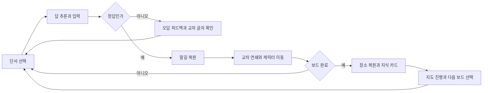
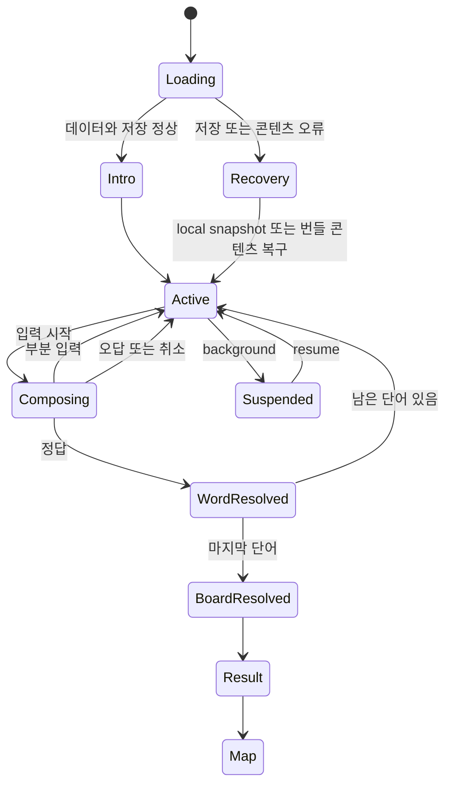

# 게임 디자인 문서

- 제품명: `말길: 가로세로 모험` (제안명)
- 문서 상태: draft
- 소유자: Game Design
- 버전/수정일: v0.2 / 2026-07-17
- Source of truth: 플레이 규칙, 상태, 진행, 보상과 인수 시나리오는 이 문서가 소유한다. 구현 전 `packages/crossword-core` 순수 정책으로 고정한다.
- Depends on: `00-product-brief.md`, `01-research-dossier.md`, `05-economy-content-liveops.md`, `docs/market-parity.md`
- Open blockers: `BLK-ENG-001`, `BLK-INPUT-001`, `BLK-CONTENT-001`, `BLK-MON-001`, `BLK-I18N-001`
- 승인 근거: 부분 승인 — 2026-07-17 사용자 메시지 `구조 다국어, 출시 콘텐츠 한국어 동의.` (`DEC-015`); 그 외 결정은 사용자 승인 전

## 경험 타임라인

### 첫 10초

앱 로고가 1초 안에 사라지고 5×5 튜토리얼 보드가 열린다. 첫 단서는 이미 선택되어 있고, 보드 위에는 끊어진 종이 길과 길 건너편의 안내자만 보인다. 첫 세션에는 홈, 출석 팝업, 계정, 알림, 광고를 표시하지 않는다.

### 첫 3분

첫 답은 2~3음절이며 쉬운 음절 탭으로 한 번 성공시킨다. 이후 직접 한글 입력으로 전환할 수 있다. 첫 단어가 완성되면 길이 켜지고 안내자가 걷는다. 교차 답을 완성하면 두 길이 한 번에 빛나며 `교차점이 연결될수록 세계가 빨리 깨어난다`는 규칙을 연출로 학습한다. 보드 완료 후 첫 지도 조각과 지식 카드가 열린다.

### 첫날과 첫 7일

- 첫날: 튜토리얼 1개와 선택 가능한 챕터 보드 1개를 제공한다.
- 2일차: 오늘의 보드와 기록을 연다.
- 3개 보드 완료: 컬렉션과 꾸미기 색상을 연다.
- 5개 보드 완료: 주간 도전을 연다.
- 7일차: 첫 지도 구역 복원과 다음 구역 예고를 제공한다.

## 코어 루프

플레이어가 반복하는 최소 행동은 `단서 선택 → 답 입력 → 즉시 장면 변화`다. 경제와 수집은 이 루프의 결과만 소비하며, 퍼즐을 풀지 않고 별도 미니게임을 반복해 성장하는 경로는 만들지 않는다.

## 규칙과 상태 머신

### 보드 규칙

- 공통 코어에서 한 칸은 `answerCells`의 원자 문자열 하나다. 셀 수를 JavaScript `string.length`나 code point spread로 추론하지 않는다.
- 출시 `ko-KR` profile에서는 한 칸이 NFC 정규화된 한글 완성형 음절 하나이며, 가로와 세로 답은 교차 칸의 같은 음절을 공유한다.
- 선택 답의 모든 칸을 채우면 단어 단위로 판정한다. 설정에서 즉시 오답 표시를 끌 수 있다.
- 올바른 단어는 고정되고 해당 길이 복원된다. 교차된 미완성 단어의 글자도 유지된다.
- 이미 완성된 단어를 다시 선택하면 단서, 뜻 카드, 출처를 확인할 수 있다.
- 시간 제한과 생명은 사용하지 않는다. 일일 시도 상한 제거는 DEC-005 제안이며, 사용자 승인 전에는 현재 core의 3회 계약을 유지한다. 앱 종료와 백그라운드는 실패가 아니다.

### 입력 규칙

- 기본은 선택 단어 전체를 받는 native 또는 DOM 한글 입력이다.
- React/RN 입력 controller가 IME `isComposing` 상태를 소유해 조합 중 commit을 막고, commit 뒤에는 `LanguageProfile`의 정규화·셀 분절·검증·비교 규칙을 호출한다. 한글 완성형 판별은 `ko-KR` profile 안에만 둔다.
- 쉬운 모드는 정답 길이에 맞춘 음절 후보를 탭해 배치한다. 드래그를 필수로 만들지 않는다.
- 첫 보드의 첫 답만 쉬운 모드로 고정하고, 이후 입력 방식을 선택하게 한다.
- 삭제는 현재 칸을 비우고 이전 칸으로 이동한다. 조합 중인 자모는 완성 전 정답 판정을 호출하지 않는다.
- 8×8과 9×9 보드는 격자 칸만 직접 탭하는 경로 외에 단서 목록과 48dp 이상 단어 집중 입력 스트립을 제공한다.

### 상태 머신

- `WordResolved` 연출 중에도 다음 단서를 탭할 수 있다. 연출은 취소되고 상태는 보존된다.
- `Suspended` 진입 즉시 타이머, 애니메이션, 오디오, 광고 callback을 정리한다.
- 광고 보상은 `reward_transaction_id` 단위로 한 번만 적용한다.

### 도움과 숙련

힌트는 세 단계다.

1. 단서 다시 보기: 무료, 출처와 관련 분야를 보여준다.
2. 교차 후보: 무료 크레딧 1개, 빈 교차 칸 하나에 후보 3개를 제시한다.
3. 글자 공개: 무료 크레딧 1개, 선택 답의 빈 칸 하나를 확정한다.

힌트를 사용해도 진행과 보상은 막히지 않는다. 단, 결과 카드에 `스스로 복원`, `도움받은 복원`을 구분해 숙련 기록만 남긴다.

## 진행

진행은 세 층으로 구성한다.

| 층     | 단위      | 획득                            | 쓰임                            |
| ------ | --------- | ------------------------------- | ------------------------------- |
| 보드   | 한 퍼즐   | 정답 단어, 교차 연쇄, 보드 완료 | 즉시 연출과 결과                |
| 지도   | 장소 1개  | 첫 완료당 지도 조각 1개         | 챕터 장면 복원과 다음 장소 개방 |
| 컬렉션 | 단어·테마 | 지식 카드, 기억잉크             | 복습과 외형 꾸미기              |

- 챕터 보드는 선형 3개 뒤 2개 분기 구조로 제시해 선택감을 준다.
- 일일 보드는 날짜 의식이지만 놓친 날을 처벌하지 않는다. 최근 7일 보드를 다시 열 수 있다.
- 스트릭은 `연속 방문`이 아니라 `연속 일일 보드 완료`로 계산하고 1회 보호권을 기본 제공한다.
- 희귀 단어 수로 난이도를 올리지 않는다. 격자 크기, 교차 제약, 단서 간접성, 초기 공개 글자 수를 조절한다.

## 경제

- `지도 조각`: 첫 완료에서만 얻는 비소비 진행 토큰이다.
- `기억잉크`: 보드 풀이로 얻고 길 색상, 캐릭터 흔적, 엽서 테두리에 쓰는 소프트 재화다.
- `힌트 크레딧`: 사용자 승인 전에는 현재 난이도별 easy 2, normal 3, hard 5를 유지하며 보상 광고 성공 시 2개를 추가한다. 전 난이도 3개 단일화는 DEC-013 실험 후보다.
- 유료 재화와 확률형 상자는 출시 최소 범위에 없다.
- 정확한 수치, source와 sink, 원격 설정은 `05-economy-content-liveops.md`가 소유한다.

## 콘텐츠

### 보드 타입

| 타입    |    크기 | 단어 수 | 목적                  |
| ------- | ------: | ------: | --------------------- |
| 첫 실행 | 5×5~6×6 |     4~6 | 입력과 교차 연쇄 학습 |
| 쉬움    |     7×7 |  최대 9 | 짧은 일일 성공        |
| 보통    |     8×8 | 최대 10 | 표준 세션             |
| 어려움  |     9×9 | 최대 13 | 주간 도전             |

현재 `packages/crossword-core`의 난이도 프로필을 기준선으로 사용한다. 변경은 생성기, validator, manifest, 세 시장 UI를 동시에 갱신해야 한다.

### 콘텐츠 품질 계약

- 출시 pack의 canonical 언어 필드 `contentLocale`은 `ko-KR`이며 93개 보드 전체에 동일하게 적용한다.
- 다른 언어 pack은 한국어 정답·단서의 번역본이 아니라 독립 word bank, 격자, 단서, 해설, 난이도와 검수 원장을 가진다.
- 출시 퍼즐의 모든 단서는 사람이 직접 작성하거나 라이선스가 확인된 원문을 편집한다.
- 신규 게임 목표는 `needsManualClue`가 존재하고 명시적 `false`인 entry 100%다. 필드 누락도 실패로 처리한다. 이는 현재 repo의 40% 허용치에서 변경되는 DEC-007 제안이다.
- 답, 단서, 짧은 해설, 분야 태그, `clueSource` allowlist, 출처, license ID, 검수자, 검수일, checksum을 required로 저장한다.
- 단서 하나는 한 가지 지식을 묻고, 답의 표기 규칙을 예측할 수 있게 한다.
- 혐오, 성적 대상화, 특정 집단 비하, 의료·법률 오정보, 시의성이 끝난 사실은 검수표에서 차단한다.
- 같은 답과 거의 같은 단서는 30일 재사용 쿨다운을 둔다.

## 온보딩

| 단계 | 플레이어 행동            | 시스템 피드백                | 해금           |
| ---- | ------------------------ | ---------------------------- | -------------- |
| 1    | 첫 단서와 음절 후보 확인 | 안내자의 시선과 길 끝이 점멸 | 없음           |
| 2    | 첫 답 입력               | 길 점등, 캐릭터 이동         | 직접 입력 전환 |
| 3    | 교차 답 입력             | 교차점 파동과 두 길 연결     | 힌트 버튼      |
| 4    | 마지막 답 완료           | 장소 전체 복원               | 지도 홈        |
| 5    | 지식 카드 넘김           | 정답 뜻과 출처 노출          | 오늘의 보드    |

- 설명 모달은 한 화면 한 문장으로 제한한다.
- 첫 제어권은 상호작용 가능 시점부터 5초 이내에 준다.
- 알림 동의는 첫 보드 완료 후 결과 화면의 별도 선택지로만 제안한다.
- AIT Game Center 프로필은 첫 플레이 전에 요구하지 않고, 소셜 기능을 도입하는 단계에서 다시 평가한다.

## 수익화

### 출시 계약

- 첫 세션과 튜토리얼에는 광고를 표시하지 않는다.
- 보상형 광고는 힌트 추가 또는 보너스 보드 해금처럼 플레이어가 먼저 요청한 경우만 표시한다.
- `load_failed` 또는 `timeout` 광고 실패는 재화를 차감하지 않고 보드당 1회, local day 최대 2회까지 무료 대체 힌트 1개를 제공한다. 사용자 취소는 지급 대상이 아니다.
- 보상은 SDK의 완료 callback 이후 idempotent transaction으로 지급한다.
- 결과 전면 광고는 기본 OFF이며 이번 승인 범위에는 넣지 않는다. 별도 데이터와 사용자 승인이 생기기 전에는 호출 경로도 만들지 않는다.
- 구독, 소모성 유료 재화, 확률형 상품은 출시 최소 범위에서 제외한다.

## 소셜 또는 오프라인 경계

- 핵심 플레이, 저장, 최근 다운로드 보드, 컬렉션 열람은 오프라인에서 동작한다.
- 광고, 새 manifest, 분석 업로드, 오류 제보만 연결이 필요하다.
- 출시 최소 범위에는 실시간 경쟁과 채팅이 없다.
- 기록 공유는 완료 시간, 도움 사용 여부, 복원 엽서 이미지만 포함하며 정답과 개인 식별자는 포함하지 않는다.
- 향후 친구 비교를 넣더라도 핵심 지도 진행과 보상은 순위에 의존하지 않는다.

## 저장과 리셋 계약

- `uiLocale`은 설정 profile에, 퍼즐 진행은 `contentLocale:puzzleId` namespace에 저장한다. UI 언어 변경은 진행을 이동·초기화하지 않는다.
- 기존 unversioned 저장은 migration에서 `contentLocale=ko-KR`로만 매핑한다. 다른 locale에 같은 `puzzleId`가 있어도 완료·보상 ledger를 공유하지 않는다.
- 완성형 음절 입력, 힌트 사용, 단어 완료, 보드 완료마다 재화·entitlement를 제외한 compact emergency journal을 canonical 비동기 저장보다 먼저 기록한다.
- AppsInToss `Storage` 또는 mobile `AsyncStorage`의 durable ack 뒤 journal을 지운다. 다음 시작에서는 `puzzle_id`·콘텐츠 checksum이 맞는 journal만 마지막 durable snapshot에 재적용한다.
- 앱 중단 후 같은 `puzzle_id`와 콘텐츠 checksum이면 마지막 선택 단어와 입력까지 복원한다.
- 콘텐츠가 교체되었으면 저장된 puzzle snapshot으로 재개하고 새 manifest를 강제 덮어쓰지 않는다.
- 기존 앱의 완료 보드, 스트릭, 기록, 힌트 설정을 v2 save로 한 번만 변환한다.
- 기존 완료 수는 `초기 탐험가` legacy 엽서로 보존한다. 과거 퍼즐을 다시 풀도록 강제하지 않는다.
- 설정의 데이터 초기화는 영향 범위를 보여주고 2단계 확인을 거친다. 광고 식별자와 분석 동의는 플랫폼 설정 경로도 안내한다.
- 출시 최소 범위는 계정과 cloud save가 없어 앱 삭제·재설치와 기기 이전 복구를 지원하지 않는다. Android의 현재 `allowBackup=false`도 유지한다. 해당 기능을 약속하려면 Auth, backend rules, privacy와 충돌 정책을 별도 승인한다.

## 인수 시나리오

### AC-001 첫 세션 첫 성공

신규 저장 상태에서 앱을 열면 5초 안에 첫 단서를 조작할 수 있고, 45초 안에 첫 정답 성공 연출을 볼 수 있어야 한다. 그 전에 홈, 광고, 계정, 권한 모달이 나오면 실패다.

### AC-002 한글 입력과 재개

한글 조합 중 앱을 백그라운드로 보낸 뒤 복귀해도 미완성 자모가 오답으로 판정되지 않아야 한다. 완성형 입력은 저장되고 같은 단어 위치로 돌아와야 한다.

### AC-003 보상 광고 원자성

보상 광고 callback이 중복되거나 앱 복귀 callback과 겹쳐도 같은 `reward_transaction_id`의 힌트는 한 번만 지급되어야 한다. 실패와 취소 시 재화가 줄지 않아야 한다.

### AC-004 세 시장 패리티

같은 `puzzle_id`, Remote Config snapshot, 저장 상태를 AIT, Android, iOS에 주입하면 공개 보드, 힌트 비용, 보상, 완료 판정, 분석 이벤트 이름이 같아야 한다.

### AC-005 접근 가능한 퍼즐 완료

VoiceOver 또는 TalkBack 사용자가 격자 직접 탭 없이 단서 목록과 단어 집중 입력으로 튜토리얼을 완료할 수 있어야 한다. 색상 없이 선택, 오답, 완료 상태를 구분해야 한다.

### AC-006 콘텐츠 무결성

`needsManualClue` 누락 또는 `false` 이외 값, `clueSource` allowlist 위반, 라이선스 원장 누락, checksum 불일치, 난이도 프로필 불일치 중 하나라도 있는 pack은 공개 manifest에 올라가면 안 된다.

### AC-007 locale 경계

출시 `ko-KR` pack과 future-locale synthetic fixture를 같은 core에 주입하면 `LanguageProfile`이 각각의 `answerCells`를 결정적으로 검증해야 한다. `uiLocale`을 바꿔도 선택한 `contentLocale`, progress snapshot checksum, `contentChecksum`은 바뀌지 않는다. UI 설정을 포함하는 save envelope 또는 profile checksum은 바뀔 수 있다. 존재하지 않는 content locale을 한국어 정답으로 조용히 대체하면 실패다.
