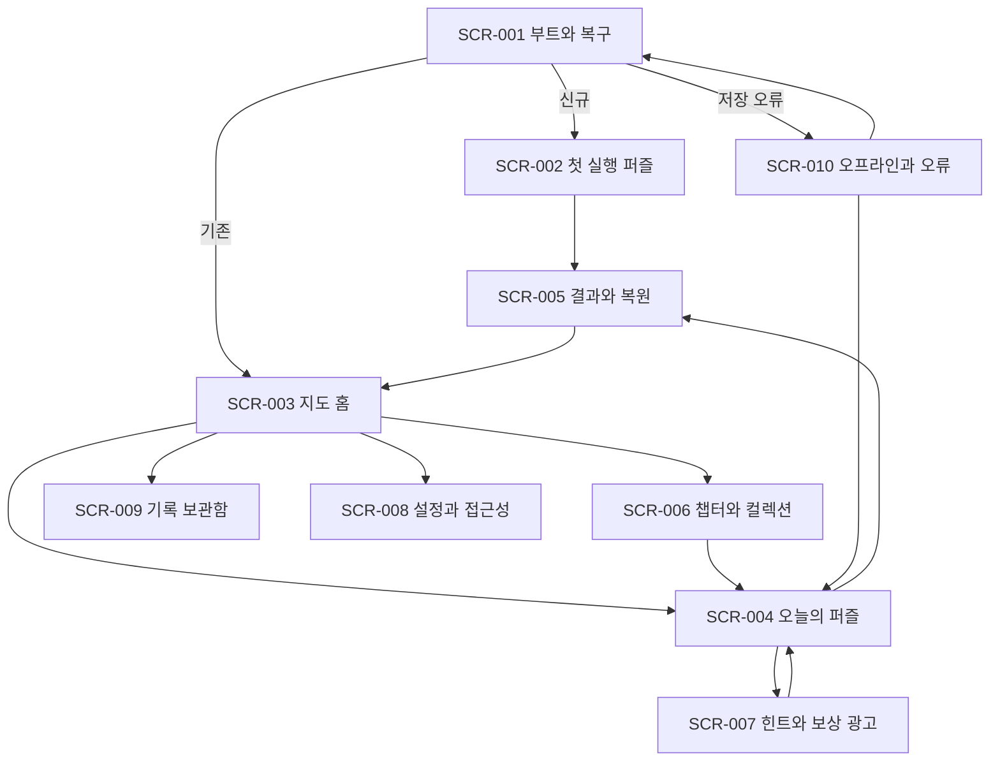

# UI UX 명세

- 제품명: `말길: 가로세로 모험` (제안명)
- 문서 상태: draft
- 소유자: Product Design / UX
- 버전/수정일: v0.2 / 2026-07-17
- Source of truth: 화면 구조, 입력, 피드백, 접근성과 반응형 동작은 이 문서가 소유한다.
- Depends on: `00-product-brief.md`, `02-gdd.md`, `04-art-audio-bible.md`, Apple HIG, Android 접근성 지침
- Open blockers: `BLK-INPUT-001`, `BLK-A11Y-001`, `BLK-ART-001`, `BLK-ORIENT-001`, `BLK-I18N-001`
- 승인 근거: 부분 승인 — 2026-07-17 사용자 메시지 `구조 다국어, 출시 콘텐츠 한국어 동의.` (`DEC-015`); 그 외 결정은 사용자 승인 전

## 내비게이션 그래프

- 신규 이용자는 `SCR-001 → SCR-002`로 직행한다.
- 모든 풀이 화면은 저장 후 지도 홈으로 빠질 수 있다.
- 광고, 권한, 공지 화면은 전역 진입점이 아니다. 사용자의 관련 행동 뒤에만 열린다.
- Android back과 iOS edge swipe는 `이전 화면 또는 저장 후 지도` 규칙을 사용한다.
- AIT 게임에서는 container의 OS back gesture를 비활성화하고 게임 내부 뒤로가기만 같은 규칙을 적용한다. 프레임워크 우측 상단 X는 어떤 scene에서도 가리지 않으며 저장 후 종료 확인과 `closeView`로 연결한다.

## 디자인 시스템

### 레이아웃

- 4dp 공간 단위를 쓰고 주요 간격은 8, 12, 16, 24, 32dp로 제한한다.
- 상단은 safe area와 현재 장소, 중앙은 세계·격자, 하단은 단서·입력의 세 층이다.
- 첫 release는 현재 native 설정과 같은 portrait를 phone·tablet 기본으로 유지한다. tablet landscape는 BLK-ORIENT-001 후보이며 native orientation, IME, 광고, 저장 복귀, 스토어 소재 gate를 모두 통과한 뒤 연다.
- 주요 동작은 하단 엄지 영역에 둔다. 자주 쓰는 버튼은 Apple 44×44pt, Android 48×48dp보다 작지 않다.
- 격자 칸은 전체 보드 축소 시 터치 목표로 간주하지 않는다. 단어 집중 입력 스트립과 단서 목록이 항상 동등한 조작 경로다.
- AIT의 X 버튼과 safe area를 game viewport 밖 예약 영역으로 취급한다. 모든 화면은 내부 종료 동작도 제공한다.
- browser pinch zoom은 비활성화한다. 퍼즐 확대는 접근 가능한 `확대`, `축소`, `전체 보기` 버튼과 동일 동작의 keyboard command로만 제공한다.

### 색과 재질

| 토큰            | 역할                   | 제안                               |
| --------------- | ---------------------- | ---------------------------------- |
| `surface-paper` | 기본 배경              | 따뜻한 아이보리, 질감 대비 3% 이하 |
| `ink-primary`   | 본문과 미복원 길       | 짙은 남청                          |
| `path-active`   | 선택 단어              | 청록, 외곽선과 굵기 변화 병행      |
| `path-complete` | 완료 단어              | 황금빛 주황, 체크 아이콘 병행      |
| `state-error`   | 오답                   | 진홍, 진동과 텍스트 병행           |
| `focus-ring`    | 키보드와 보조기술 초점 | 3dp 고대비 외곽선                  |

본문과 작은 텍스트는 배경 대비 4.5:1 이상, 큰 텍스트와 비문자 핵심 요소는 3:1 이상을 내부 기준으로 삼는다. 색 하나만으로 상태를 전달하지 않는다.

### 타이포그래피와 아이콘

- 한글 본문 최소 16sp, 단서 기본 18sp, 중요 답 입력 22~28sp다.
- 모든 UI 문구는 안정 key catalog에서 렌더링한다. 출시 catalog는 `ko-KR` 하나이며, 두 번째 완성 catalog가 추가되기 전에는 언어 선택 항목을 표시하지 않는다.
- 날짜·숫자·요일은 `uiLocale` formatter를 사용하고, 어순이 달라지는 문장을 문자열 조각 연결로 만들지 않는다. 단서·정답·해설은 UI catalog가 아니라 선택한 `contentLocale` pack에서만 읽는다.
- Dynamic Type와 Android font scale 200%에서 잘림 없이 재배치한다.
- 숫자 단서와 방향은 `12 가로`, `12 세로`처럼 텍스트로도 읽힌다.
- 아이콘 버튼에는 항상 접근성 이름을 붙이고, 낯선 아이콘은 텍스트 레이블을 병기한다.

### 동작 우선순위

1. 답 입력과 삭제
2. 다음 단서와 이전 단서
3. 힌트
4. 확대, 연필, 설정

주 동작과 부가 동작을 한 줄에 같은 시각 무게로 두지 않는다.

## 화면 계약

분석 행에서 `v1 유지`는 현재 `gameAnalytics.ts` 계약이고 `v2 제안`은 구현 전 이름이다. v2 제안 이벤트는 core schema, 세 adapter, BigQuery 검증 SQL이 함께 추가되기 전에는 발행하지 않는다.

### 공통 화면 계약

| 항목          | 모든 SCR에 적용할 계약                                                                                                                                                                                                               |
| ------------- | ------------------------------------------------------------------------------------------------------------------------------------------------------------------------------------------------------------------------------------ |
| Exit/back     | command → compact emergency journal → durable save ack → route. 2초 내 ack가 없으면 마지막 저장 시각·미저장 변경 수·재시도/명시적 나가기를 표시하며 조용히 timeout하지 않는다. 풀이 abandon은 확인 뒤 지도, AIT X는 ack 후 closeView |
| Copy          | 출시 한국어는 CTA 16자, 제목 24자, 보조 문구 80자, 단서 120자로 검증하고, locale-independent layout은 1.35× pseudo-locale overflow fixture를 함께 통과                                                                               |
| Components    | default, pressed, focused, disabled, loading, error, offline, completed 상태 sheet 필요                                                                                                                                              |
| Assets        | background, interactive, decorative, icon을 분리하고 decorative canvas는 접근성 tree에서 숨김                                                                                                                                        |
| Motion        | 사건, duration, interrupt, reduced-motion 대체, background 중단을 화면별 motion sheet에 기록                                                                                                                                         |
| Accessibility | focus order, label, value, hint, live region, font 200%, external keyboard를 화면별 확인                                                                                                                                             |
| Screenshot AC | Compact/Standard/Tablet, light/high-contrast, default/error/offline을 release build에서 캡처                                                                                                                                         |

### 보조 overlay inventory

| ID                        | 진입·목표                 | 완료·이탈                     | 필수 상태와 접근성                             |
| ------------------------- | ------------------------- | ----------------------------- | ---------------------------------------------- |
| OVR-001 pause·abandon     | 풀이의 일시정지·나가기    | 계속, 저장 후 지도, AIT 종료  | 저장 중, timeout, screen reader focus trap     |
| OVR-002 알림 동의         | 첫 완료 뒤 복귀 알림 제안 | 동의, 거절, 미지원            | 혜택·빈도 설명, 거절을 같은 무게로 제공        |
| OVR-003 광고 lifecycle    | 사용자가 보상 광고 요청   | reward, cancel, fail, timeout | 비용·보상 선고지, 중복 callback, 원 focus 복원 |
| OVR-004 공유              | 결과 엽서 공유            | system sheet, 취소            | 정답·식별자 제외, 이미지 대체 텍스트           |
| OVR-005 라이선스·개인정보 | 설정의 법적 정보          | 원문 보기, 외부 링크          | offline copy, link focus, SDK·콘텐츠 원장      |
| OVR-006 데이터 초기화     | 설정의 local data 삭제    | 2단계 확인, 취소              | 삭제 범위, cloud 복구 불가, 성공·실패 결과     |

상세 copy, high-fidelity key screen, component state sheet가 승인되기 전 UI gate는 열린 상태로 유지한다.

### SCR-001 부트와 복구

| 항목      | 계약                                                                       |
| --------- | -------------------------------------------------------------------------- |
| 진입      | 앱 시작, foreground 복귀, deep link                                        |
| 목표      | 1초 안에 브랜드, 2.5초 P75 안에 조작 가능한 화면 제공                      |
| 계층      | 작은 로고 → 로딩 진행 텍스트 → 복구 동작                                   |
| 정상 동작 | 저장과 콘텐츠 checksum 확인 후 신규는 SCR-002, 기존은 SCR-003으로 이동     |
| 상태      | 로컬 정상, 원격 지연, 번들 fallback, 저장 마이그레이션, 치명 오류          |
| 분석      | v2 제안 `game_boot`, `game_save_migration_result`, `game_content_fallback` |
| 인수      | 로딩 애니메이션만 5초 이상 지속하지 않고 복구 선택지를 보여준다.           |

### SCR-002 첫 실행 퍼즐

| 항목      | 계약                                                                                                  |
| --------- | ----------------------------------------------------------------------------------------------------- |
| 진입      | 신규 이용자, 튜토리얼 재시작                                                                          |
| 목표      | 설명보다 먼저 첫 정답과 길 복원을 경험                                                                |
| 계층      | 복원 전 세계 → 5×5 격자 → 선택 단서 → 음절 탭 또는 직접 입력                                          |
| 주 동작   | 답 입력, 삭제, 다음 단서                                                                              |
| 보조 동작 | 음소거, 글자 크게, 튜토리얼 나가기                                                                    |
| 상태      | 입력 전, 조합 중, 오답, 단어 완료, 교차 연쇄, 보드 완료                                               |
| 분석      | v1 유지 `game_first_input`; v2 제안 `game_ftue_step_view`, `game_word_complete`, `game_ftue_complete` |
| 인수      | 첫 광고와 권한 요청이 없고, 첫 단서가 선택된 상태로 시작한다.                                         |

### SCR-003 지도 홈

| 항목      | 계약                                                                        |
| --------- | --------------------------------------------------------------------------- |
| 진입      | 기존 시작, 결과 닫기, 풀이 저장 후 나가기                                   |
| 목표      | 5초 안에 다음 권장 행동을 이해                                              |
| 계층      | 복원 지도 → 오늘의 보드 CTA → 진행 중 보드 → 챕터·기록·설정                 |
| 주 동작   | 오늘의 보드 시작 또는 이어하기                                              |
| 보조 동작 | 챕터, 컬렉션, 기록, 설정                                                    |
| 상태      | 신규 지도, 이어하기, 오늘 완료, 오프라인, 새 콘텐츠 있음                    |
| 분석      | v2 제안 `game_screen_view`, `game_map_node_select`, `game_daily_cta_select` |
| 인수      | 출석 팝업이 CTA를 가리지 않고, 미수령 보상을 여러 모달로 쌓지 않는다.       |

### SCR-004 오늘의 퍼즐

| 항목      | 계약                                                                                                               |
| --------- | ------------------------------------------------------------------------------------------------------------------ |
| 진입      | 지도 노드, 오늘의 CTA, 기록에서 이어하기                                                                           |
| 목표      | 단서를 읽고 한 손으로 답을 입력                                                                                    |
| 계층      | 세계 미리보기 → 격자 → 단서 카드 → 단어 집중 입력 → 도구                                                           |
| 주 동작   | 입력, 삭제, 다음·이전 단서                                                                                         |
| 보조 동작 | 힌트, 확대, 연필, 일시정지                                                                                         |
| 상태      | 로딩, active, IME 조합, 오답, 완료, 광고 pause, background, 저장 오류                                              |
| 분석      | `game_puzzle_start`, `game_first_input`, `game_progress`, `game_puzzle_abandon`                                    |
| 인수      | 9×9에서도 단어 집중 입력의 각 음절 표적이 48dp 이상이며 버튼식 격자 확대가 가능하다. pinch zoom은 사용하지 않는다. |

### SCR-005 결과와 복원

| 항목      | 계약                                                                                            |
| --------- | ----------------------------------------------------------------------------------------------- |
| 진입      | 마지막 답 완료                                                                                  |
| 목표      | 퍼즐 결과와 세계 변화의 인과를 2초 안에 전달                                                    |
| 계층      | 최종 복원 연출 → 완료 등급 → 새 지식 카드 → 다음 행동                                           |
| 주 동작   | 지도에서 계속하기                                                                               |
| 보조 동작 | 지식 카드, 공유, 다시 보기                                                                      |
| 상태      | 첫 완료, 재완료, 도움받음, 오프라인 보상 보류                                                   |
| 분석      | v1 유지 `game_puzzle_complete`; v2 제안 `game_world_restore_complete`, `game_result_cta_select` |
| 인수      | 닫기 버튼은 연출 시작 즉시 제공하고, 광고가 결과를 선점하지 않는다.                             |

### SCR-006 챕터와 컬렉션

| 항목      | 계약                                                                            |
| --------- | ------------------------------------------------------------------------------- |
| 진입      | 지도 홈, 결과의 새 카드                                                         |
| 목표      | 복원한 장소와 단어 지식을 다시 보고 다음 목표 선택                              |
| 계층      | 챕터 진행 → 장소 노드 → 지식 카드 → 꾸미기                                      |
| 주 동작   | 열린 보드 선택                                                                  |
| 보조 동작 | 카드 필터, 꾸미기 적용, 출처 보기                                               |
| 상태      | 잠김, 진행 중, 완료, 신규 카드, 콘텐츠 다운로드 대기                            |
| 분석      | v2 제안 `game_chapter_view`, `game_collection_card_view`, `game_cosmetic_apply` |
| 인수      | 잠금 이유와 해금 조건을 같은 화면에서 읽을 수 있다.                             |

### SCR-007 힌트와 보상 광고

| 항목      | 계약                                                              |
| --------- | ----------------------------------------------------------------- |
| 진입      | 퍼즐의 힌트 버튼                                                  |
| 목표      | 비용과 결과를 알고 도움 수준 선택                                 |
| 계층      | 무료 단서 보기 → 교차 후보 → 글자 공개 → 크레딧 부족 시 광고 선택 |
| 주 동작   | 도움 적용                                                         |
| 보조 동작 | 광고로 2개 받기, 취소                                             |
| 상태      | 충분한 크레딧, 부족, 광고 로딩, 보상 성공, 실패, 취소             |
| 분석      | `game_hint_use`, `game_assist_ad`, 기존 광고 lifecycle 이벤트     |
| 인수      | 광고 실패 시 진행을 막지 않고 무료 대체 도움을 제공한다.          |

### SCR-008 설정과 접근성

| 항목      | 계약                                                                                                           |
| --------- | -------------------------------------------------------------------------------------------------------------- |
| 진입      | 지도, 퍼즐 일시정지                                                                                            |
| 목표      | 시각·입력·소리·진동·개인정보 설정을 즉시 미리보기                                                              |
| 계층      | 글자 크기 → 고대비 → reduced motion → 입력 방식 → BGM/SFX/햅틱 → 데이터. 언어는 catalog가 2개 이상일 때만 표시 |
| 주 동작   | 설정 변경                                                                                                      |
| 보조 동작 | 튜토리얼 재실행, 라이선스, 개인정보, 데이터 초기화                                                             |
| 상태      | 시스템 설정 따름, 사용자 override, 미지원 햅틱, 단일 locale selector 숨김                                      |
| 분석      | v2 제안, 민감한 값 없이 `game_accessibility_setting_change`                                                    |
| 인수      | font scale 200%에서 모든 토글 이름과 현재 값이 보인다.                                                         |

UI 언어와 콘텐츠 언어는 같은 selector로 묶지 않는다. 출시에는 둘 다 `ko-KR` 하나라 selector를 표시하지 않으며, future locale의 UI·content catalog가 각각 승인될 때 독립 항목으로 연다.

### SCR-009 기록 보관함

| 항목      | 계약                                                     |
| --------- | -------------------------------------------------------- |
| 진입      | 지도 홈                                                  |
| 목표      | 최근 풀이, 스트릭, 도움 사용, 복원 엽서를 확인           |
| 계층      | 최근 7일 → 달력 → 통계 → legacy 엽서                     |
| 주 동작   | 완료 보드와 엽서 열기                                    |
| 보조 동작 | 필터, 공유, 스트릭 규칙 보기                             |
| 상태      | 기록 없음, 일부 저장, legacy 변환, 오프라인              |
| 분석      | v2 제안 `game_archive_view`, `game_legacy_postcard_view` |
| 인수      | 스트릭 보호와 끊김 원인을 날짜별로 설명한다.             |

### SCR-010 오프라인과 오류

| 항목      | 계약                                                               |
| --------- | ------------------------------------------------------------------ |
| 진입      | 콘텐츠, 저장, 광고, 네트워크 오류                                  |
| 목표      | 데이터 손실 없이 계속하거나 안전하게 복구                          |
| 계층      | 무슨 일이 생겼는지 → 보존된 상태 → 다시 시도 또는 오프라인 계속    |
| 주 동작   | 오프라인 계속, 다시 시도                                           |
| 보조 동작 | 오류 코드 복사, 문의, 마지막 정상 local snapshot 복구              |
| 상태      | 원격 manifest 실패, checksum 실패, 저장 손상, 광고 실패            |
| 분석      | 오류 코드와 app/content version만 기록                             |
| 인수      | 정답이나 로컬 저장 원문을 로그와 문의 본문에 자동 포함하지 않는다. |

## 상태 매트릭스

| 컴포넌트 | 기본              | 로딩                    | 비활성             | 오류                 | 성공             | 오프라인             |
| -------- | ----------------- | ----------------------- | ------------------ | -------------------- | ---------------- | -------------------- |
| 격자     | 선택 단어 강조    | skeleton 대신 보드 윤곽 | 완료 단어 고정     | 진동+외곽선+텍스트   | 잉크 흐름        | 저장된 snapshot 표시 |
| 입력     | caret와 현재 길이 | 입력 차단 이유 표시     | 조합 중 판정 보류  | 답 유지, 재입력 유도 | 다음 단서로 이동 | 동일 동작            |
| 힌트     | 비용 표시         | 취소 가능한 spinner     | 완료 단어에는 숨김 | 무료 대체 경로       | 적용 위치 점멸   | 광고 CTA 숨김        |
| 오늘 CTA | 시작/이어하기     | 날짜와 상태 유지        | 완료 시 다시 보기  | 최근 번들 보드 제안  | 지도 조각 표시   | 다운로드 보드만 노출 |
| 보상     | 수량과 이유       | 거래 ID 보존            | 중복 수령 차단     | 재시도 또는 보류     | 한 번만 증가     | local pending ledger |

오류는 toast 하나로 끝내지 않는다. 진행을 막는 오류는 원인, 보존 상태, 다음 행동을 한 화면에서 제공한다.

## 피드백과 게임 필

| 사건      | 시각                        | 오디오             | 햅틱            |  시간 예산 |
| --------- | --------------------------- | ------------------ | --------------- | ---------: |
| 글자 입력 | 잉크가 번지며 정착          | 종이 위 가벼운 탭  | 없음 또는 light |       80ms |
| 오답      | 단어 외곽이 한 번 접힘      | 낮은 나무 클릭     | warning 1회     |      180ms |
| 단어 완료 | 길을 따라 잉크 sweep        | 3음 상승 motif     | success         |      450ms |
| 교차 연쇄 | 교차점 파동과 다음 길 점등  | 연쇄마다 음정 상승 | 간격 둔 light   | 700ms 이하 |
| 보드 완료 | 장면이 종이 모형으로 펼쳐짐 | 2초 완결 phrase    | success 후 종료 |  skip 가능 |

- 입력은 애니메이션 종료를 기다리지 않는다.
- 연쇄 연출은 3회 이상이면 압축하고, 다음 입력 시 즉시 축약한다.
- reduced motion에서는 이동 대신 색, 외곽선, 짧은 crossfade를 사용한다.
- 햅틱과 SFX는 별도 토글을 제공하며 시스템 무음 상태를 존중한다.

## 접근성

- Phaser 후보 채택 시 canvas는 보조기술 tree에서 `aria-hidden`으로 두고 React DOM이 단서, 선택 단어, 입력, 완료 상태의 primary accessibility tree를 소유한다.
- VoiceOver와 TalkBack에서 `12 가로, 4글자, 2글자 입력됨, 선택됨` 순서로 읽는다.
- 격자와 같은 정보를 단서 목록과 단어 집중 스트립에서도 조작할 수 있다.
- RN host와 WebView DOM 사이의 focus 진입·복귀를 명시하고, system font scale을 CSS typography token으로 전달한다.
- IME composition 중 snapshot 갱신이 focus나 조합 문자열을 초기화하지 않아야 한다.
- 외부 키보드의 Tab, 화살표, Enter, Backspace를 지원한다.
- 고대비, 색각 안전 팔레트, reduced motion, BGM/SFX/햅틱 분리, 단서 글자 확대를 제공한다.
- 화면 낭독 중 세계 애니메이션은 자동 설명을 반복하지 않고, 중요 완료만 live region으로 한 번 알린다.
- 타이머는 기록용이며 압박 요소가 아니다. 숨기기 설정을 제공한다.
- 긴 단서는 접지 않고 최대 4줄을 우선 표시하며, 더보기에서 전체 내용을 읽는다.
- 자막이 필요한 음성 콘텐츠는 출시 범위에 넣지 않는다. 향후 음성 안내를 추가하면 동등한 텍스트를 제공한다.

## 반응형 기기 매트릭스

| 구간        | 대표 해상도    | 퍼즐 배치                               | 입력                | 특수 계약                     |
| ----------- | -------------- | --------------------------------------- | ------------------- | ----------------------------- |
| Compact     | 360×640~800dp  | 격자 너비 우선, 단어 집중 sheet 고정    | 48dp 음절 칸, 한 손 | 단서 2줄+확장, 세계 장식 축소 |
| Standard    | 390×844dp 전후 | 세계와 격자 55%, 입력 45%               | bottom sheet        | 기본 기준                     |
| Large phone | 430×932dp 전후 | 세계 여백 확대 금지, 단서 가독성에 사용 | bottom sheet        | Dynamic Island safe area      |
| Foldable    | 600dp 이상     | 격자와 단서를 2열 배치                  | 오른쪽 패널         | hinge 영역 회피               |
| Tablet      | 768dp 이상     | portrait 2열: 세계·격자와 단서·입력     | 고정 패널           | landscape는 별도 후보         |

키보드가 열리면 선택 단어와 입력 스트립이 가려지지 않아야 한다. fold와 window resize는 진행 저장 뒤 재배치하며 scene을 재시작하지 않는다. landscape 후보를 열면 회전 중 IME·광고·저장 복귀도 같은 조건으로 검증한다.

## 첫 세션 스토리보드

| 프레임 |      시간 | 화면    | 행동과 카피                                | 검증 질문                            |
| ------ | --------: | ------- | ------------------------------------------ | ------------------------------------ |
| F01    |     0~2초 | SCR-001 | 종이 조각 로고가 접히며 보드로 전환        | 로고가 플레이를 지연하는가           |
| F02    |     2~7초 | SCR-002 | 첫 단서 선택, `이 낱말로 길을 이어 주세요` | 첫 조작 위치가 즉시 보이는가         |
| F03    |    7~30초 | SCR-002 | 음절 탭으로 첫 답 완성                     | 설명 없이 입력을 이해하는가          |
| F04    |   30~50초 | SCR-002 | 길 점등과 안내자 이동                      | 정답과 장면 변화의 인과가 읽히는가   |
| F05    |  50~100초 | SCR-002 | 직접 입력으로 교차 답 완성                 | 한글 IME가 흐름을 끊는가             |
| F06    | 100~160초 | SCR-005 | 장소 복원, 지도 조각, 지식 카드            | 보상이 퍼즐 내용과 연결되는가        |
| F07    | 160~180초 | SCR-003 | 오늘의 보드와 챕터 중 선택                 | 다음 목표가 하나의 주 CTA로 보이는가 |

## UI 인수 증거

출시 후보마다 다음 증거를 보관한다.

1. Compact, Standard, Large phone, Tablet 각 1개의 전체 화면 캡처 세트
2. font scale 100%, 150%, 200% 비교 캡처
3. VoiceOver와 TalkBack으로 AC-005를 완료한 화면 녹화와 발화 기록
4. 한글 조합, 삭제, 앱 복귀를 포함한 입력 자동화 결과
5. reduced motion, 고대비, 색각 필터의 상태별 캡처
6. 광고 전후 pause/resume과 입력 focus 유지 화면 녹화
7. 디자이너, 개발자, QA가 함께 서명한 화면별 pass/fail 표
