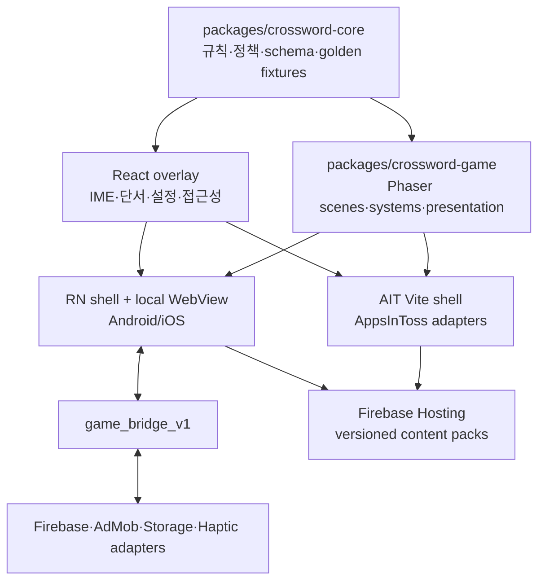

# 기술 제작 계획

- 제품명: `말길: 가로세로 모험` (제안명)
- 문서 상태: draft
- 소유자: Tech Lead / Production
- 버전/수정일: v0.2 / 2026-07-17
- Source of truth: 엔진, 런타임 아키텍처, 데이터, 성능, 마이그레이션과 제작 단계는 이 문서가 소유한다.
- Depends on: `AGENTS.md`, `docs/architecture.md`, `docs/market-parity.md`, `02-gdd.md`, `03-ui-ux-spec.md`
- Open blockers: `BLK-ENG-001`, `BLK-CONTENT-001`, `BLK-BRIDGE-001`, `BLK-A11Y-001`, `BLK-CAP-001`, `BLK-I18N-001`
- 승인 근거: 부분 승인 — 2026-07-17 사용자 메시지 `구조 다국어, 출시 콘텐츠 한국어 동의.` (`DEC-015`); 그 외 결정은 사용자 승인 전

## 아키텍처와 엔진

### 권고안

`Phaser 4.2.1 + React DOM 접근성 계층 + 기존 TypeScript core`를 Phase 0 후보로 권고한다. Phaser는 단어 길, 세계, 캐릭터, VFX, 카메라를 담당하고 React DOM은 한글 IME, 단서, 설정, 접근성 semantics를 담당한다. RN native 계층은 종료, 권한, 광고 같은 플랫폼 surface만 소유한다.

이 선택은 기존 화면에 효과만 붙이는 안이 아니다. `src/App.tsx`와 `apps/mobile/App.tsx`의 화면 코드는 이식하지 않고, 순수 도메인 계약만 보존해 새 scene과 화면 흐름을 만든다.

### 비교 기준

점수는 1~5이며 현재 저장소 제약에 대한 의사결정 보조다.

| 기준                | 가중치 | Phaser 4.2.1 | Godot 4.6.3 | Unity 6.3 LTS |
| ------------------- | -----: | -----------: | ----------: | ------------: |
| TS core 직접 재사용 |     25 |            5 |           1 |             1 |
| 3마켓 런타임        |     20 |            3 |           5 |             5 |
| 한글 IME·접근성     |     20 |            5 |           2 |             3 |
| AIT 시작·용량       |     15 |            5 |           4 |             3 |
| 현재 CI·팀 전환비   |     10 |            5 |           3 |             2 |
| 2D 세계 연출        |     10 |            4 |           5 |             5 |
| 가중 결과           |    100 |      **4.5** |         3.2 |           3.0 |

- **Phaser**: 기존 core와 Vite/AIT 경로를 직접 유지하고 DOM 입력을 쓸 수 있다. Android/iOS는 local WebView와 native bridge 품질이 핵심 위험이다.
- **Godot**: 네이티브·Web 단일 게임 코드가 강점이다. GDScript 포팅, AIT JS bridge, 한글 IME와 screen reader가 핵심 위험이며 TypeScript core의 단일 source 계약과 충돌한다.
- **Unity**: AIT 공식 SDK와 네이티브 export가 강점이다. C# 포팅, WebGL payload, 라이선스·CI 비용이 2D 퍼즐 범위에 비해 크다.

Phase 0에서 한글 입력이나 VoiceOver/TalkBack이 실패하면 먼저 DOM semantics, focus handoff, RN host 접근성 경계를 재설계한다. WebView 수명주기·WebGL·시작 성능을 해결하지 못하면 Godot 수직 슬라이스를 비교한다. 모바일 native 접근성 API가 제품 핵심이 되거나 3D 공간 연출이 범위에 들어올 때만 Unity를 다시 평가한다.

### 목표 구조



`GameController`가 core command를 적용하는 유일한 writer다. Phaser scene과 React DOM은 같은 immutable snapshot을 구독하는 projection이며 직접 완료, 보상, 분석 상태를 바꾸지 않는다. 입력은 `React → GameController command → core snapshot → Phaser/React render` 순서로만 흐른다.

### 디렉터리 제안

```text
packages/crossword-core/      순수 정책, 타입, schema, golden fixture
packages/crossword-game/      Phaser scene, animation, audio, world state
src/game-shell/               AIT React overlay와 adapter 조립
src/adapters/                 AppsInToss, Web Firebase, Storage, legacy migration
apps/mobile/                  RN local WebView shell과 native adapter
public/game-assets/           versioned atlas, audio, fonts
server/batch/                 콘텐츠 생성과 발행
```

`packages/crossword-core`에는 Phaser, React, React Native, AppsInToss, Firebase, AdMob import를 넣지 않는다.

### 다국어 경계 (`DEC-015`)

| 축             | 공통 구조                                                      | 출시 값                                   |
| -------------- | -------------------------------------------------------------- | ----------------------------------------- |
| UI             | BCP 47 `uiLocale`, stable message ID catalog, locale formatter | `supportedUiLocales=["ko-KR"]`            |
| 퍼즐 콘텐츠    | BCP 47 `contentLocale`, locale별 독립 pack·word bank·검수 원장 | `supportedContentLocales=["ko-KR"]`       |
| 스토어 listing | Play/App Store/AIT metadata locale                             | 현재 repo-local metadata의 `ko-KR`만      |
| 국가·지역 공개 | 각 마켓 콘솔 availability                                      | 이번 승인 범위가 아니며 별도 release 결정 |
| 일일 공개 시각 | manifest의 `releaseTimeZone`; 표시 locale과 독립               | `Asia/Seoul`                              |

`packages/crossword-core`에는 SDK 없는 `LanguageProfile` port를 둔다. 출시 구현은 `ko-KR/v1` 하나뿐이며 미래 영어 case-folding, CJK 분절, RTL 규칙을 미리 추정하지 않는다.

```ts
type LanguageProfile = {
  id: string;
  version: number;
  contentLocale: string;
  normalizeSource(value: string): string;
  segmentAnswer(value: string): string[];
  normalizeCommittedCell(value: string): string;
  validateCell(value: string): boolean;
  cellsEqual(left: string, right: string): boolean;
};
```

React/RN controller가 IME `isComposing`을 전달하고 조합 중에는 commit하지 않는다. profile은 commit된 값만 정규화·검증한다. `answer.length`, answer 문자열의 spread syntax, 한글 regex, `ko-KR`이 하드코딩된 `Intl` formatter를 공통 규칙으로 사용하지 않는다. 현재 `answerInput.ts`, `puzzle.ts`, `uiPolicy.ts`, `puzzleLabels.ts`, Web/Mobile UI의 `글자` 문구는 Phase 1 migration 대상이고, `build-krdict-wordbank.mjs`는 `ko-KR` 전용 producer로 유지한다.

### 부트 선택과 런타임 킬 스위치

- AIT와 RN host shell은 신규 engine chunk와 독립된 최소 legacy 진입점을 보존한다.
- bundled `game_runtime_enabled` 기본값은 `false`다. host는 Remote Config resolution을 2초로 제한하고, 그 안에 fetched snapshot을 확정하지 못하면 서명·schema를 검증한 cache, 그것도 없으면 bundled `false`를 사용한 뒤에만 engine chunk를 동적 import한다.
- import 직전 AIT `Storage.setItem()` 또는 mobile `AsyncStorage.setItem()`으로 `game_boot_pending` marker의 durable ack를 `await`한다. 1초 안에 ack가 없으면 import하지 않고 legacy를 연다. marker는 bridge handshake와 첫 interactive ack 뒤 지우며, 직전 marker가 남아 있으면 다음 시작은 engine import 없이 legacy로 진입한다.
- import, WebGL context, bridge handshake, 첫 interactive ack를 합친 5초 watchdog을 host가 소유한다. timeout·exception·white-screen probe 실패 시 engine surface를 폐기하고 같은 세션에서 legacy를 연다.
- Remote Config OFF가 online fetch 전에 반영되는 경로, cached ON+손상 chunk, offline cached ON+직전 boot marker를 AIT·Android·iOS release build에서 각각 검증한다. engine bundle이 config나 watchdog을 소유하면 실패다.

## 데이터 계약

### Game content schema v1

기존 unversioned puzzle·manifest DTO와 구분되는 신규 게임 전용 schema다. 하위 호환 reader를 유지하되 기존 `/puzzles` 경로를 즉시 교체하지 않는다.

| 필드                                          | 계약                                   |
| --------------------------------------------- | -------------------------------------- |
| `schemaVersion`                               | `game-content/1`                       |
| `contentLocale`, `releaseTimeZone`            | BCP 47 pack locale, 공개 기준 timezone |
| `languageProfile`                             | `{ id, version }`; 출시 `ko-KR/v1`     |
| `puzzleId`, `packId`, `slotId`                | 기존 안정 ID 유지                      |
| `grid`, `entries[].answerCells`, `difficulty` | `answerCells`가 gameplay 권위 셀 배열  |
| `themeId`, `chapterId`, `worldTriggerSet`     | 장면과 지도 연결                       |
| `generatorCommit`, `generatorConfigHash`      | 생성기 재현성                          |
| `contentChecksum`                             | 저장 snapshot과 무결성 비교            |
| `licenseManifestId`                           | 단서·답 출처 원장 연결                 |
| `review`                                      | 검수자 ID, 검수일, manual coverage     |
| `minClientVersion`                            | 호환하지 않는 client 차단              |

`entries[].answer`는 사람이 따로 작성하는 두 번째 권위값이 아니라 `answerCells.join("")`으로 생성하는 legacy projection이다. validator는 profile 정규화, `answer === answerCells.join("")`, grid 교차 셀, locale/profile version, checksum을 fail-closed로 비교한다. checksum에는 `contentLocale`, profile ID/version과 `answerCells`를 포함한다.

정답 JSON은 공개 클라이언트 자산이므로 secret으로 취급하지 않는다. 향후 경쟁 점수의 권위 판단은 공개 pack이 아닌 서버 검증으로 분리한다.

JSON Schema는 `clueSource`를 허용 enum으로 제한하고 `needsManualClue`의 명시적 `false`, 검수자, 검수일, `licenseManifestId`, `contentChecksum`, `generatorCommit`, `generatorConfigHash`를 required로 둔다. 필드 누락을 수동 검수 완료로 해석하지 않는 fail-closed validator를 생성기, staging, live URL 검사에 공통 적용한다.

신규 pack은 `/game-content/v1/{contentLocale}/packs/{packId}/{contentChecksum}.json` immutable 경로에 발행하고 `/game-content/v1/{contentLocale}/current.json` pointer를 분리한다. 요청 locale, manifest locale, payload locale이 다르면 차단하며 bundled/cache fallback도 같은 `contentLocale`만 허용한다. 기존 84개 `/puzzles` manifest는 legacy client가 참조하는 동안 유지한다. 신규 runtime의 staged rollout과 Save v2 검증 뒤에만 `ko-KR` current pointer를 전환하며, 이전 client 영향과 CDN cache를 관측한다.

### game_bridge_v1

| 방향      | 메시지                 | 필수 payload              | 응답                |
| --------- | ---------------------- | ------------------------- | ------------------- |
| Game→Host | `analytics.log`        | event, params, eventId    | ack                 |
| Game→Host | `storage.get/set`      | key, schemaVersion, value | result              |
| Game→Host | `ad.load/show`         | placement, transactionId  | lifecycle           |
| Game→Host | `haptic.play`          | semantic type             | ack                 |
| Game→Host | `notification.request` | reason                    | result              |
| Host→Game | `app.pause/resume`     | timestamp                 | ack                 |
| Host→Game | `config.snapshot`      | version, values           | ack                 |
| Host→Game | `locale.preferred`     | ordered BCP 47 UI locales | resolved `uiLocale` |
| Host→Game | `deep_link`            | allowlisted route         | navigation result   |

- 모든 메시지는 `bridgeVersion`, `messageId`, `timestamp`를 가진다.
- 시작 시 `sessionId`, version, capability handshake를 완료해야 command를 받는다.
- request와 response는 `messageId`로 연결하고 timeout, cancellation, 명시적 오류 상태를 가진다.
- WebView reload 이전 session의 늦은 광고·저장 callback은 폐기한다.
- host는 allowlist 외 type과 route, schema에 맞지 않는 양방향 payload, 크기 상한을 넘는 메시지를 거부한다.
- 광고와 저장은 transaction ID로 중복 호출에 안전해야 한다.
- 외부 navigation이 감지되면 bridge를 제거하고 화면을 차단한다.
- WebView는 bundled entry와 allowlisted HTTPS 콘텐츠만 열고 CSP, navigation delegate, origin allowlist, mixed-content 차단을 적용한다.
- WebView에서 임의 URL 이동, `eval`, 원격 executable code를 허용하지 않는다.

## 분석 이벤트 분류

현재 `gameAnalytics.ts`의 7개 이벤트 이름과 의미는 전환 중 바꾸지 않는다. legacy runtime만 현행 schema v1을 emit한다. 신규 runtime은 같은 핵심 이벤트도 `schema_version=2`와 locale context로 emit하고, 신규 게임 사건은 proposed schema v2로 추가한다. proposed 항목은 구현 전에는 분석 계약으로 간주하지 않는다.

| schema       | 분류   | 이벤트                                                                                                     | 핵심 파라미터                       | 용도             |
| ------------ | ------ | ---------------------------------------------------------------------------------------------------------- | ----------------------------------- | ---------------- |
| 이름 유지·v2 | 활성화 | `game_puzzle_start`, `game_first_input`                                                                    | market, puzzle, difficulty, elapsed | 기존 퍼널        |
| 이름 유지·v2 | 진행   | `game_progress`, `game_puzzle_complete`, `game_puzzle_abandon`                                             | progress, assist, elapsed           | 완료·이탈        |
| 이름 유지·v2 | 도움   | `game_hint_use`, `game_assist_ad`                                                                          | type, lifecycle                     | 도움·광고        |
| v2 제안      | 단어   | `game_word_complete`                                                                                       | entryIndex, chainBucket, assist     | 코어 루프 세분화 |
| v2 제안      | 세계   | `game_world_restore_start`, `game_world_restore_complete`, `game_map_node_unlock`                          | chapterId, sceneId, durationBucket  | 엔진 가치        |
| v2 제안      | FTUE   | `game_ftue_step_view`, `game_ftue_complete`, `game_ftue_skip`                                              | stepId, inputVariant                | 온보딩           |
| v2 제안      | 경제   | `game_currency_source`, `game_currency_sink`, `game_cosmetic_apply`                                        | currency, amountBucket, source      | 밸런스           |
| v2 제안      | 품질   | `game_save_write_result`, `game_save_migration_result`, `game_content_fallback`, `game_performance_sample` | version, resultCode, bucket         | 안정성           |

- 정답 문자열, 단서 원문, 자유 입력, 광고 ID, device identifier를 event parameter에 넣지 않는다.
- 신규 runtime의 모든 event는 `schema_version=2`, `eventId`, allowlist된 `ui_locale`, `content_locale`, `language_profile_id`, `language_profile_version`을 필수로 가진다. `eventId`는 AIT와 Firebase 이중 sink 및 전환기 dual-write 중복 식별에 사용한다.
- 이벤트 질문, trigger, 필수 parameter, enum, cardinality, privacy 등급을 `packages/crossword-core` schema에 먼저 추가하고 세 adapter와 BigQuery 검증 SQL을 같은 변경에서 배포한다.
- BigQuery compatibility view는 동일 event name의 legacy v1과 신규 runtime v2를 한 퍼널로 병합하고, `eventId`가 있는 dual-write record를 중복 제거한다.
- 이벤트 이름과 필수 파라미터는 core contract test로 세 시장을 비교한다.
- 기존 GA4 퍼널과 연결하기 위해 start, first input, complete, abandon의 의미를 바꾸지 않는다.
- 정답·단서·`answerCells` 원문은 locale context와 별개로 기록하지 않는다.
- legacy v1의 locale 누락은 pre-cutover app/schema에 한해 BigQuery compatibility view에서 `ko-KR`로 보정하며 신규 event의 일반 fallback으로 사용하지 않는다.

현재 dependency에는 Crashlytics가 없고 AIT crash-free provider도 확인되지 않았으므로 crash/save KPI는 아직 측정 gate가 아니다. Android는 Play Android vitals, iOS는 App Store Connect crash report를 기본 source로 쓰고 native Crashlytics 추가는 privacy review와 함께 결정한다. AIT는 local unclean-session marker와 다음 시작의 recovery event로 fatal proxy를 만들되 `crash-free`와 같은 지표로 부르지 않는다. Save v2는 모든 write attempt/result를 집계 가능한 v2 event로 남기고 BigQuery SQL에서 성공 분모, 시장, app/content version을 고정한다.

## 성능 예산

| 항목                   | 내부 목표                                        | 내부 출시 차단                                       | 플랫폼 하드 기준    |
| ---------------------- | ------------------------------------------------ | ---------------------------------------------------- | ------------------- |
| AIT 상호작용 가능 P75  | 2.5초 이하                                       | 저사양 5초 초과                                      | 최초 화면 10초 이내 |
| 첫 입력→next paint p95 | 80ms 이하                                        | 150ms 초과 지속                                      | 없음                |
| 활성 연출 frame time   | 기준 P90≤18ms·P99≤33ms, 저사양 P90≤33ms·P99≤50ms | P99 상한 초과 또는 5분당 100ms hitch 기준>1·저사양>2 | 없음                |
| 저사양 memory          | 120MB 이하                                       | 200MB 초과                                           | 없음                |
| `.ait` 압축 해제 크기  | 60MB 이하                                        | 80MB 초과 시 감량                                    | 100MB 미만          |
| 초기 압축 game payload | 12MB 이하                                        | 20MB 초과                                            | 없음                |
| atlas texture          | 동시 32MB 이하                                   | GPU profile 실패                                     | 없음                |
| 오디오                 | 동시 stream 2, SFX voice 8                       | background에서 voice 1개 이상                        | 없음                |

- 첫 scene에는 튜토리얼에 필요한 atlas와 font만 넣고 나머지는 idle 시 불러온다.
- 출시 renderer는 AIT·Android WebView·WKWebView에서 공통 검증한 WebGL 경로로 고정하고 WebGPU는 범위에서 제외한다.
- device pixel ratio는 2를 상한으로 시작해 Compact 저사양 기기에서 동적으로 낮춘다.
- 2048 texture를 기본 상한으로 두고 저사양에서는 half-resolution atlas를 선택한다.
- inactive scene의 timer, tween, audio, input listener를 모두 정리한다.
- 정적 단서 읽기 구간은 render loop를 감속하고 background에서는 중단한다.
- WebGL context loss와 WebView process eviction 뒤에는 texture를 다시 만들고 마지막 Save v2 journal에서 scene을 복원한다.
- 단어 완료, atlas streaming, shader compile을 포함한 5분 trace에서 average/P90/P99 frame time과 100ms 이상 hitch를 기록한다. 기준 기기는 hitch 1회 이하, 저사양은 2회 이하이며 WebGL context loss는 0회다.
- 성능 숫자는 AIT 샌드박스, Android release, iOS release 실기기에서 수집한다.

## 저장 마이그레이션

### Save v2

```text
saveVersion
profile: settings, uiLocale, activeContentLocale, inputMode, accessibility
content[contentLocale]: puzzle snapshots, completed IDs, current word, cell values, map nodes, cards, streak, completion records
economyRecords: immutable grant, currency ledger, cosmetic entitlement records; each has contentLocale and scopeVersion
legacy: postcard
migration: sourceVersion, migratedAt, checksum
```

`economyRecords`는 발생 locale을 잃지 않는 원장이지, locale 간 잔액·cosmetic 공유 정책을 미리 결정하는 schema가 아니다. 후속 locale의 balance projection과 cosmetic 공유 범위는 별도 경제 결정 전까지 계산·직렬화하지 않는다. `uiLocale` 같은 global setting과 legacy postcard만 content namespace 밖에 둔다. journal, archive, grant ID와 원장 transaction ID는 모두 `contentLocale`을 유지한다.

### 절차

1. 기존 AIT live-origin localStorage 또는 mobile AsyncStorage를 읽기 전 read-only backup을 만든다.
2. 기존 완료 ID, 진행 셀, 스트릭, 기록, 힌트·연필·reveal 상태를 `contentLocale=ko-KR` namespace로만 정규화한다.
3. v2를 임시 key에 쓰고 checksum과 golden fixture를 검증한다.
4. 성공하면 active pointer를 v2로 바꾸고 legacy가 읽을 수 있는 현행 `SavedProgress`, mission, streak, completion, settings projection을 dual-write한다.
5. 실패하면 기존 앱 또는 legacy reader로 돌아가고 v2 제안 `game_save_migration_result` 오류 코드만 기록한다.

마이그레이션은 여러 번 실행해도 같은 결과여야 한다. 현재 mobile이 일부 reveal·tentative 상태를 버리는 패리티 부채는 v2에서 승계하지 않는다. legacy key는 한 release가 아니라 leapfrog upgrade와 단계 배포 성공이 확인될 때까지 삭제하지 않는다.

commit된 셀마다 `contentLocale`, `puzzleId`, content checksum, cell delta, command sequence와 base save checksum만 담은 compact emergency journal을 canonical write 전에 남긴다. 재화, 광고 보상, 구매·entitlement는 journal에 넣지 않고 원자적 ledger만 사용한다. AIT `Storage` 또는 mobile `AsyncStorage` ack 뒤 journal을 지우며, 다음 시작에는 locale, base checksum과 command sequence가 맞을 때만 한 번 재적용한다. 2초 안에 durable ack가 없으면 저장 실패 UI를 보여 주고 재시도 또는 마지막 durable snapshot으로 명시적 이탈하게 한다.

fixture는 확인된 AIT/Play internal `v0.3.108`, App Store TestFlight `v1.0.1`, version 없는 Web·mobile 저장, 현재 main을 각각 출발점으로 둔다. 한 버전 이상을 건너뛴 upgrade, v2→legacy reversible projection, legacy runtime rollback을 GATE-SAVE에서 검증한다. 신규 지도·재화는 legacy가 표현할 수 없으므로 rollback 시 v2 namespace에 보존하고 legacy 화면에서는 읽기 전용으로 숨긴다.

legacy dual-write는 completion·settings뿐 아니라 시장별 기존 reader가 실제로 읽는 진행 필드를 projection한다. 선택 단어, 지도, cosmetic, 신규 재화처럼 legacy DTO가 표현하지 못하는 값은 v2 namespace에 보존하며 rollback 비교 report에 명시한다.

| 저장 필드 그룹                                         | AIT/Web legacy  | mobile legacy 현재 main      | rollout 계약                                                                 |
| ------------------------------------------------------ | --------------- | ---------------------------- | ---------------------------------------------------------------------------- |
| `cellValues`, `earnedHintCredits`, `hintCount`         | 읽기·쓰기       | 읽기·쓰기                    | 양쪽 dual-write와 fixture equality                                           |
| `revealUsed`, `tentativeCells`                         | 읽기·쓰기       | reader·write effect에서 누락 | mobile legacy를 먼저 보정하고 tag fixture를 통과하기 전 mobile runtime은 OFF |
| mission, streak, completion record, settings           | 시장별 기존 key | 시장별 기존 key              | 각 tag의 실제 key/DTO inventory로 projection하고 필드별 equality 검증        |
| current word, map, cosmetic, 신규 currency·entitlement | 표현 불가       | 표현 불가                    | v2 namespace와 원자적 ledger에 보존, legacy에서는 숨김                       |

GATE-SAVE는 rollback 직후 각 시장의 legacy 표현 가능 필드가 pre-switch fixture와 같고, v2-only 값이 runtime 재활성화 뒤 그대로 복구되는지 검증한다.

AIT의 canonical 영속 저장은 AppsInToss `Storage` API다. localStorage는 기존 사용자 migration source와 비치명 cache로만 사용한다. QR 테스트 origin과 live origin이 저장을 공유하지 않는 조건을 전제로, 실제 live-origin localStorage→Storage 변환과 rollback을 별도 gate로 검증한다.

## 백엔드와 보안 경계

- 출시 최소 범위는 로그인 없는 local-first를 유지한다.
- Firebase Hosting은 공개 versioned puzzle pack만 서빙한다.
- Firebase Analytics와 Remote Config는 adapter가 담당하고 core에 SDK를 넣지 않는다.
- Auth, Firestore, Cloud Storage는 기기 이전이나 친구 기능이 승인될 때 rules와 threat model부터 추가한다.
- 생성 Job의 service credential은 `~/.config/seorilabs` 또는 CI secret에서만 읽고 출력·커밋하지 않는다.
- manifest 발행은 generator commit, config hash, license manifest, checksum 검증 뒤 atomic pointer를 교체한다.
- 원격 콘텐츠는 데이터일 뿐 script, shader code, HTML을 포함하지 않는다.
- 오류 제보는 정답 원문, 자유 입력, 로컬 save 전체를 자동 전송하지 않는다.

## 플랫폼 연동

| 기능       | AIT                        | Android/iOS                         | 공통 계약                           |
| ---------- | -------------------------- | ----------------------------------- | ----------------------------------- |
| 게임 렌더  | Vite의 Phaser canvas       | local bundled WebView               | game chunk·asset manifest 동일 hash |
| IME·접근성 | React DOM, canvas는 숨김   | WebView DOM + RN host focus handoff | input state machine                 |
| 저장       | AppsInToss Storage adapter | AsyncStorage native bridge          | Save v2 repository                  |
| 분석       | AppsInToss + Firebase Web  | RNFirebase                          | v1 유지 + proposed v2 eventId       |
| 광고       | AppsInToss IntegratedAd    | AdMob native                        | placement lifecycle                 |
| 햅틱       | AIT adapter                | native haptic                       | semantic event                      |
| 알림       | AIT agreement              | native permission adapter           | core prompt policy                  |
| 콘텐츠     | Firebase Hosting fetch     | Firebase Hosting + bundled fallback | `game-content/1`                    |

Native Firebase 설정 파일은 커밋하지 않고 `scripts/restore-mobile-firebase-config.mjs`로 복구한다. RNFirebase iOS의 static framework와 `RCT_USE_RN_DEP=0`, `RCT_USE_PREBUILT_RNCORE=0` 설정을 유지한다.

Phase 0은 Android asset 경로와 iOS bundle 경로에서 local HTML, hashed JS, font, audio를 각각 검증한다. 올바른 base URL, Firebase Hosting CORS, iOS ATS, 완전 오프라인 cold start, CSP, origin allowlist, mixed-content 차단, WebGL context 복구가 모두 통과해야 한다. 동일 shell binary가 아니라 `crossword-game` chunk와 asset manifest checksum 일치를 패리티 기준으로 삼는다.

현재 `apps/mobile`에는 `react-native-webview`가 없으므로 local WebView는 구현 완료 전제가 아니라 BLK-BRIDGE-001 가정이다. Phase 0 spike에서만 의존성을 추가해 위 gate를 통과한 뒤 목표 구조로 승격한다.

## 제작 단계

| 단계                  | 기간 가정 | 산출물                                                                                 | 종료 gate                                |
| --------------------- | --------: | -------------------------------------------------------------------------------------- | ---------------------------------------- |
| 0A 운영 정상화        |     1~2주 | 검수 후보 생성기, fail-closed schema, staging 반복, image digest 배포, live monitor    | explicit manual 100%, config hash 일치   |
| 0B 엔진 수직 슬라이스 |       2주 | `ko-KR` 퍼즐 1개, IME, synthetic locale fixture, 연출, Storage, 세 시장 build          | 성능·접근성·복귀·locale·local asset gate |
| 1 코어와 shell        |     5~6주 | `crossword-game`, React overlay, bridge v1, Save v2, catalog·LanguageProfile·namespace | golden tests와 locale/market parity      |
| 2 제품 수직 완성      |       4주 | FTUE, 지도, 퍼즐, 결과, 컬렉션                                                         | 10명 사용성 테스트                       |
| 3 콘텐츠·경제         |       6주 | 93개 보드, 3챕터, 꾸미기 12종                                                          | 콘텐츠와 경제 gate                       |
| 4 안정화              |       4주 | 기기 QA, store metadata, migration rehearsal                                           | 론칭 gate 전부 통과                      |
| 5 소프트론칭          |       4주 | 단계 rollout, 지표 판단, rollback rehearsal                                            | KPI 또는 재설계 결정                     |

다국어 구조 승인으로 Phase 1에 2~3주를 추가해 총 26~28주로 다시 가정한다. 추가 언어 콘텐츠 제작 기간은 포함하지 않는다. 운영 콘텐츠 정상화와 수직 슬라이스가 끝나기 전에는 전체 에셋·콘텐츠 양산을 시작하지 않는다.

Phase 0A는 현재 main을 그대로 재배포하는 작업이 아니다. 현재 40% 허용 validator와 수동 검수 503개 제약을 먼저 바꾼다. 순서는 `검수 완료 후보만 선택 → required field를 강제하는 JSON Schema → staging에서 최소 30개 연속 pack 생성·strict 검증 → generator commit과 image digest 고정 → Cloud Run 배포 → 신규 immutable 경로의 전체 JSON 재다운로드 검증`이다. 실패하면 검수 단서 풀과 일정부터 늘리고 허용치를 완화하지 않는다.

## 빌드와 테스트 명령

### 현재 저장소 기준

```bash
npm run lint
npm run validate:puzzles
npm run test:adapters
npm run test:core
npm run test:components
npm run build
npm run check:release-parity
npm run check:mobile
```

2026-07-17 main에서 core 386개, adapter 88개, component 124개 테스트와 puzzle validation, release parity가 통과한 상태를 기준선으로 둔다.

### Phase 1에서 추가할 계약

```bash
npm run test:game
npm run test:bridge
npm run test:save-migration
npm run test:language-profiles
npm run test:golden-parity
npm run check:i18n
npm run check:content-locales
npm run check:game-assets
npm run check:content-live
npm run build:game
npm run build:game:mobile
```

명령 구현과 CI 연결은 같은 변경에서 추가한다. AIT/Web 일반 작업은 private repo의 `seorilabs-rpi-arm64`, Android release는 x64 Linux, iOS release는 macOS runner 경계를 유지한다.

### Phase 0 실기기 증거

```text
AIT sandbox .ait + launch/performance log
Android release APK/AAB + frame/memory trace
iOS release/TestFlight + Instruments trace
VoiceOver/TalkBack completion recording
background/ad/resume repetition 20회 결과
```
