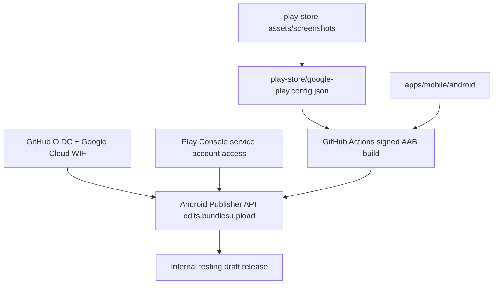

# Google Play 출시 자동화

## 현재 판정

현재 `crossword-puzzle`은 AppsInToss WebView/Vite 앱을 유지하면서 Google Play/App Store용 React Native `apps/mobile` skeleton을 함께 둔다.

`apps/mobile`에는 Android/iOS 네이티브 프로젝트가 생성되어 있지만, 아직 실제 퍼즐 UI 포팅과 release upload key 설정이 끝나지 않았다. 따라서 지금 단계의 목표는 internal testing draft release를 만들 수 있는 빌드/업로드 체계를 유지하면서 남은 blocker를 명시하는 것이다.



## 현재 추가된 자동화

| 파일                                      | 역할                                                                          |
| ----------------------------------------- | ----------------------------------------------------------------------------- |
| `play-store/google-play.config.json`      | Play 등록/출시 source of truth                                                |
| `scripts/check-google-play-readiness.mjs` | packageName, 정책값, 이미지, Android 프로젝트, AAB, upload workflow 상태 점검 |
| `scripts/setup-google-play-wif.sh`        | Google Cloud WIF + deploy service account 생성/바인딩 자동화                  |
| `scripts/upload-google-play-internal.py`  | Android Publisher API로 AAB를 internal track에 업로드                         |
| `.github/workflows/build-google-play.yml` | signed AAB build, artifact 보관, 선택적 internal upload                       |
| `docs/google-play-store-listing.md`       | 스토어 등록값과 미확정 항목                                                   |

## 1. Package Name 먼저 확정

Play Console의 package name은 고유하고 영구적이다. 현재 후보는 다음 값이다.

```text
com.seorilabs.crosswordpuzzle
```

확정하면 `play-store/google-play.config.json.packageName`과 Android `applicationId`를 같은 값으로 맞춘다.

## 2. Google Cloud deploy service account 준비

장기 service account JSON key보다 GitHub Actions OIDC + Workload Identity Federation을 기본값으로 둔다.

전제 조건:

- 사용할 Google Cloud project가 있어야 한다. 없으면 Google Cloud Console에서 먼저 만든다.
- 이 project에서 Play Developer API와 WIF 관련 API를 활성화할 권한이 있어야 한다.
- Play Console 앱 shell이 있어야 service account에 앱 단위 권한을 줄 수 있다.

먼저 dry-run으로 생성 계획을 확인한다.

```bash
scripts/setup-google-play-wif.sh --project-id <gcp-project-id>
```

계획이 맞으면 적용한다.

```bash
scripts/setup-google-play-wif.sh --project-id <gcp-project-id> --apply
```

이 스크립트가 하는 일:

- `androidpublisher.googleapis.com`, `iamcredentials.googleapis.com`, `sts.googleapis.com` 활성화
- GitHub Actions용 Workload Identity Pool/Provider 생성
- `crossword-puzzle-play-publisher@<project>.iam.gserviceaccount.com` 생성
- `seorilabs/crossword-puzzle` repo만 해당 service account를 impersonate할 수 있게 IAM binding 추가
- GitHub repository variables 설정

생성 후 Play Console에서 수동으로 해야 하는 일:

1. Play Console > Users and permissions로 이동한다.
2. 생성된 service account 이메일을 초대한다.
3. 이 앱에 대한 앱 단위 권한을 부여한다.
4. 최소 목표는 앱 정보 보기와 internal/closed testing release 관리 권한이다.

Google 공식 문서 기준으로 service account는 Google Cloud에서 만들고 Play Console Users & permissions에서 초대해 권한을 부여해야 한다.

## 3. Play Console 앱 shell 생성

첫 앱 생성은 API 자동화 대상이 아니다. Play Console에서 직접 만든다.

입력해야 할 값:

- 기본 언어: `ko-KR`
- 앱 이름: `가로세로낱말퍼즐`
- 앱/게임: `게임`
- 무료/유료: `무료`
- 고객 문의 이메일: `cs@seorilabs.com`
- packageName: 확정 후 Android 빌드와 동일하게 사용
- Play App Signing 약관/설정

## 4. Android AAB 타깃

현재 선택지는 `apps/mobile` React Native 타깃이다. Android/iOS를 별도 앱으로 나누지 않는다.

현재 생성값:

| 항목                     | 값                                                                     |
| ------------------------ | ---------------------------------------------------------------------- |
| RN version               | `0.85.3`                                                               |
| Android applicationId    | `com.seorilabs.crosswordpuzzle`                                        |
| iOS bundle id            | `com.seorilabs.crosswordpuzzle`                                        |
| Android targetSdkVersion | `36`                                                                   |
| AAB path                 | `apps/mobile/android/app/build/outputs/bundle/release/app-release.aab` |

공통 필수 조건:

- `applicationId == play-store/google-play.config.json.packageName`
- `targetSdk >= 35`
- `versionCode` 증가 가능
- release signing이 debug keystore가 아니어야 함
- signed `.aab` 생성 가능

## 5. Upload Key와 GitHub Secrets

Android 타깃을 만든 뒤 upload key를 만든다. 예시는 alias 후보값이다.

```bash
mkdir -p play-store/secrets
keytool -genkeypair \
  -v \
  -keystore play-store/secrets/crossword-puzzle-upload-key.jks \
  -alias crossword-puzzle-upload \
  -keyalg RSA \
  -keysize 2048 \
  -validity 10000
```

GitHub Actions secret/variable:

```bash
base64 -i play-store/secrets/crossword-puzzle-upload-key.jks | tr -d '\n' | gh secret set GOOGLE_PLAY_UPLOAD_KEYSTORE_BASE64
gh secret set GOOGLE_PLAY_UPLOAD_KEYSTORE_PASSWORD
gh variable set GOOGLE_PLAY_UPLOAD_KEY_ALIAS --body "crossword-puzzle-upload"
```

key password가 keystore password와 다르면 추가한다.

```bash
gh secret set GOOGLE_PLAY_UPLOAD_KEY_PASSWORD
```

## 6. Internal Track 업로드

Android 타깃과 service account 권한이 준비되면 먼저 artifact build만 실행한다.

```bash
gh workflow run build-google-play.yml -f upload_to_internal=false
```

업로드까지 실행한다.

```bash
gh workflow run build-google-play.yml \
  -f upload_to_internal=true \
  -f release_status=draft
```

첫 목표는 production rollout이 아니라 internal testing draft release다.

## 7. 로컬 검증/적용 명령

현재 blocker를 확인한다.

```bash
npm run check:play
python3 /Users/syous/.codex/skills/google-play-store-registration/scripts/validate_play_store_config.py --root . --allow-missing-tablet
```

Play Console 앱 shell과 API 권한이 준비된 뒤 listing API dry-run:

현재는 `packageName`과 `privacyPolicyUrl`이 `확정 필요`라 아래 명령도 실패하는 것이 정상이다. 두 값을 확정한 뒤 실행한다.

```bash
python3 /Users/syous/.codex/skills/google-play-store-registration/scripts/apply_play_store_listing.py --root . --dry-run --allow-missing-tablet --allow-console-gates
```

listing 적용:

```bash
python3 /Users/syous/.codex/skills/google-play-store-registration/scripts/apply_play_store_listing.py --root . --apply --replace-images --allow-missing-tablet --allow-console-gates
```

로컬 ADC가 필요하면 다음을 사용한다.

```bash
gcloud auth application-default login --scopes=https://www.googleapis.com/auth/androidpublisher,https://www.googleapis.com/auth/cloud-platform
gcloud auth application-default print-access-token >/dev/null
python3 -m pip install --user google-api-python-client google-auth google-auth-httplib2 httplib2
```

## 현재 남은 blocker

- packageName 최종 확정
- 개인정보 처리방침 URL과 실제 문구 검토
- Android 타깃 생성
- upload key 생성과 GitHub secrets 설정
- Play Console 앱 shell 생성
- Play Console service account 초대/권한 부여
- 콘텐츠 등급, 타겟 연령, Data Safety, 한국 게임 등급 판단
- Google Play용 tablet screenshot 필요 여부 판단

## 참고 공식 문서

- [Google Play Developer API Getting started](https://developers.google.com/android-publisher/getting_started)
- [Create and set up your app](https://support.google.com/googleplay/android-developer/answer/9859152)
- [Target API level requirements](https://support.google.com/googleplay/android-developer/answer/11926878)
- [Android Publisher edits.bundles.upload](https://developers.google.com/android-publisher/api-ref/rest/v3/edits.bundles/upload)
- [Google Cloud Workload Identity Federation for deployment pipelines](https://cloud.google.com/iam/docs/workload-identity-federation-with-deployment-pipelines)
