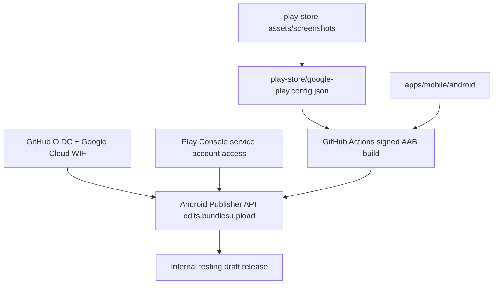

# Google Play 출시 자동화

## 현재 판정

현재 `crossword-puzzle`의 1차 론칭 목표는 AppsInToss WebView다. Google Play/App Store용 React Native `apps/mobile` 타깃은 앱인토스와 같은 퍼즐 UI를 네이티브로 빌드할 수 있는 상태를 우선한다.

제출용 release upload key가 없으면 Android release 빌드는 repo-local `debug.keystore` fallback으로 서명해 산출물을 만든다. 이 fallback AAB는 빌드 확인용이며, Play 제출용으로는 upload key 기반 서명이 필요하다. AIT 론칭 전에는 Play internal testing draft release를 필수 blocker로 보지 않고, 빌드/업로드 체계와 남은 blocker를 문서로 유지한다.



## 현재 추가된 자동화

| 파일                                      | 역할                                                                          |
| ----------------------------------------- | ----------------------------------------------------------------------------- |
| `play-store/google-play.config.json`      | Play 등록/출시 source of truth                                                |
| `scripts/check-google-play-readiness.mjs` | packageName, 정책값, 이미지, Android 프로젝트, AAB, upload workflow 상태 점검 |
| `scripts/setup-google-play-wif.sh`        | shared Play publisher service account에 repo별 WIF impersonation 권한 추가    |
| `scripts/apply-google-play-listing.py`    | API로 쓰기 가능한 Play listing/details/images 적용                            |
| `scripts/upload-google-play-internal.py`  | Android Publisher API로 AAB를 internal track에 업로드                         |
| `.github/workflows/deploy-google-play.yml` | signed AAB build, artifact 보관, 선택적 internal upload                       |
| `docs/google-play-store-listing.md`       | 스토어 등록값과 미확정 항목                                                   |

## 1. Package Name

Play Console의 package name은 고유하고 영구적이다. 현재 후보는 다음 값이다.

```text
com.seorilabs.crosswordpuzzle
```

`play-store/google-play.config.json.packageName`과 Android `applicationId`는 이 값으로 맞춘다.

## 2. Shared Play publisher service account 준비

장기 service account JSON key보다 GitHub Actions OIDC + Workload Identity Federation을 기본값으로 둔다. 여러 앱 repo를 계속 추가할 것이므로 앱별 service account가 아니라 shared Play publisher service account 1개를 기본값으로 둔다.

전제 조건:

- 사용할 Google Cloud project가 있어야 한다. 없으면 Google Cloud Console에서 먼저 만든다.
- 이 project에서 Play Developer API와 WIF 관련 API를 활성화할 권한이 있어야 한다.
- Play Console에서 shared service account를 한 번 초대하고 필요한 권한을 부여한다.
- 새 앱마다 콘솔 권한 작업을 반복하지 않으려면 shared service account에 account-level 권한을 둔다. 더 좁은 blast radius를 원하면 app-level 권한을 쓰되, 그 경우 새 앱마다 권한 추가는 수동/별도 API 작업이 된다.

새 repo를 shared service account에 연결할 때는 dry-run으로 계획을 확인한다.

```bash
npm run play:onboard:repo -- --project-id <gcp-project-id> --github-repo crossword-puzzle
```

계획이 맞으면 적용한다.

```bash
npm run play:onboard:repo -- --project-id <gcp-project-id> --github-repo crossword-puzzle --apply
```

이 스크립트가 하는 일:

- `androidpublisher.googleapis.com`, `iamcredentials.googleapis.com`, `sts.googleapis.com` 활성화
- GitHub Actions용 Workload Identity Pool/Provider 생성
- `seorilabs-play-publisher@<project>.iam.gserviceaccount.com` shared service account 생성 또는 재사용
- 지정한 GitHub repo만 shared service account를 impersonate할 수 있게 IAM binding 추가
- 해당 repo의 GitHub repository variables 설정

생성 후 Play Console에서 수동으로 해야 하는 일:

1. Play Console > Users and permissions로 이동한다.
2. shared service account 이메일을 초대한다.
3. 새 앱별 콘솔 권한 반복을 피하려면 account-level 권한을 부여한다.
4. 최소 목표는 앱 정보 보기, store presence 관리, internal/closed testing release 관리 권한이다.

Google 공식 문서 기준으로 service account는 Google Cloud에서 만들고 Play Console Users & permissions에서 초대해 권한을 부여해야 한다.

## 3. Play Console 앱 shell 생성

첫 앱 생성은 API 자동화 대상이 아니다. Play Console에서 직접 만든다.

입력해야 할 값:

- 기본 언어: `ko-KR`
- 앱 이름: `가로세로 낱말 퍼즐`
- 앱/게임: `게임`
- 무료/유료: `무료`
- 고객 문의 이메일: `cs@seorilabs.com`
- packageName: 확정 후 Android 빌드와 동일하게 사용
- Play App Signing 약관/설정

## 4. Android AAB 타깃

현재 선택지는 `apps/mobile` React Native 타깃이다. Android/iOS를 별도 앱으로 나누지 않는다.

현재 생성값:

| 항목                     | 값                                                                     |
| ------------------------ | ---------------------------------------------------------------------- |
| RN version               | `0.85.3`                                                               |
| Android applicationId    | `com.seorilabs.crosswordpuzzle`                                        |
| iOS bundle id            | `com.seorilabs.crosswordpuzzle`                                        |
| Android targetSdkVersion | `36`                                                                   |
| AAB path                 | `apps/mobile/android/app/build/outputs/bundle/release/app-release.aab` |

공통 제출 조건:

- `applicationId == play-store/google-play.config.json.packageName`
- `targetSdk >= 35`
- `versionCode` 증가 가능
- release signing이 debug keystore가 아니어야 함
- signed `.aab` 생성 가능

로컬 빌드 확인 조건:

- `npm run build`
- `npm run check:mobile`
- `npm run build:android`

macOS 로컬 기본 JDK가 GraalVM/JDK 22인 경우 Android 36 `core-for-system-modules.jar` 변환 단계에서 `jlink` 실패가 날 수 있다. 로컬 Android release AAB는 JDK 17로 고정해 확인한다.

```bash
JAVA_HOME=$(/usr/libexec/java_home -v 17) npm run build:android
```

## 5. Upload Key와 GitHub Secrets

Android 타깃을 만든 뒤 upload key를 만든다. 예시는 alias 후보값이다.

```bash
mkdir -p play-store/secrets
keytool -genkeypair \
  -v \
  -keystore play-store/secrets/crossword-puzzle-upload-key.jks \
  -alias crossword-puzzle-upload \
  -keyalg RSA \
  -keysize 2048 \
  -validity 10000
```

GitHub Actions secret/variable:

```bash
base64 -i play-store/secrets/crossword-puzzle-upload-key.jks | tr -d '\n' | gh secret set GOOGLE_PLAY_UPLOAD_KEYSTORE_BASE64
gh secret set GOOGLE_PLAY_UPLOAD_KEYSTORE_PASSWORD
gh variable set GOOGLE_PLAY_UPLOAD_KEY_ALIAS --body "crossword-puzzle-upload"
```

key password가 keystore password와 다르면 추가한다.

```bash
gh secret set GOOGLE_PLAY_UPLOAD_KEY_PASSWORD
```

Android Firebase native config도 release build 전에 복구해야 한다.

```bash
base64 -i apps/mobile/android/app/google-services.json | tr -d '\n' | gh secret set FIREBASE_ANDROID_GOOGLE_SERVICES_JSON_BASE64
```

## 6. Internal Track 업로드

Android 타깃과 service account 권한이 준비되면 먼저 artifact build만 실행한다.

```bash
gh workflow run deploy-google-play.yml \
  -f release_tag=v0.1.1 \
  -f upload_to_internal=false
```

업로드까지 실행한다.

```bash
gh workflow run deploy-google-play.yml \
  -f release_tag=v0.1.1 \
  -f upload_to_internal=true \
  -f release_status=draft
```

첫 목표는 production rollout이 아니라 internal testing draft release다.
`upload_to_internal=true`일 때는 `release_tag`가 필수이며, Android `versionName`, `versionCode`, Play release name은 해당 태그에서 계산한다.

## 7. API listing/details/images 적용

아래 항목은 API 자동화 범위에서 제외한다. 앱 shell 생성과 정책 판단은 사람이 먼저 고정한다.

- 최초 앱 생성
- privacy policy URL 설정/검토
- Target audience
- 콘텐츠 등급/IARC
- 한국 게임 등급/GRAC 판단
- 정책 선언의 정확성

그 외 API로 쓰기 가능한 details/listing/images는 repo-local config에서 적용한다.

Dry-run:

```bash
npm run play:listing:dry-run
```

적용:

```bash
npm run play:listing:apply
```

검증:

```bash
npm run play:listing:verify
```

이 CLI는 `play-store/google-play.config.json`에서 다음 항목을 읽어 Android Publisher API에 쓴다.

- default language
- support email / website / phone
- localized title / short description / full description / video
- app icon
- feature graphic
- phone/tablet screenshots

privacy policy URL은 config에 확정값으로 추적하지만 이 listing CLI가 쓰지 않는다. Play Console에서 직접 입력/검토해야 한다. Data Safety 판단, Target audience, IARC, GRAC도 API listing 적용을 막지 않지만 최종 제출 전 Console gate로 남긴다.

## 8. 로컬 검증/적용 명령

현재 blocker를 확인한다.

```bash
npm run check:play
python3 /Users/syous/.codex/skills/google-play-store-registration/scripts/validate_play_store_config.py --root . --allow-missing-tablet
```

Console gate를 열어 둔 채 API로 쓸 수 있는 listing/details/images만 검증하려면 아래 명령을 쓴다.

```bash
python3 /Users/syous/.codex/skills/google-play-store-registration/scripts/validate_play_store_config.py --root . --allow-missing-tablet --allow-console-gates
npm run play:listing:dry-run
```

listing apply/verify는 Android Publisher API 인증이 필요하다. 로컬 ADC가 만료되었거나 없으면 다음을 사용한다.

```bash
gcloud auth application-default login --scopes=https://www.googleapis.com/auth/androidpublisher,https://www.googleapis.com/auth/cloud-platform
gcloud auth application-default print-access-token >/dev/null
python3 -m pip install --user google-api-python-client google-auth google-auth-httplib2 httplib2
```

## 현재 남은 blocker

- Play Console privacy policy URL 입력/검토
- upload key GitHub secrets 설정
- shared Play publisher service account Play Console 권한 부여 확인
- 콘텐츠 등급, 타겟 연령, Data Safety, 한국 게임 등급 판단
- Google Play용 tablet screenshot 필요 여부 판단

## 2026-06-07 앱 정보 API 반영

- `gcloud auth application-default login --scopes=https://www.googleapis.com/auth/androidpublisher,https://www.googleapis.com/auth/cloud-platform`로 로컬 ADC를 재인증했다.
- `npm run play:listing:apply`로 Android Publisher API edit `01758169730218357159`를 commit했다.
- 반영 범위: support email/website, 한국어 앱명/짧은 설명/상세 설명, 앱 아이콘, feature graphic, phone screenshot 3장.
- `npm run play:listing:verify` 결과 API readback이 repo config와 일치했다.
- `npm run check:play`는 여전히 `dataSafety`, `contentRating`, `targetAudience`, `koreaGameRating` 때문에 실패한다. 이는 Play Console 정책 gate가 끝나기 전까지 의도한 상태다.

## 참고 공식 문서

- [Google Play Developer API Getting started](https://developers.google.com/android-publisher/getting_started)
- [Create and set up your app](https://support.google.com/googleplay/android-developer/answer/9859152)
- [Target API level requirements](https://support.google.com/googleplay/android-developer/answer/11926878)
- [Android Publisher edits.bundles.upload](https://developers.google.com/android-publisher/api-ref/rest/v3/edits.bundles/upload)
- [Google Cloud Workload Identity Federation for deployment pipelines](https://cloud.google.com/iam/docs/workload-identity-federation-with-deployment-pipelines)
