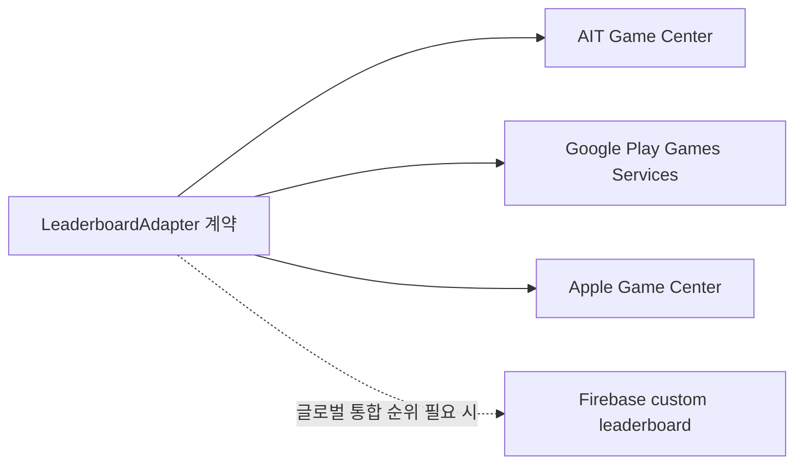

# Leaderboard Strategy

## 붙일 만한 지점

리더보드는 결과 화면이 가장 자연스럽다. 퍼즐을 끝낸 뒤 점수를 제출하고, 결과 화면에서 순위를 열 수 있게 한다.

추천 점수 산식 후보:

```text
score = 완료 단어 수 * 1000
      + 남은 도전 수 * 200
      - 사용 힌트 수 * 80
```

초기에는 완료한 퍼즐만 제출한다. 미완료 진행률 점수까지 올리면 반복 제출과 비교 기준이 흐려진다.

## 플랫폼별 구현



| 플랫폼          | 가능 여부 | 비고                                                                                                   |
| --------------- | --------- | ------------------------------------------------------------------------------------------------------ |
| AppsInToss      | 가능      | 게임 카테고리/게임센터 승인 필요. `submitGameCenterLeaderBoardScore`, `openGameCenterLeaderboard` 사용 |
| Google Play     | 가능      | Play Games Services 리더보드 사용. Android 전용 데이터 풀                                              |
| App Store       | 가능      | Game Center 리더보드 사용. Apple 플랫폼 데이터 풀                                                      |
| Firebase custom | 가능      | Google/Apple/AIT 통합 순위가 필요하면 Cloud Functions/Firestore로 별도 구현 필요                       |

Android/iOS도 결과 화면의 같은 `순위 보기` CTA와 core 점수 산식을 사용한다. React Native Codegen 기반 `NativeLeaderboard` TurboModule이 Android에서는 Play Games Services v2, iOS에서는 GameKit을 호출한다. 세 플랫폼의 제공자 계정과 데이터 풀은 서로 분리되므로 현재 구현은 전 세계 단일 통합 순위가 아니라 각 마켓의 글로벌 순위다.

## 추상화 계약

플랫폼 SDK는 앱 adapter에만 둔다. core에는 아래 정도의 계약만 둔다.

```ts
type LeaderboardAdapter = {
  submitScore(score: number, context: LeaderboardContext): Promise<void>;
  openLeaderboard(): Promise<void>;
};
```

공통 UI는 `leaderboard_enabled` Remote Config가 true이고, 현재 플랫폼 adapter가 `supported`일 때만 버튼을 노출한다.

## 플랫폼 설정

| 플랫폼     | 콘솔 설정                                                              | 빌드 입력                                            |
| ---------- | ---------------------------------------------------------------------- | ---------------------------------------------------- |
| AppsInToss | 게임 카테고리와 게임센터 리더보드 승인                                 | 별도 ID 없음                                         |
| Android    | Play Console의 Play Games Services 프로젝트와 리더보드 생성·앱 연결    | `PLAY_GAMES_PROJECT_ID`, `PLAY_GAMES_LEADERBOARD_ID` |
| iOS        | App Store Connect Game Center 리더보드 생성·Bundle ID 연결·entitlement | `GAME_CENTER_LEADERBOARD_ID`                         |

- Android 설정값이 비어 있으면 native adapter는 `supported=false`로 보고 CTA와 점수 제출을 숨긴다. iOS는 App Store Connect에서 확정한 공개 ID `com.seorilabs.crosswordpuzzle.global_score`를 Xcode project 기본 build setting으로 유지하고, GitHub Actions의 `GAME_CENTER_LEADERBOARD_ID`가 같은 값으로 덮어쓰고 archive에서 일치 여부를 검증한다.
- AppsInToss 게임 리더보드는 게임 카테고리 미니앱에서만 정상 동작하며, 미니앱 정보 승인 전에는 `LeaderBoard not found`가 날 수 있다.
- Android는 앱 시작 시 프로젝트 ID가 있을 때만 `PlayGamesSdk.initialize`를 호출하고, 순위 기능을 요청한 시점에 인증을 확인한다.
- iOS는 Game Center 인증과 시스템 순위 화면을 GameKit에 위임한다. Bundle ID capability, App Store Connect Game Center detail, 리더보드, entitlement가 함께 필요하다.
- 점수 산식과 퍼즐별 중복 제출 방지는 공통 앱 로직에서 관리한다.

## 현재 결정

AIT 론칭 후 지표(2026-07-25~2026-07-28)에서 첫날 퍼즐 완료율은 78.0%(128/164)로 높았지만 D1은 약 10%, D2는 2.4%(3/126)로 재방문이 가장 큰 병목이었다. 완료 경험은 유지하면서 순위 확인·갱신 동기를 검증하기 위해 `leaderboard_enabled` 기본값을 `true`로 전환한다.

- Remote Config 킬스위치를 유지해 승인·운영 문제가 생기면 `false`로 즉시 끈다.
- adapter가 미지원이거나 점수 제출·순위 조회가 실패하면 현재 세션에서 순위 CTA를 숨기고 기존 결과 화면을 유지한다.
- 점수 제출 결과는 `leaderboard_score_submit.outcome=success|failure`로 구분해 개방 후 발화율과 실패율을 관찰한다.
- 각 마켓 테스트 계정에서 점수 제출·순위 화면·재실행 중복 제출을 확인하고, D1 효과는 주 단위 코호트로 비교한다.
