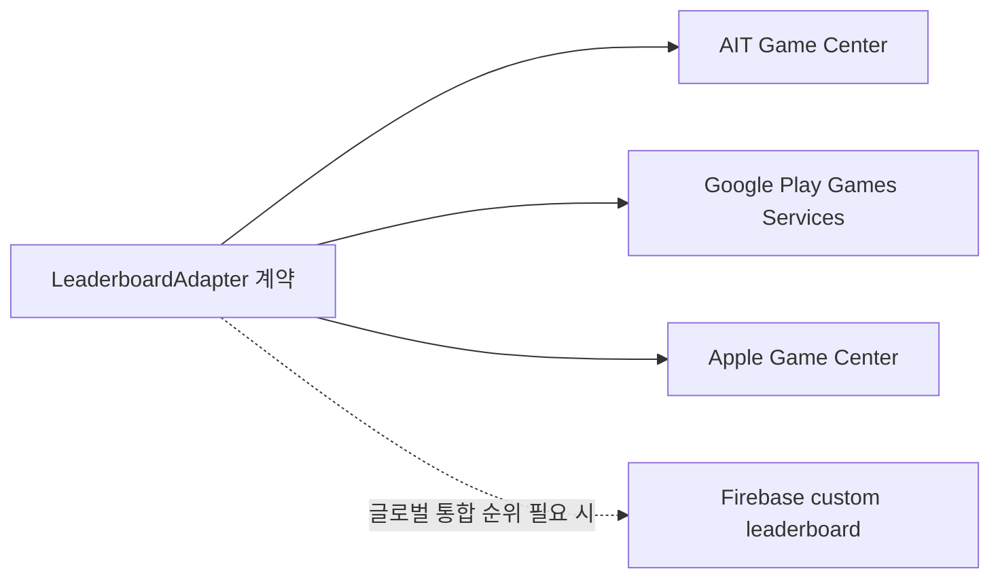

# Leaderboard Strategy

## 붙일 만한 지점

리더보드는 결과 화면이 가장 자연스럽다. 퍼즐을 끝낸 뒤 점수를 제출하고, 결과 화면에서 순위를 열 수 있게 한다.

추천 점수 산식 후보:

```text
score = 완료 단어 수 * 1000
      + 남은 도전 수 * 200
      - 사용 힌트 수 * 80
```

초기에는 완료한 퍼즐만 제출한다. 미완료 진행률 점수까지 올리면 반복 제출과 비교 기준이 흐려진다.

## 플랫폼별 구현



| 플랫폼          | 가능 여부 | 비고                                                                                                   |
| --------------- | --------- | ------------------------------------------------------------------------------------------------------ |
| AppsInToss      | 가능      | 게임 카테고리/게임센터 승인 필요. `submitGameCenterLeaderBoardScore`, `openGameCenterLeaderboard` 사용 |
| Google Play     | 가능      | Play Games Services 리더보드 사용. Android 전용 데이터 풀                                              |
| App Store       | 가능      | Game Center 리더보드 사용. Apple 플랫폼 데이터 풀                                                      |
| Firebase custom | 가능      | Google/Apple/AIT 통합 순위가 필요하면 Cloud Functions/Firestore로 별도 구현 필요                       |

## 추상화 계약

플랫폼 SDK는 앱 adapter에만 둔다. core에는 아래 정도의 계약만 둔다.

```ts
type LeaderboardAdapter = {
  submitScore(score: number, context: LeaderboardContext): Promise<void>;
  openLeaderboard(): Promise<void>;
};
```

공통 UI는 `leaderboard_enabled` Remote Config가 true이고, 현재 플랫폼 adapter가 `supported`일 때만 버튼을 노출한다.

## AIT 주의점

- AppsInToss 게임 리더보드는 게임 카테고리 미니앱에서만 정상 동작한다.
- 미니앱 정보 승인 전에는 `LeaderBoard not found` 오류가 날 수 있다.
- 토스앱 최소 지원 버전은 문서 기준 5.221.0 이상이다.
- 점수는 문자열 형태의 숫자로 제출하므로, 산식과 중복 제출 방지는 앱 로직에서 관리한다.

## 현재 결정

AIT 1차 론칭에는 리더보드를 바로 노출하지 않는다. 먼저 Analytics와 광고 이벤트로 완료율, 힌트 사용량, 광고 보상 수락률을 본 뒤 리더보드가 재방문에 도움이 되는지 판단한다.
