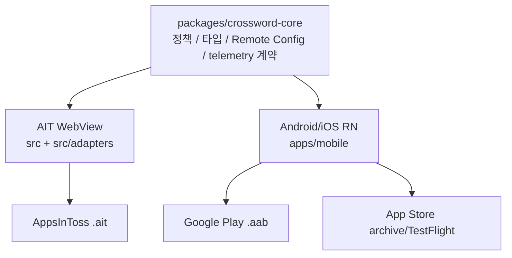

# 3마켓 패리티

## 목표

`crossword-puzzle`는 AppsInToss, Google Play, App Store에서 같은 퍼즐 정책과 운영 계약을 유지한다. 시장별 SDK와 빌드 산출물은 다르지만, 사용자가 보는 공개 퍼즐, 보너스 해금, 힌트, 시도 횟수, 이벤트 이름, Remote Config 키는 공통 계약을 따른다.

## Source Of Truth

| 영역                    | Source of truth                                             | 시장별 구현                                                              |
| ----------------------- | ----------------------------------------------------------- | ------------------------------------------------------------------------ |
| 퍼즐 타입/검증          | `packages/crossword-core/src/types.ts`, `puzzle.ts`         | 없음                                                                     |
| 발행 난이도 로테이션    | `packages/crossword-core/src/difficultyRotation.ts`         | 세 시장이 같은 Firebase Hosting manifest를 읽음                          |
| 난이도 한글 라벨        | `packages/crossword-core/src/puzzleLabels.ts`               | AIT와 Android/iOS가 쉬움·보통·어려움을 공통 노출                         |
| 공개/보너스/힌트 정책   | `packages/crossword-core/src/uiPolicy.ts`                   | 화면 렌더링만 분리                                                       |
| Remote Config 키/기본값 | `packages/crossword-core/src/launchConfig.ts`               | AIT는 Firebase Web SDK, mobile은 RNFirebase                              |
| telemetry 파라미터 정리 | `packages/crossword-core/src/platformContracts.ts`          | AIT는 AppsInToss Analytics + Firebase Web, mobile은 RNFirebase Analytics |
| 광고 adapter            | `src/adapters/appsInTossAds.ts`, `apps/mobile/mobileAds.ts` | AIT는 AppsInToss 광고, mobile은 AdMob                                    |
| AIT adapter             | `src/adapters`                                              | AppsInToss SDK, Web Firebase, localStorage                               |
| Android/iOS adapter     | `apps/mobile`                                               | RNFirebase, AsyncStorage, native projects                                |

## Firebase

| 시장        | Firebase 방식                  | 설정 파일/secret                                                               |
| ----------- | ------------------------------ | ------------------------------------------------------------------------------ |
| AppsInToss  | Firebase Web SDK optional init | `VITE_FIREBASE_*` GitHub Variables                                             |
| Google Play | RNFirebase native Android      | `FIREBASE_ANDROID_GOOGLE_SERVICES_JSON_BASE64` repo secret                     |
| App Store   | RNFirebase native iOS          | `FIREBASE_IOS_GOOGLE_SERVICE_INFO_PLIST_BASE64` `app-store` environment secret |

`google-services.json`과 `GoogleService-Info.plist`는 커밋하지 않는다. CI는 `scripts/restore-mobile-firebase-config.mjs`로 복구하고, local native build도 같은 스크립트를 사용한다.

## 개발 규칙

- 새 제품 정책은 먼저 `packages/crossword-core`에 추가한다.
- AIT와 mobile이 같은 값을 써야 하는 설정은 `launchConfig.ts`에 추가하고, `remoteconfig.template.json`과 문서를 같이 갱신한다.
- 시장별 SDK import는 app adapter에만 둔다.
- `npm run check:release-parity`가 3마켓 패리티의 최소 자동 가드다.
- Android/iOS가 같은 `apps/mobile` 타깃을 공유하므로, 인앱 홈 타이틀이나 입력 UX를 `Platform.OS === 'ios'` / `Platform.OS === 'android'` 분기로 되돌리면 안 된다. `check:release-parity`는 iOS 전용 홈 타이틀 분기, Android 전용 보드 입력 재포커스, 관련 테스트 누락을 실패 처리한다.
- 한 시장에서만 기능을 임시로 끄는 경우, fallback UX와 해제 조건을 이 문서 또는 release 문서에 남긴다.

## 일간 발행 난이도 구성

- 자정 배치 한 번에서 `easy 5×5`, `normal 8×8`, `hard 8×8`을 각각 한 판 발행한다. 내부 슬롯은 h00/h01/h02로 분리한다.
- `PUZZLE_DAILY_TIERS=false`인 레거시 다회 실행에서만 코어의 `normal/easy/normal/hard` 로테이션을 사용한다.
- AIT/Web과 Android/iOS는 같은 Firebase Hosting manifest를 읽으므로 난이도 구성과 완료 후 상위 티어 추천 정책이 세 시장에서 동일하다.
- manifest 항목과 퍼즐 JSON의 `difficulty`는 모두 필수이며 서로 다르면 발행 검증이 실패한다. 난이도가 없는 구버전 원격 항목은 전환 시 제거하고 사전 뜻풀이 구조 검증·보드 품질 게이트를 통과한 새 슬롯으로 교체한다.

## 막힘 힌트 과다 노출 방어 (#265)

- 막힘 판정 시간·오답 임계·퍼즐당 노출 상한·dismiss 상한·최소 쿨다운은 `packages/crossword-core/src/launchConfig.ts`의 공용 Remote Config 계약을 따른다. 기본 정책은 같은 퍼즐에서 최대 2회, 노출 간 최소 180초, 첫 dismiss 후 해당 퍼즐 재노출 금지다.
- **AIT/Web**은 `src/useStuckHintPrompt.ts`가 퍼즐 ID를 기준으로 상태를 유지하므로 같은 퍼즐의 재도전이나 홈 왕복으로 상한과 dismiss 억제를 초기화하지 않는다. 기존 `stuck_hint_prompt`, `stuck_hint_prompt_accept`, `stuck_hint_prompt_dismiss` 이벤트 이름은 유지한다.
- **Android/iOS(RN)**는 아직 자동 막힘 힌트 CTA가 없어 설정값만 공용 Remote Config에서 읽고 화면 동작은 no-op이다. native에 CTA를 추가할 때 같은 코어 기본값과 이벤트 계약을 사용해야 한다.

## 리워드 힌트 광고 시스템 실패 재시도 (#277)

- AIT/Web과 Android/iOS는 `packages/crossword-core/src/rewardedAdRetry.ts`의 정책에 따라 시스템 실패만 정확히 1회 자동 재시도한다. 사용자가 닫은 `dismissed`와 SDK 미지원 `unsupported`는 재시도하지 않는다.
- 최초 광고 요청부터 최종 결과까지 loading 상태를 유지해 중복 탭을 막고, 첫 시스템 실패 뒤에는 `광고를 다시 준비하는 중` 안내를 노출한다. 두 번째 실패 뒤에는 기존 실패 안내로 돌아간다.
- `rewarded_hint_ad_request`, `rewarded_hint_ad_event`, `rewarded_hint_ad_result`, 보상 이벤트에 `retry=0|1`을 기록해 최초 시도와 회수 시도를 구분한다.

## 완료 직후 다음 퍼즐 연결 (#274)

- 다음 퍼즐 선택은 `packages/crossword-core/src/recommendation.ts`가 세 시장에 동일하게 적용한다. 한 단계 높은 난이도, 같은 난이도, 그 외 미완료 순으로 고르며 미완료 후보가 없으면 완료 퍼즐을 재추천하지 않는다.
- AIT/Web과 Android/iOS 완료 축하 오버레이는 추천 후보가 있을 때 난이도·퍼즐 라벨을 포함한 `다음 퍼즐 풀기`를 primary CTA로 먼저 노출하고, 탭하면 목록 없이 풀이 화면으로 진입한다. 후보가 없으면 기존 결과·홈·보너스 동선을 유지한다.
- `next_puzzle_cta` 이벤트는 공용 이름을 유지하고 `source=result_overlay|result_screen`, `next_puzzle_id`, `next_difficulty`를 같은 계약으로 기록한다.

## 보너스 퍼즐 패널 노출 계측 (#278)

- `bonus_puzzle_panel_impression` 이벤트와 `status=waiting|available|used|unlocked` 계약은 `packages/crossword-core/src/gameAnalytics.ts`에 두고 AIT/Web과 Android/iOS가 동일하게 사용한다.
- 패널이 실제 렌더되는 홈·결과 화면에서만 기록하며, 데이터 로딩 중인 `loading` 상태는 노출에서 제외한다.
- 앱 세션 안에서 같은 상태는 최초 한 번만 기록하고, 패널 상태가 바뀌면 변경된 상태를 각각 한 번 새로 기록한다.

## 복귀 리마인드 푸시 동의 (D1 재방문)

- 결정 로직(언제·몇 번 동의를 유도할지)은 코어 `packages/crossword-core/src/returnReminder.ts`에 두어 3개 시장이 같은 정책으로 동작한다. 노출 게이트는 Remote Config 키 `return_reminder_enabled`(기본값 `true`, #162)이다. 필요 시 Remote Config에서 `false`로 끌 수 있다.
- 실제 동의 요청(시장별 알림 SDK)은 adapter로 분리한다. **AIT/Web**은 `src/adapters/notificationAgreement.ts`가 `@apps-in-toss/web-framework`의 `requestNotificationAgreement`(스마트발송 캠페인 동의)를 호출하고, 다음날 "오늘의 퍼즐" 리마인드는 서버(스마트발송)가 발송한다.
- **Android/iOS(RN)**는 아직 알림 SDK 의존성이 없어 동의 요청 adapter가 없다(후속 작업). 기본값이 `true`로 바뀌면서 **AIT/Web만 완료 시 동의를 유도**하고, mobile은 이 값과 무관하게 동의 유도/이벤트가 없는 no-op으로 동작한다(`apps/mobile/firebaseClient.ts`는 키를 읽지만 prompt 호출부가 없음). mobile에서 동일 동작을 켜려면 RN 알림 동의 adapter를 먼저 추가해야 한다. 이 시장 차이는 의도된 상태다.
- 동의 유도/결과는 텔레메트리 `return_reminder_prompt`, `return_reminder_result`(영문 키 유지)로 계측한다. 동의/거부/미지원은 1회 결과로 종결하고, `error`/`timeout`만 다음 날짜에 총 3회 상한으로 재유도한다. 결과의 `prompt_count`에는 실제 유도 회차를 기록한다. `error` 결과에는 사람이 읽는 `error_reason`(#253)과 SDK 구조화 코드 `error_code`(#288)를 함께 남겨 서버 거절 사유를 식별한다.
- AIT/Web의 `templateCode`는 콘솔에서 발급되는 실제 코드여야 하며, 빌드 환경변수 `VITE_RETURN_REMINDER_TEMPLATE_CODE`로 주입한다(미설정 시 기본값 `crossword-daily-reminder`). 발급 코드 확인·반영 절차는 README를 참고한다(#288).

## 신규 첫 실행 온보딩 퍼즐 자동 진입 (#205)

- 판정 로직(도전 이력이 전혀 없는 신규인지)은 코어 `packages/crossword-core/src/uiPolicy.ts`의 `shouldAutoStartFirstRun` 순수 함수에 둔다. 게이트는 Remote Config 키 `first_run_auto_start_enabled`(기본값 `true`)이며 회귀 시 Remote Config에서 `false`로 즉시 끌 수 있다.
- **AIT/Web**은 `src/App.tsx`가 퍼즐 팩 로드·원격 설정 fetch 완료 후 1회 판정해, 신규면 홈 대신 온보딩(easy) 퍼즐 풀이 화면으로 자동 진입한다. 진입 시 `first_run_auto_start` 임프레션과 기존 `attempt_start`(attempt_kind=first)가 발화된다.
- **Android/iOS(RN)**는 아직 이 자동 진입 배선이 없다(후속 작업). `apps/mobile`은 이 키와 무관하게 기존 홈 진입으로 동작하는 no-op이다. 이 시장 차이는 의도된 상태다.

## 연필(임시 입력) 모드 (#200)

- 어떤 입력을 임시(연필)로 볼지의 정책은 코어 `packages/crossword-core/src/tentative.ts`의 `shouldMarkTentative`(연필 ON + `manual` 입력만 임시, `reveal`/`debug`는 항상 확정) 순수 함수에 둔다. 임시 셋 갱신·렌더 가드·저장 스키마(`SavedProgress.tentativeCells`)는 기존 코어 로직을 그대로 쓴다.
- **AIT/Web**은 풀이 툴바의 연필 토글(`aria-pressed`)로 모드를 켜고 끈다. 모드 자체는 세션 한정 상태이고, 임시 표시는 `SavedProgress.tentativeCells`로 재진입 후에도 복원된다.
- **Android/iOS(RN)**는 아직 연필 토글 UI가 없다(후속 작업). `apps/mobile`은 기존처럼 항상 확정 입력으로 동작하는 no-op이다. 이 시장 차이는 의도된 상태다.

## 일일 도전 횟수 상한 원격화 (#225)

- 하루 도전 횟수 상한은 코어 `packages/crossword-core/src/launchConfig.ts`의 Remote Config 키 `daily_attempt_limit`(기본값 `3` = `uiPolicy.DAILY_ATTEMPT_LIMIT`, 최소 1로 클램프)로 조정한다. 기본값이 기존 상수와 같아 원격 미주입 시 3마켓 모두 기존과 동일하게 3회로 동작한다.
- **AIT/Web**은 `src/App.tsx`가 미션 로드 시 `launchConfig.dailyAttemptLimit`를 `loadMission`에 넘겨 미션의 `maxAttempts`로 반영하고, 카드 "도전 종료" 판정도 미션의 `maxAttempts`를 따른다. 원격에서 값을 2/4로 바꾸면 재배포 없이 상한이 반영된다.
- **Android/iOS(RN)**는 아직 `apps/mobile/firebaseClient.ts`가 이 키를 읽지 않고 `apps/mobile/App.tsx`가 공유 기본 상수 `DAILY_ATTEMPT_LIMIT`를 그대로 사용한다(후속 작업). 원격값을 3에서 바꾸면 **AIT/Web만** 반영되고 mobile은 기본 3회로 유지되는 시장 차이가 생기며, 이는 의도된 상태다. mobile까지 원격화하려면 `apps/mobile/firebaseClient.ts`에 `daily_attempt_limit` 파싱과 미션 로드부 배선을 추가해야 한다.
