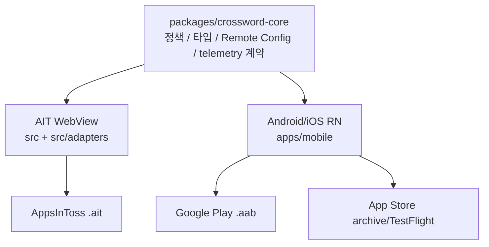

# 3마켓 패리티

## 목표

`crossword-puzzle`는 AppsInToss, Google Play, App Store에서 같은 퍼즐 정책과 운영 계약을 유지한다. 시장별 SDK와 빌드 산출물은 다르지만, 사용자가 보는 공개 퍼즐, 보너스 해금, 힌트, 시도 횟수, 이벤트 이름, Remote Config 키는 공통 계약을 따른다.

## Source Of Truth

| 영역                    | Source of truth                                             | 시장별 구현                                                              |
| ----------------------- | ----------------------------------------------------------- | ------------------------------------------------------------------------ |
| 퍼즐 타입/검증          | `packages/crossword-core/src/types.ts`, `puzzle.ts`         | 없음                                                                     |
| 발행 난이도 로테이션    | `packages/crossword-core/src/difficultyRotation.ts`         | 세 시장이 같은 Firebase Hosting manifest를 읽음                          |
| 난이도 한글 라벨        | `packages/crossword-core/src/puzzleLabels.ts`               | AIT와 Android/iOS가 쉬움·보통·어려움을 공통 노출                         |
| 공개/보너스/힌트 정책   | `packages/crossword-core/src/uiPolicy.ts`                   | 화면 렌더링만 분리                                                       |
| Remote Config 키/기본값 | `packages/crossword-core/src/launchConfig.ts`               | AIT는 Firebase Web SDK, mobile은 RNFirebase                              |
| telemetry 파라미터 정리 | `packages/crossword-core/src/platformContracts.ts`          | AIT는 AppsInToss Analytics + Firebase Web, mobile은 RNFirebase Analytics |
| Presence opt-in 정책    | `packages/crossword-core/src/platformPresence.ts`           | AIT WebView와 Android/iOS가 Platform SDK 0.4.0 lifecycle을 연결          |
| 광고 adapter            | `src/adapters/appsInTossAds.ts`, `apps/mobile/mobileAds.ts` | AIT는 AppsInToss 광고, mobile은 AdMob                                    |
| 리더보드 정책/점수      | `packages/crossword-core/src/leaderboard.ts`                | AIT Game Center, Android Play Games Services, iOS GameKit                |
| AIT adapter             | `src/adapters`                                              | AppsInToss SDK, Web Firebase, localStorage                               |
| Android/iOS adapter     | `apps/mobile`                                               | RNFirebase, AsyncStorage, native projects                                |

## 퍼즐 식별자 telemetry 문자열 계약

- `puzzle_id`, `puzzle_alias`, `next_puzzle_id`, `pack_id`, `slot_id`는 AppsInToss Web, Google Play Android, App Store iOS에서 모두 문자열로 전송한다. `packages/crossword-core/src/platformContracts.ts`가 일반 telemetry를, `gameAnalytics.ts`가 `game_*` 컨텍스트를 전송 전에 정규화한다.
- Web과 mobile의 원격 퍼즐 loader는 manifest와 puzzle JSON의 숫자 식별자를 즉시 문자열로 바꿔 `Puzzle["puzzleId"]` 타입과 런타임 값을 일치시킨다.
- 교정 전 GA4 데이터에는 같은 키가 `string_value`와 `int_value`로 나뉘어 있다. 과거 구간 쿼리는 `COALESCE(value.string_value, CAST(value.int_value AS STRING))`로 읽고, 교정 이후에도 연속 시계열을 위해 이 형태를 유지한다.

## 완료 후 다음 퍼즐 추천 계약

- Web과 RN은 공용 `getNextRecommendedPuzzleSummary` 정책에 발행 manifest 전체, 완료 목록, 현재 퍼즐(`puzzleId`·`difficulty`·`date`)을 넘긴다. RN 홈 rail의 오늘·로컬 노출 제한은 추천 후보를 제한하지 않는다.
- 같은 날짜의 남은 사다리 단계를 가장 먼저 추천한다. 워밍업(easy)을 끝내면 오늘의 퍼즐(hard), hard를 먼저 끝냈고 easy가 남았으면 easy로 잇는다. CTA 문구는 core `formatDailyLadderNextLabel`이 만든 `오늘의 퍼즐 이어서 풀기`/`워밍업 퍼즐 풀기`를 두 표면이 그대로 쓴다.
- 오늘 발행분을 모두 완료해도 과거 미완료 발행분이 있으면 `다음 퍼즐 풀기` CTA를 노출한다.
- 실제 미완료 후보가 없거나 온보딩 난이도 완화 정책이 추천을 보류하면 RN 완료 모달과 결과 화면은 `퍼즐 기록 보기` fallback CTA를 노출한다.

## Firebase

| 시장        | Firebase 방식                  | 설정 파일/secret                                                               |
| ----------- | ------------------------------ | ------------------------------------------------------------------------------ |
| AppsInToss  | Firebase Web SDK optional init | `VITE_FIREBASE_*` GitHub Variables                                             |
| Google Play | RNFirebase native Android      | `FIREBASE_ANDROID_GOOGLE_SERVICES_JSON_BASE64` repo secret                     |
| App Store   | RNFirebase native iOS          | `FIREBASE_IOS_GOOGLE_SERVICE_INFO_PLIST_BASE64` `app-store` environment secret |

`google-services.json`과 `GoogleService-Info.plist`는 커밋하지 않는다. CI는 `scripts/restore-mobile-firebase-config.mjs`로 복구하고, local native build도 같은 스크립트를 사용한다.

## Platform Presence Phase A (#356)

- Web/AIT와 Android/iOS는 `@seorilabs/platform-sdk@0.4.0`을 사용하고 안정된 `appId=crossword-puzzle`, 플랫폼, 앱 버전만 Presence context로 전달한다. 사용자 ID·광고 ID·외부 세션 ID·기타 PII와 재전송 큐는 추가하지 않는다.
- 공용 기본 opt-in은 `packages/crossword-core/src/platformPresence.ts`의 `PLATFORM_PRESENCE_ENABLED=false`다. 비활성 상태에서는 token/Edge 요청이 발생하지 않는다.
- 각 composition root는 시작·background/hidden 정지·foreground/visible 복귀를 SDK Presence lifecycle에 연결한다. 동기 SDK 오류와 SDK 내부의 timeout·5xx·DNS·TLS 실패는 모두 fail-open이며 앱 시작·퍼즐 플레이·저장 흐름을 막지 않는다.
- SDK가 제공하는 전용 token/Edge HTTP 경로, Edge 2초 timeout, no-outbox/no-replay 계약을 그대로 사용한다. 앱 adapter는 직접 heartbeat나 별도 fallback을 구현하지 않는다.
- 이 단계는 활성화 준비만 완료한 상태다. 중앙 canary와 정확한 릴리스 후보 승인이 끝나기 전에는 `true`로 바꾸거나 배포·live readback 완료로 간주하지 않는다.

## 개발 규칙

- 새 제품 정책은 먼저 `packages/crossword-core`에 추가한다.
- AIT와 mobile이 같은 값을 써야 하는 설정은 `launchConfig.ts`에 추가하고, `remoteconfig.template.json`과 문서를 같이 갱신한다.
- 시장별 SDK import는 app adapter에만 둔다.
- `npm run check:release-parity`가 3마켓 패리티의 최소 자동 가드다.
- Android/iOS가 같은 `apps/mobile` 타깃을 공유하므로, 인앱 홈 타이틀이나 입력 UX를 `Platform.OS === 'ios'` / `Platform.OS === 'android'` 분기로 되돌리면 안 된다. `check:release-parity`는 iOS 전용 홈 타이틀 분기, Android 전용 보드 입력 재포커스, 관련 테스트 누락을 실패 처리한다.
- 한 시장에서만 기능을 임시로 끄는 경우, fallback UX와 해제 조건을 이 문서 또는 release 문서에 남긴다.

## 홈 사다리와 주간 스트릭

- 홈은 오늘의 두 난이도를 병렬 선택지가 아니라 `워밍업 · 5×5 → 오늘의 퍼즐 · 8×8` 두 단계의 사다리로 보여 준다. 단계 순서·상태(new/in_progress/exhausted/done)·주 CTA 판정은 core `buildDailyLadder`(`packages/crossword-core/src/dailyLadder.ts`)가 맡고, Web은 `DailyLadderCard`, RN은 `renderDailyLadder`가 렌더만 한다. 하단 주 CTA는 항상 다음 미완료 단계를 가리키고 두 단계를 모두 끝냈으면 `내일 다시`로 비활성화한다. 오늘 퍼즐이 없으면(원격 미로드·번들 폴백) 선택 퍼즐 기준 기존 CTA로 폴백한다.
- 단계를 직접 눌러 hard로 바로 가는 것은 막지 않는다. 단계 탭과 하단 CTA는 `home_quick_start` 이벤트에 `source=ladder_step_1|ladder_step_2`, `ladder_step`, `step_status`, `difficulty`를 실어 계측한다.
- 사다리 위에는 오늘로 끝나는 7일 스트릭 스트립(`buildWeeklyStreakStrip`)과 헤드라인(`formatStreakStripHeadline`), 마일스톤 넛지(`getStreakMilestoneProgress`)를 둔다.
- 스트릭 숫자는 core `computeConsecutiveStreakDays` 하나로 계산한다. 홈 표시는 오늘 미완료·어제 완료면 오늘 몫을 더한 낙관 값(`countTodayPending: true`)이고, 7/30/100일 마일스톤 발화의 "이전 값"만 비관 값(`countTodayPending: false`)으로 읽는다. Web은 localStorage 미션 레코드, RN은 아카이브 레코드에서 `collectCompletedDates`로 같은 완료일 집합을 만든다.
- 온보딩 난이도 램프는 `onboardingPuzzleId`(Web 온보딩 퍼즐)와 일치하는 완료에만 개입한다. RN은 온보딩 퍼즐이 없어 첫 daily easy 완료 후 곧바로 오늘의 hard로 잇는다.

## 일간 발행 난이도 구성

- 자정 배치 한 번에서 `easy 5×5`, `hard 8×8`을 각각 한 판 발행한다. 내부 슬롯은 h00/h01로 분리한다.
- `PUZZLE_DAILY_TIERS=false`인 레거시 다회 실행에서만 코어의 `normal/easy/normal/hard` 로테이션을 사용한다.
- AIT/Web과 Android/iOS는 같은 Firebase Hosting manifest를 읽으므로 난이도 구성과 완료 후 상위 티어 추천 정책이 세 시장에서 동일하다.
- manifest 항목과 퍼즐 JSON의 `difficulty`는 모두 필수이며 서로 다르면 발행 검증이 실패한다. 난이도가 없는 구버전 원격 항목은 전환 시 제거하고 사전 뜻풀이 구조 검증·보드 품질 게이트를 통과한 새 슬롯으로 교체한다.

## 막힘 힌트 과다 노출 방어 (#265)

- 첫 입력 가이드와 자동 막힘 프롬프트는 각각 공용 Remote Config `first_input_guide_enabled`, `stuck_hint_prompt_enabled`를 따른다. 두 키는 기본 `true`이고 Web·Android·iOS에서 독립적으로 즉시 끌 수 있다.
- 막힘 판정 시간·첫 입력 전용 지연(`stuck_hint_first_input_idle_ms`, 기본 6초)·오답 임계·퍼즐당 노출 상한·dismiss 상한·최소 쿨다운은 `packages/crossword-core/src/launchConfig.ts`의 공용 Remote Config 계약을 따른다. 기본 정책은 같은 퍼즐에서 최대 2회, 노출 간 최소 180초, 첫 dismiss 후 해당 퍼즐 재노출 금지다.
- **AIT/Web**은 `src/useStuckHintPrompt.ts`가 퍼즐 ID를 기준으로 상태를 유지하므로 같은 퍼즐의 재도전이나 홈 왕복으로 상한과 dismiss 억제를 초기화하지 않는다. 기존 `stuck_hint_prompt`, `stuck_hint_prompt_accept`, `stuck_hint_prompt_dismiss` 이벤트 이름은 유지한다.
- **AIT/Web**은 보드가 비고 이번 attempt에 입력이 없으면 6초 뒤 `trigger=first_input` 입력 개시 안내를 띄운다. 수락은 힌트를 소비하지 않고 첫 빈 칸 선택·입력 포커스만 수행한다. 첫 입력 뒤에는 기존 20초 idle/5초 오답 분기로 돌아간다.
- **Android/iOS(RN)**도 `apps/mobile/useStuckHintPrompt.ts`에서 같은 코어 지연·쿨다운·상한 함수를 사용한다. 첫 입력 가이드는 AsyncStorage 열람 상태로 재진입 중복을 막고, 첫 수동 입력 또는 닫기에서 종결한다. `onboarding_guide_shown|complete|dismiss`와 `stuck_hint_prompt|accept|dismiss`는 Web과 같은 파라미터 키로 RNFirebase Analytics에 발화한다.

## 리워드 힌트 광고 시스템 실패 재시도 (#277)

- AIT/Web과 Android/iOS는 `packages/crossword-core/src/rewardedAdRetry.ts`의 정책에 따라 시스템 실패만 정확히 1회 자동 재시도한다. 사용자가 닫은 `dismissed`와 SDK 미지원 `unsupported`는 재시도하지 않는다.
- 최초 광고 요청부터 최종 결과까지 loading 상태를 유지해 중복 탭을 막고, 첫 시스템 실패 뒤에는 `광고를 다시 준비하는 중` 안내를 노출한다. 두 번째 실패 뒤에는 기존 실패 안내로 돌아간다.
- `rewarded_hint_ad_request`, `rewarded_hint_ad_event`, `rewarded_hint_ad_result`, 보상 이벤트에 `retry=0|1`을 기록해 최초 시도와 회수 시도를 구분한다.

## 완료 직후 다음 퍼즐 연결 (#274)

- 다음 퍼즐 선택은 `packages/crossword-core/src/recommendation.ts`가 세 시장에 동일하게 적용한다. 한 단계 높은 난이도, 같은 난이도, 그 외 미완료 순으로 고르며 미완료 후보가 없으면 완료 퍼즐을 재추천하지 않는다.
- `onboarding_difficulty_ramp_enabled`는 기본 `true`다. 기완료 퍼즐이 없는 사용자의 첫 easy 완료 직후에는 남은 easy를 한 판 더 추천하고, easy가 없으면 normal까지만 폴백한다. hard만 남으면 CTA를 숨긴다. 두 번째 완료부터는 기존 난이도 상승 정책으로 복귀하며, Remote Config의 명시적 `false`가 3마켓 공통 킬스위치다.
- AIT/Web과 Android/iOS 완료 축하 오버레이는 추천 후보가 있을 때 난이도·퍼즐 라벨을 포함한 `다음 퍼즐 풀기`를 primary CTA로 먼저 노출하고, 탭하면 목록 없이 풀이 화면으로 진입한다. 후보가 없으면 기존 결과·홈 동선을 유지한다.
- `next_puzzle_cta` 이벤트는 공용 이름을 유지하고 `source=result_overlay|result_screen`, `next_puzzle_id`, `next_difficulty`를 같은 계약으로 기록한다.

## 보너스 퍼즐 제거 상태 (#326)

- `bonus_puzzle_panel_impression` 계약은 f992a61(2026-07-25)에서 기능과 함께 제거됨. 1.0.9+ 론칭 사용자에게서 미발화하는 것이 현재 정상 상태다.
- `rewarded_bonus_puzzle` 광고·Remote Config 계약도 f992a61에서 제거됨. 광고 퍼널과 마켓 파리티 대상에 포함하지 않는다.
- 복원 여부는 제품 결정 대기 상태다. 제거 전 표본이 개발자 1~2명뿐이라 리텐션 효과 근거가 없으며, 별도 결정과 검증 계획 없이 기능을 복원하지 않는다.

## 기록·통계·공유 계약

- 개인 통계(`computePersonalStats`·`computeSolveTimeDistribution`), 스트릭 달력(`buildStreakCalendarWeeks`·`computeLongestStreakDays`), 공유 문구·격자(`buildShareText`·`buildShareGrid`), 공유 계측(`shareResult.ts`의 `share_result_click`/`share_result_outcome`, `surface=result_screen|completion_dialog`), 진척 화면 노출(`emitProgressionScreenView` → `personal_stats_view`·`streak_view`)과 스트릭 마일스톤(`emitStreakMilestoneIfReached`)은 모두 core 에 있고 Web·RN 이 같은 함수를 호출한다.
- RN 기록 화면은 `apps/mobile/recordsComponents.tsx`(`PersonalStatsCard`·`StreakHeatmap`·`ShareGridPreview`)로 웹과 같은 카드를 그린다. 완료 모달·결과 화면 배지는 core `getCompletionAchievements`(노힌트·첫 도전·최고 기록 자격)를 쓰고 `🏆 최고 기록 갱신!`을 포함한다. 진행 마일스톤(25/50/75%) 보상 토스트도 core 문구를 쓴다.
- RN 저장 키: 최고 기록 `crossword-puzzle:best-times`(퍼즐별 ms 단일 JSON, 갱신 판정은 core `shouldRecordBestTime`), 완료일 `crossword-puzzle:completion-dates`(정렬된 `YYYY-MM-DD[]`, 아카이브 30건 상한과 무관하게 누적), 백필 마커 `crossword-puzzle:completion-dates:migrated`. 첫 실행에 아카이브 완료 레코드와 `crossword-puzzle:mission:{date}:{puzzleId}` 키를 한 번 스캔해 완료일을 백필하므로 기존 기기의 스트릭·히트맵이 줄지 않는다. 마커는 스캔과 저장이 모두 성공했을 때만 남기고, 실패하면 다음 실행에서 다시 백필한다. 최고 기록도 저장이 성공했을 때만 갱신으로 본다(웹 `saveBestTimeMs`와 동일). 아카이브 레코드는 완료 시점의 `hintCount`·`revealUsed`를 동결한다.
- 스트릭과 7일 스트립·12주 히트맵은 모두 누적 완료일 저장소에서 파생한다(`computeConsecutiveStreakDays`).

## 리더보드

- 세 시장은 `packages/crossword-core`의 완료 제출 조건, 점수 산식, `leaderboard_enabled`, `leaderboard_score_submit` 계약을 공유한다. 결과 화면에서 완료한 퍼즐에만 `순위 보기`를 노출한다.
- **AIT/Web**은 AppsInToss Game Center adapter, **Android**는 Play Games Services v2, **iOS**는 GameKit을 사용한다. Android/iOS는 React Native Codegen의 `NativeLeaderboard` TurboModule을 통해 같은 mobile adapter에 연결한다.
- 완료 직후 자동 제출은 네이티브의 비대화형 `isAuthenticated` 조회가 true일 때만 수행한다. 미인증이면 `outcome=skipped`, `error_code=leaderboard_auth_required`로 계측하고 `순위 보기` CTA를 유지한다. Android의 대화형 PGS `signIn()`은 사용자가 `순위 보기`를 누른 열람 경로에서만 허용한다.
- 자동 제출 실패는 네이티브 reject code를 `leaderboard_score_submit.error_code`에 보존하고 CTA를 숨기지 않는다. 명시적 순위 열람 자체가 실패한 경우에만 기존처럼 현재 세션 CTA를 숨긴다.
- AIT, Google, Apple의 순위 데이터 풀은 서로 분리된다. 세 마켓 사용자를 한 표에 합치는 기능은 Firebase custom leaderboard를 별도 설계해야 한다.
- Android 빌드에는 `PLAY_GAMES_PROJECT_ID`와 `PLAY_GAMES_LEADERBOARD_ID`가 필요하다. iOS는 App Store Connect의 실제 공개 ID를 Xcode project의 `GAME_CENTER_LEADERBOARD_ID` 기본값으로 유지하고 GitHub Actions variable로 동일 값을 검증한다. 플랫폼 설정이 없거나 Remote Config가 `false`면 안전하게 CTA를 숨긴다.

## 복귀 리마인드 푸시 동의 (D1 재방문)

- 결정 로직(언제·몇 번 동의를 유도할지)은 코어 `packages/crossword-core/src/returnReminder.ts`에 두어 3개 시장이 같은 정책으로 동작한다. 노출 게이트는 Remote Config 키 `return_reminder_enabled`(기본값 `true`, #162)이다. 필요 시 Remote Config에서 `false`로 끌 수 있다.
- 실제 동의 요청(시장별 알림 SDK)은 adapter로 분리한다. **AIT/Web**은 `src/adapters/notificationAgreement.ts`가 `@apps-in-toss/web-framework`의 `requestNotificationAgreement`(스마트발송 캠페인 동의)를 호출하고, 다음날 "오늘의 퍼즐" 리마인드는 서버(스마트발송)가 발송한다.
- **사전 안내(pre-prompt)**: 두 표면 모두 완료 축하 화면 안에 core 문구(`RETURN_REMINDER_PREPROMPT_COPY`, `formatReturnReminderPrepromptBody(streak)`) 카드를 먼저 보여 주고, "알림 받기"를 누른 뒤에만 시스템 다이얼로그(AIT 스마트발송 동의·OS 알림 권한)를 띄운다. 시스템 다이얼로그는 한 번 거부되면 되돌리기 어렵기 때문이다. "괜찮아요"와 카드에 답하지 않은 닫기는 `declined`로 기록하며, 종결이 아니라 `error`/`timeout`처럼 다음 날 다시 안내하고 유도 예산(3회)은 소진한다. 카드 노출·수락·보류는 `return_reminder_preprompt(action=shown|accept|decline, channel, prompt_count, streak_days)`로 계측한다. Web은 `src/components/ReturnReminderPrepromptCard.tsx`, RN은 완료 모달 안 인라인 카드다.
- **Android/iOS(RN)**는 `react-native-notify-kit` adapter가 사전 안내 수락 뒤 OS 알림 권한을 요청하고, 허용 시 다음 날 09:00 KST에 "오늘의 퍼즐" 로컬 알림 한 건을 예약한다(`apps/mobile/mobileReturnReminder.ts`의 `prepare → confirm/decline`). 동의(`agreed`) 상태면 **매 완료마다** D+1로 다시 예약한다(`refreshMobileReturnReminderSchedule`, `return_reminder_schedule(channel=local, outcome, reminder_date)`) — 이전에는 동의한 첫날 한 번만 예약돼 D1 알림 한 건으로 끝났다. 앱을 다시 열면(초기 로드·active 복귀) 예약 날짜가 오늘 이전·오늘인 알림은 취소한다(`cancelStaleMobileReturnReminder`). 같은 notification ID를 취소 후 재사용하고 Android는 `alarmManager=false`로 WorkManager를 사용하므로 exact-alarm 권한이 필요 없다. 앱이 꺼진 상태의 탭은 early background handler가 저장하고, foreground/cold-start 소비가 `today` 화면으로 이동시킨다.
- Android 13+ 권한은 Manifest의 `POST_NOTIFICATIONS`와 SDK 런타임 요청으로 처리한다. iOS 알림 권한 문구는 OS가 앱 이름과 함께 표시하며 사용자 정의 purpose-string용 Info.plist 키가 없으므로 가짜 키를 추가하지 않는다. 양쪽 모두 퍼즐 완료라는 사용 맥락에서 요청한다.
- 동의 유도/결과는 텔레메트리 `return_reminder_prompt`, `return_reminder_result`(영문 키 유지)로 계측하고 `channel=ait|local`로 구분한다. 동의/거부/미지원은 1회 결과로 종결하고, `error`/`timeout`/`declined`만 다음 날짜에 총 3회 상한으로 재유도한다. 결과에는 `prompt_count`, `error_reason`, 가장 구체적인 `error_code`, 다른 최상위 래퍼가 있으면 `error_wrapper_code`, 실패 단계 `stage=preflight|sdk_callback|timeout`을 기록한다. 중첩 코드 `4000`도 AIT 배포 설정 오류로 인식해 프롬프트 예산 상한을 우회한다. RN 알림 탭은 `notification_opened(channel=local, notification_kind=daily_puzzle, reminder_date)`를 한 번 발화한다.
- AIT/Web의 `templateCode`는 콘솔에서 발급되는 실제 코드여야 하며, 빌드 환경변수 `VITE_RETURN_REMINDER_TEMPLATE_CODE`로 주입한다. 로컬 개발은 기본값 `crossword-daily-reminder`로 폴백할 수 있지만 `Deploy AIT`는 repository variable이 없거나 공백이면 빌드 전에 실패한다. 발급 코드 확인·반영 절차는 README를 참고한다.

## 신규 첫 실행 온보딩 퍼즐 자동 진입 (#205)

- 판정 로직(도전 이력이 전혀 없는 신규인지)은 코어 `packages/crossword-core/src/uiPolicy.ts`의 `shouldAutoStartFirstRun` 순수 함수에 둔다. 게이트는 Remote Config 키 `first_run_auto_start_enabled`(기본값 `true`)이며 회귀 시 Remote Config에서 `false`로 즉시 끌 수 있다.
- **AIT/Web**은 `src/App.tsx`가 퍼즐 팩 로드·원격 설정 fetch 완료 후 1회 판정해, 신규면 홈 대신 온보딩(easy) 퍼즐 풀이 화면으로 자동 진입한다. 진입 시 `first_run_auto_start` 임프레션과 기존 `attempt_start`(attempt_kind=first)가 발화된다.
- **Android/iOS(RN)**는 아직 이 자동 진입 배선이 없다(후속 작업). `apps/mobile`은 이 키와 무관하게 기존 홈 진입으로 동작하는 no-op이다. 이 시장 차이는 의도된 상태다.

## 연필(임시 입력) 모드 (#200)

- 어떤 입력을 임시(연필)로 볼지의 정책은 코어 `packages/crossword-core/src/tentative.ts`의 `shouldMarkTentative`(연필 ON + `manual` 입력만 임시, `reveal`/`debug`는 항상 확정) 순수 함수에 둔다. 임시 셋 갱신·렌더 가드·저장 스키마(`SavedProgress.tentativeCells`)는 기존 코어 로직을 그대로 쓴다.
- **AIT/Web**은 풀이 툴바의 연필 토글(`aria-pressed`)로 모드를 켜고 끈다. 모드 자체는 세션 한정 상태이고, 임시 표시는 `SavedProgress.tentativeCells`로 재진입 후에도 복원된다.
- **Android/iOS(RN)**는 아직 연필 토글 UI가 없다(후속 작업). `apps/mobile`은 기존처럼 항상 확정 입력으로 동작하는 no-op이다. 이 시장 차이는 의도된 상태다.

## 일일 도전 횟수 상한 원격화 (#225)

- 하루 도전 횟수 상한은 코어 `packages/crossword-core/src/launchConfig.ts`의 Remote Config 키 `daily_attempt_limit`(기본값 `3` = `uiPolicy.DAILY_ATTEMPT_LIMIT`, 최소 1로 클램프)로 조정한다. 기본값이 기존 상수와 같아 원격 미주입 시 3마켓 모두 기존과 동일하게 3회로 동작한다.
- **AIT/Web**은 `src/App.tsx`가 미션 로드 시 `launchConfig.dailyAttemptLimit`를 `loadMission`에 넘겨 미션의 `maxAttempts`로 반영하고, 카드 "도전 종료" 판정도 미션의 `maxAttempts`를 따른다. 원격에서 값을 2/4로 바꾸면 재배포 없이 상한이 반영된다.
- **Android/iOS(RN)**는 아직 `apps/mobile/firebaseClient.ts`가 이 키를 읽지 않고 `apps/mobile/App.tsx`가 공유 기본 상수 `DAILY_ATTEMPT_LIMIT`를 그대로 사용한다(후속 작업). 원격값을 3에서 바꾸면 **AIT/Web만** 반영되고 mobile은 기본 3회로 유지되는 시장 차이가 생기며, 이는 의도된 상태다. mobile까지 원격화하려면 `apps/mobile/firebaseClient.ts`에 `daily_attempt_limit` 파싱과 미션 로드부 배선을 추가해야 한다.
