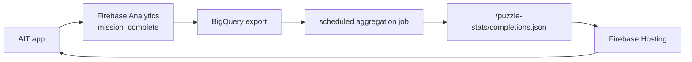

# Puzzle Completion Stats

## 결정

리더보드 전에 퍼즐별 완료자 수를 먼저 노출한다. AIT 1차 론칭에서는 앱이 Firestore에 직접 쓰지 않고, Firebase Analytics의 `mission_complete` 이벤트를 지연 집계한 공개 JSON만 읽는다.

## 사용자 표시

- 홈 날짜 카드: `14시 · 123명 완료`
- 선택한 미션: `도전 준비 완료 · 123명 완료`
- `completion_stats_min_display_count` 미만이면 `10명 미만 완료`로 표시한다.
- stats가 없거나 `completion_stats_enabled=false`이면 표시하지 않는다.

## 앱 읽기 계약

기본 URL:

```text
https://crossword-puzzle-79ae0.web.app/puzzle-stats/completions.json
```

빌드 환경에서 `VITE_PUZZLE_STATS_URL`을 설정하면 해당 URL을 우선한다. GitHub Actions는 `vars.PUZZLE_STATS_URL`을 `VITE_PUZZLE_STATS_URL`로 전달한다.

JSON schema:

```json
{
  "generatedAt": "2026-06-03T09:00:00.000Z",
  "stats": [
    {
      "puzzleId": "2026-06-03-h08-normal-a1b2c3",
      "completionCount": 123,
      "lastAggregatedAt": "2026-06-03T08:59:00.000Z"
    }
  ]
}
```

`stats`는 object map 형태도 허용한다.

```json
{
  "stats": {
    "2026-06-03-h08-normal-a1b2c3": {
      "completionCount": 123,
      "lastAggregatedAt": "2026-06-03T08:59:00.000Z"
    }
  }
}
```

## 집계 방식

권장 파이프라인:



집계 기준:

- event name: `mission_complete`
- distinct user key: Firebase Analytics `user_pseudo_id`
- group key: `puzzle_id`
- optional dimensions: `slot_id`, `pack_id`
- refresh interval: 15분에서 1시간
- retention: 퍼즐팩 노출/보관 정책과 같은 최근 84개 기준

## 개인정보/품질 기준

- 앱에 사용자별 완료 여부를 내려주지 않는다.
- 홈 UI에는 집계 숫자만 표시한다.
- 낮은 표본은 정확한 숫자 대신 `N명 미만 완료`로 표시한다.
- 중복 완료는 Analytics export에서 `COUNT(DISTINCT user_pseudo_id)`로 줄인다.
- 실시간 순위나 공정성 검증이 필요해지면 리더보드 또는 서버 API로 별도 전환한다.
