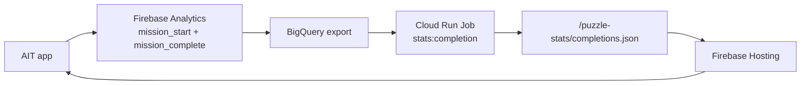

# Puzzle Completion Stats

## 결정

리더보드 전에 퍼즐별 참여자/완료자/완료율을 먼저 노출한다. AIT 1차 론칭에서는 앱이 Firestore에 직접 쓰지 않고, Firebase Analytics 이벤트를 지연 집계한 공개 JSON만 읽는다.

## 사용자 표시

- 홈 날짜 카드: `14시 · 42% 완료`
- 선택한 미션: `도전 준비 완료 · 128명 참여 · 54명 완료(42%)`
- `completion_stats_min_display_count` 미만이면 `10명 미만 참여` 또는 `10명 미만 완료`로 표시한다.
- stats가 없거나 `completion_stats_enabled=false`이면 표시하지 않는다.

## 앱 읽기 계약

기본 URL:

```text
https://crossword-puzzle-79ae0.web.app/puzzle-stats/completions.json
```

빌드 환경에서 `VITE_PUZZLE_STATS_URL`을 설정하면 해당 URL을 우선한다. GitHub Actions는 `vars.PUZZLE_STATS_URL`을 `VITE_PUZZLE_STATS_URL`로 전달한다.

JSON schema:

```json
{
  "generatedAt": "2026-06-03T09:00:00.000Z",
  "stats": [
    {
      "puzzleId": "2026-06-03-h08-normal-a1b2c3",
      "participantCount": 128,
      "completionCount": 54,
      "completionRate": 0.421875,
      "lastAggregatedAt": "2026-06-03T08:59:00.000Z"
    }
  ]
}
```

`stats`는 object map 형태도 허용한다.

```json
{
  "stats": {
    "2026-06-03-h08-normal-a1b2c3": {
      "participantCount": 128,
      "completionCount": 54,
      "completionRate": 0.421875,
      "lastAggregatedAt": "2026-06-03T08:59:00.000Z"
    }
  }
}
```

## 집계 방식

권장 파이프라인:



집계 기준:

- 참여자 event: `mission_start`, 단 기존 이벤트 누락을 보완하기 위해 `mission_complete`도 참여자로 포함한다.
- 완료자 event: `mission_complete`
- distinct user key: Firebase Analytics `user_pseudo_id`
- group key: `puzzle_id`
- optional dimensions: `slot_id`, `pack_id`
- refresh interval: 15분에서 1시간
- retention: 퍼즐팩 노출/보관 정책과 같은 최근 84개 기준

로컬 검증:

```bash
npm run stats:completion -- \
  --skipPublish \
  --analyticsDataset=analytics_<property_id> \
  --project=crossword-puzzle-79ae0 \
  --hostingBaseUrl=https://crossword-puzzle-79ae0.web.app
```

Cloud Run Job entrypoint:

```bash
npm run job:completion-stats
```

Cloud Run Job 등록:

```bash
scripts/setup-completion-stats-cloud-run-job.sh \
  --project-id crossword-puzzle-79ae0 \
  --firebase-hosting-site crossword-puzzle-79ae0 \
  --analytics-dataset analytics_<property_id> \
  --bigquery-location asia-northeast3
```

등록 스크립트가 수행하는 일:

- `Dockerfile.completion-stats-job` 이미지 build/push
- `crossword-puzzle-completion-stats-aggregator` Cloud Run Job 생성/업데이트
- `crossword-puzzle-completion-stats-every-30m` Cloud Scheduler 생성/업데이트
- runtime service account에 `roles/firebasehosting.admin`, `roles/bigquery.jobUser`, `roles/bigquery.dataViewer` 부여
- scheduler service account에 Cloud Run Job `roles/run.invoker` 부여

BigQuery export 준비 전 동작:

- Scheduler는 켜둬도 된다.
- Job 시작 시 `FIREBASE_ANALYTICS_DATASET` 존재 여부와 `events_*` / `events_intraday_*` 테이블 존재 여부를 먼저 확인한다.
- dataset 또는 이벤트 테이블이 아직 없으면 통계 파일을 쓰지 않고 정상 종료한다.
- GA4 BigQuery export가 실제 이벤트 테이블을 만들면 같은 Scheduler 실행에서 자동으로 집계를 시작한다.

운영 환경 변수:

| 변수                               | 기본값                                            | 설명                                   |
| ---------------------------------- | ------------------------------------------------- | -------------------------------------- |
| `FIREBASE_ANALYTICS_DATASET`       | 필수                                              | GA4 BigQuery export dataset            |
| `FIREBASE_ANALYTICS_TABLE_PATTERN` | `events_*`                                        | GA4 export table wildcard              |
| `BIGQUERY_SOURCE_PROJECT`          | `FIREBASE_PROJECT_ID`                             | Analytics export가 있는 GCP project    |
| `BIGQUERY_LOCATION`                | `asia-northeast3`                                 | BigQuery query location                |
| `STATS_LOOKBACK_DAYS`              | `14`                                              | 조회 기간                              |
| `STATS_PUBLIC_DIR`                 | `public`                                          | Hosting publish staging root           |
| `STATS_OUTPUT_PATH`                | `/puzzle-stats/completions.json`                  | stats JSON 출력 경로                   |
| `STATS_MANIFEST_URL`               | `<PUZZLE_HOSTING_BASE_URL>/puzzles/manifest.json` | 현재 원격 manifest hydrate 경로        |
| `STATS_SKIP_PUBLISH`               | `false`                                           | `true`면 JSON만 쓰고 Hosting 배포 생략 |

주의: Firebase Hosting release는 파일 집합 전체를 반영한다. 통계 Job은 `/puzzle-stats`만 배포하지 말고 현재 원격 `/puzzles/manifest.json`과 퍼즐 JSON을 staging public에 hydrate한 뒤 stats JSON을 얹어서 배포해야 한다. `server/batch/aggregate-completion-stats.mjs`는 이 순서로 동작한다.

## 개인정보/품질 기준

- 앱에 사용자별 완료 여부를 내려주지 않는다.
- 홈 UI에는 집계 숫자만 표시한다.
- 낮은 표본은 정확한 숫자 대신 `N명 미만 완료`로 표시한다.
- 참여자 수가 낮으면 정확한 참여자 수와 완료율을 숨긴다.
- 완료자 수가 낮으면 정확한 완료자 수와 완료율을 숨긴다.
- 중복 시작/완료는 Analytics export에서 `COUNT(DISTINCT user_pseudo_id)`로 줄인다.
- 실시간 순위나 공정성 검증이 필요해지면 리더보드 또는 서버 API로 별도 전환한다.
