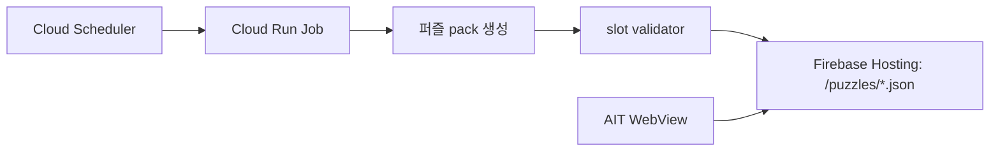

# Puzzle Pack Cloud Run Job

퍼즐 JSON pack을 로컬과 Cloud Run Job에서 같은 entrypoint로 생성한다.



## 로컬 검증

추적 중인 `public/puzzles`를 건드리지 않으려면 임시 public root 아래에 생성한다.

```bash
rm -rf /tmp/crossword-puzzle-public
npm run batch:puzzles -- \
  --days=1 \
  --start=2026-05-30 \
  --seed=20260530 \
  --outDir=/tmp/crossword-puzzle-public/puzzles

npm run validate:puzzles -- \
  --manifest=/tmp/crossword-puzzle-public/puzzles/manifest.json \
  --assetRoot=/tmp/crossword-puzzle-public
```

Cloud publish 계획만 확인하려면 dry run을 사용한다.

```bash
npm run publish:puzzles -- \
  --dryRun \
  --project=<firebase-project-id> \
  --site=<firebase-hosting-site-id> \
  --publicDir=/tmp/crossword-puzzle-public \
  --manifest=/tmp/crossword-puzzle-public/puzzles/manifest.json
```

Cloud Run Job과 같은 wrapper를 로컬에서 검증하려면 publish만 끈다.

```bash
npm run job:puzzle-pack -- \
  --days=1 \
  --start=2026-05-30 \
  --seed=20260530 \
  --outDir=/tmp/crossword-puzzle-job-public/puzzles \
  --skipPublish
```

## Cloud 구성

사전 조건:

- Google Cloud / Firebase project가 존재해야 한다.
- Firebase Hosting site가 존재해야 한다.
- 로컬에서 `gcloud` 인증과 project 접근 권한이 있어야 한다.

현재 dev 환경:

| 환경 | Firebase project ID      | Hosting site ID          | Hosting URL                              |
| ---- | ------------------------ | ------------------------ | ---------------------------------------- |
| dev  | `crossword-puzzle-79ae0` | `crossword-puzzle-79ae0` | `https://crossword-puzzle-79ae0.web.app` |

설정:

```bash
scripts/setup-puzzle-pack-cloud-run-job.sh \
  --project-id <firebase-project-id> \
  --firebase-hosting-site <firebase-hosting-site-id> \
  --region asia-northeast3 \
  --scheduler-location asia-northeast3 \
  --schedule "15 */2 * * *" \
  --time-zone Asia/Seoul \
  --puzzle-days 1 \
  --puzzle-keep 84
```

스크립트가 수행하는 일:

- 필요한 API 활성화
- Artifact Registry Docker repository 생성
- Cloud Run Job runtime service account 생성
- runtime service account에 `roles/firebasehosting.admin` 부여
- `Dockerfile.puzzle-pack-job` 이미지 build/push
- Cloud Run Job 생성 또는 업데이트
- Scheduler service account 생성
- Scheduler service account에 Cloud Run Job `roles/run.invoker` 부여
- Cloud Scheduler HTTP job 생성 또는 업데이트

즉시 1회 실행:

```bash
gcloud run jobs execute crossword-puzzle-pack-generator \
  --project <firebase-project-id> \
  --region asia-northeast3 \
  --wait
```

## Runtime env

Cloud Run Job은 다음 환경 변수를 사용한다.

| 변수                      |                   기본값 | 설명                                                                                                                      |
| ------------------------- | -----------------------: | ------------------------------------------------------------------------------------------------------------------------- |
| `FIREBASE_PROJECT_ID`     |                     필수 | Firebase Hosting project                                                                                                  |
| `FIREBASE_HOSTING_SITE`   |                     필수 | Firebase Hosting site ID                                                                                                  |
| `PUZZLE_DAYS`             |                      `1` | 한 번에 생성할 퍼즐 슬롯 수                                                                                               |
| `PUZZLE_TIME_ZONE`        |             `Asia/Seoul` | 동적 시작 날짜 계산 timezone                                                                                              |
| `PUZZLE_SEED`             |                     자동 | 재현용 고정 seed. 지정하지 않으면 `PUZZLE_TIME_ZONE`, 시작 날짜, `PUZZLE_PUBLISHED_AT`을 섞어 실행마다 다른 seed를 만든다 |
| `PUZZLE_OUT_DIR`          |         `public/puzzles` | 생성 결과 출력 폴더                                                                                                       |
| `PUZZLE_HOSTING_BASE_URL` | `https://<site>.web.app` | 앱/운영자가 참조할 base URL                                                                                               |
| `PUZZLE_APPEND`           |                   `true` | 기존 manifest를 불러와 새 퍼즐을 append할지 여부                                                                          |
| `PUZZLE_KEEP`             |                     `84` | manifest에 유지할 최근 퍼즐 수. 2시간 주기 기준 7일치                                                                     |
| `PUZZLE_INTERVAL_HOURS`   |                      `2` | `slotId` 계산에 사용하는 퍼즐 발행 간격                                                                                   |
| `PUZZLE_CORS_ORIGIN`      |                      `*` | AIT WebView에서 JSON을 fetch할 수 있도록 `/puzzles/**` 응답에 넣을 CORS origin                                            |

생성 옵션은 `PUZZLE_ATTEMPTS`, `PUZZLE_BEAM`, `PUZZLE_BRANCH`, `PUZZLE_CANDIDATES`, `PUZZLE_DENSE`, `PUZZLE_MIN_CROSS`, `PUZZLE_MIN_DENSITY`, `PUZZLE_MIN_ENTRIES`, `PUZZLE_MIN_MULTI`, `PUZZLE_MAX_AUTO`, `PUZZLE_RETRIES`, `PUZZLE_SAMPLES`, `PUZZLE_SIZE`, `PUZZLE_WORDS`, `PUZZLE_WORDBANK`, `PUZZLE_PUBLISHED_AT`, `PUZZLE_EXISTING_MANIFEST_URL`로 override할 수 있다. `PUZZLE_SEED`를 지정하면 같은 입력에서 같은 퍼즐이 다시 생성될 수 있으므로, 운영 스케줄에서는 보통 비워 둔다.

## Append manifest

2시간마다 1개씩 생성하면 하루 12개가 생긴다. Job은 새 퍼즐을 기존 manifest에 append하고, `PUZZLE_KEEP` 개수만 남긴다.

- 기본 스케줄은 `15 */2 * * *`이다.
- 기본 유지 개수는 `84`개다. 2시간 주기 기준 최근 7일치다.
- 각 생성물은 `packId`, `puzzleId`, `slotId`, `publishedAt`를 가진다.
- `puzzleId`는 로컬 진행 상태 key로 쓰이므로 같은 날짜에 여러 퍼즐이 있어도 진행 상태가 섞이지 않는다.
- `PUZZLE_SEED`를 고정하지 않으면 기본 seed가 `publishedAt` 기반으로 바뀌어서 같은 날짜의 2시간 슬롯도 서로 다른 퍼즐로 생성된다.
- 기존 remote manifest가 있으면 `PUZZLE_HOSTING_BASE_URL/puzzles/manifest.json`을 먼저 읽고, 유지 대상 puzzle JSON도 다시 받아 현재 publish 디렉터리에 채운다.
- remote manifest가 아직 없으면 로컬 `public/puzzles/manifest.json`을 fallback source로 사용한다.

## AIT 앱 연결

AIT WebView 앱은 퍼즐 데이터를 읽을 때 Firebase SDK를 사용하지 않고 공개 Hosting JSON을 `fetch`한다. Firebase Auth, Firestore, Storage를 쓰는 단계는 아니며, 현재 `firebase` Web SDK는 Analytics와 Remote Config에만 선택적으로 사용한다.

퍼즐별 참여자/완료자/완료율은 퍼즐 데이터 JSON과 별도로 `/puzzle-stats/completions.json`을 읽는다. 이 파일은 퍼즐 생성 Job이 아니라 Analytics 지연 집계 Job(`npm run job:completion-stats`)이 갱신한다.

집계 Job은 별도로 등록한다.

```bash
scripts/setup-completion-stats-cloud-run-job.sh \
  --project-id crossword-puzzle-79ae0 \
  --firebase-hosting-site crossword-puzzle-79ae0 \
  --analytics-dataset analytics_<property_id>
```

자세한 계약은 `docs/puzzle-completion-stats.md`를 따른다.

운영 빌드에서 Firebase Hosting pack을 읽게 하려면 앱 빌드 환경에 base URL을 넣는다.

```bash
VITE_PUZZLE_PACK_BASE_URL=https://crossword-puzzle-79ae0.web.app npm run build
```

`.env.production.local`을 쓴다면 다음 한 줄만 둔다.

```bash
VITE_PUZZLE_PACK_BASE_URL=https://crossword-puzzle-79ae0.web.app
```

GitHub Actions의 AppsInToss 배포 workflow는 `vars.PUZZLE_PACK_BASE_URL`이 있으면 그 값을 쓰고, 없으면 현재 dev Hosting URL인 `https://crossword-puzzle-79ae0.web.app`를 쓴다.

동작 방식:

- `VITE_PUZZLE_PACK_BASE_URL`이 있으면 `<base>/puzzles/manifest.json`을 읽고, manifest의 `/puzzles/*.json` 경로도 같은 base URL로 해석한다.
- `VITE_PUZZLE_MANIFEST_URL`을 넣으면 manifest 위치만 직접 override한다.
- 원격 로딩이 실패하면 번들에 포함된 `/puzzles/manifest.json`으로 fallback한다.
- 두 환경 변수가 없으면 기존처럼 번들에 포함된 `/puzzles/manifest.json`만 읽는다.

Firebase Hosting을 AIT 앱 origin과 다른 도메인에서 읽기 때문에 CORS가 필요하다. `npm run publish:puzzles`는 `/puzzles/**` 응답에 `Access-Control-Allow-Origin`을 기본 `*`로 배포한다. 퍼즐 pack은 공개 읽기 전용 정적 데이터라 이 설정을 기본으로 둔다.
