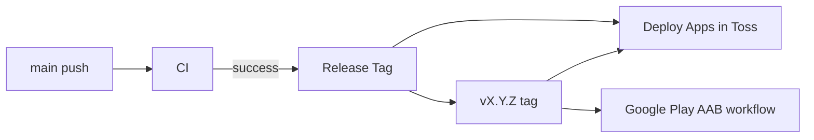

# 릴리즈 버저닝

## 정책

- `main`에 push되면 `CI`가 `lint`, `validate:puzzles`, `build`를 수행한다.
- `CI`가 성공한 push commit에만 `Release Tag` workflow가 semver 태그를 만든다.
- 자동 태그는 항상 patch 증가다. 예: `v0.1.1` -> `v0.1.2`.
- minor/major 증가는 `Release Tag` workflow를 수동 실행할 때만 선택한다.
- 기존 `crossword-puzzle-release-*` 태그는 보존하되, 새 버전 계산에서는 제외한다.
- semver 태그가 아직 없으면 `package.json`의 `version`을 기준으로 첫 patch 태그를 만든다.



## AppsInToss

`Release Tag` workflow는 태그를 만든 뒤 `deploy-apps-in-toss.yml`을 `workflow_dispatch`로 호출한다. GitHub Actions의 기본 token으로 만든 tag push는 재귀 workflow trigger가 제한되므로, AIT 빌드는 tag push 이벤트에 기대지 않고 명시적으로 dispatch한다.

AIT workflow는 전달받은 `release_tag`를 checkout하고 다음 값을 빌드/업로드에 사용한다.

- `npm version --no-git-tag-version <version>`
- `VITE_APP_VERSION=<version>`
- `VITE_RELEASE_TAG=<tag>`
- AppsInToss deploy memo: `<tag> · <memo>` 또는 `릴리즈 <tag> (<sha>)`

수동 재배포:

```bash
gh workflow run deploy-apps-in-toss.yml \
  -f release_tag=v0.1.1 \
  -f memo="릴리즈 v0.1.1 재배포"
```

## 수동 minor/major 태그

```bash
gh workflow run release-tag.yml \
  -f bump=minor \
  -f target_ref=main \
  -f deploy_apps_in_toss=true
```

`bump=major`도 같은 방식으로 실행한다. 수동 실행도 기본값은 AIT 빌드/배포 dispatch까지 진행한다.

## Google Play

Google Play AAB workflow는 `release_tag`를 받으면 Android 빌드 버전을 해당 태그에서 계산한다.

- `versionName`: `v`를 뺀 semver. 예: `0.1.1`
- `versionCode`: `major * 1000000 + minor * 1000 + patch`. 예: `v0.1.1` -> `1001`
- Android Publisher API release name: 태그 문자열. 예: `v0.1.1`

업로드까지 실행할 때는 `release_tag`가 필수다.

```bash
gh workflow run build-google-play.yml \
  -f release_tag=v0.1.1 \
  -f upload_to_internal=true \
  -f release_status=draft
```
