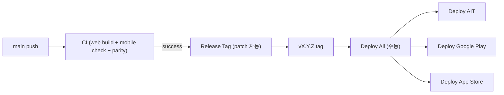

# 릴리즈 버저닝

## 정책

- `main`에 push되면 `CI`가 Web/AIT 경로의 `lint`, `validate:puzzles`, `check:release-parity`, `build`와 `apps/mobile`의 `check:mobile`을 함께 수행한다.
- `CI`가 성공한 push commit에만 `Release Tag` workflow가 semver 태그를 만든다.
- 자동 태그는 항상 patch 증가다. 예: `v0.1.1` -> `v0.1.2`.
- minor/major 증가는 `Release Tag` workflow를 수동 실행할 때만 선택한다.
- 태그 생성 이후 실제 배포는 자동으로 트리거하지 않는다. 여러 마켓을 같은 릴리즈로 배포할 때는 `Deploy All`(묶음)을 사용한다.
- 개별 `Deploy *` workflow는 단일 마켓 재배포용이다. AIT와 Google Play/App Store를 같이 내보낼 때 개별 workflow를 따로 실행하면 실행 사이에 최신 태그가 바뀔 수 있으므로 `Deploy All`로 같은 태그를 한 번만 해석한다.
- 기존 `crossword-puzzle-release-*` 태그는 보존하되, 새 버전 계산에서는 제외한다.
- semver 태그가 아직 없으면 `package.json`의 `version`을 기준으로 첫 patch 태그를 만든다.



## 수동 minor/major 태그

```bash
gh workflow run release-tag.yml \
  -f bump=minor \
  -f target_ref=main
```

`bump=major`도 같은 방식으로 실행한다.

## 태그 기본값

모든 `Deploy *` workflow(및 `Deploy All`)의 `release_tag`는 옵셔널이다. 비워두면 **최신 `vX.Y.Z` 태그**를 찾아 그 커밋을 checkout해 배포한다. 최신 태그는 다음 커맨드로 고른다.

```bash
git tag --list 'v[0-9]*.[0-9]*.[0-9]*' --sort=-v:refname | head -n 1
```

특정 태그를 넣으면 그 태그로 배포한다. 태그가 하나도 없으면 실패한다.

> GitHub Actions의 `workflow_dispatch` 폼은 입력 기본값을 동적으로 채울 수 없어서 "최신 태그를 드롭다운에 미리 선택"하는 것은 불가능하다. 대신 입력을 비우면 런타임에 최신 태그로 해석한다.

## Deploy All (묶음 배포)

`Deploy All` workflow는 `release_tag` 하나로 세 배포(`Deploy AIT`, `Deploy Google Play`, `Deploy App Store`)를 `workflow_call`로 한 번에 트리거한다. 각 배포는 토글로 켜고 끌 수 있다. `release_tag`를 비우면 선행 `resolve` job이 최신 태그를 **한 번만** 해석한 뒤 세 배포에 동일한 태그를 전달하므로, 실행 중 새 태그가 생겨도 세 배포가 같은 릴리즈를 사용한다.

CI의 `check:release-parity`는 AIT WebView와 `apps/mobile`이 공통 `packages/crossword-core/src/uiPolicy.ts` 정책을 쓰는지 확인한다. 이 가드는 무료 퍼즐/보너스 퍼즐/시도 횟수 같은 사용자 정책이 앱별 로컬 함수로 다시 갈라지는 것을 막기 위한 최소 릴리스 조건이다.

```bash
gh workflow run deploy-all.yml \
  -f release_tag=v0.1.1 \
  -f deploy_ait=true \
  -f deploy_google_play=true \
  -f deploy_app_store=true \
  -f memo="릴리즈 v0.1.1"
```

## AIT

`Deploy AIT` workflow는 `release_tag`(비우면 최신 태그)를 checkout하고 다음 값을 빌드/업로드에 사용한다.

- `npm version --no-git-tag-version <version>`
- `VITE_APP_VERSION=<version>`
- `VITE_RELEASE_TAG=<tag>`
- AppsInToss deploy memo: `<tag> · <memo>` 또는 `릴리즈 <tag> (<sha>)`

개별 재배포:

```bash
gh workflow run deploy-apps-in-toss.yml \
  -f release_tag=v0.1.1 \
  -f memo="릴리즈 v0.1.1 재배포"
```

## Google Play

`Deploy Google Play` workflow는 `release_tag`(비우면 최신 태그)에서 Android 빌드 버전을 계산한다.

- `versionName`: `v`를 뺀 semver. 예: `0.1.1`
- `versionCode`: `major * 1000000 + minor * 1000 + patch`. 예: `v0.1.1` -> `1001`
- Android Publisher API release name: 태그 문자열. 예: `v0.1.1`

```bash
gh workflow run deploy-google-play.yml \
  -f release_tag=v0.1.1 \
  -f upload_to_internal=true \
  -f release_status=draft
```

## App Store

`Deploy App Store` workflow는 `release_tag`(비우면 최신 태그)를 checkout해 iOS archive를 만들고, `upload_to_testflight=true`이면 App Store Connect/TestFlight에 업로드한다.

```bash
gh workflow run deploy-app-store.yml \
  -f release_tag=v0.1.1 \
  -f upload_to_testflight=true
```
