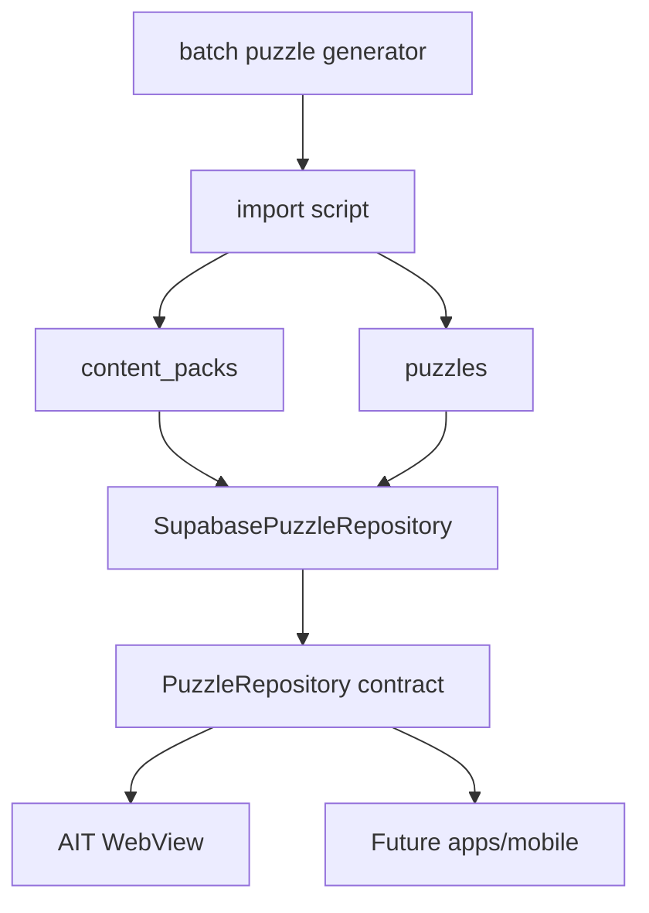

# Supabase 설계

## 현재 범위

Supabase는 지금 로그인이나 진행 상태 sync용으로 붙이지 않는다. 1차 목적은 날짜별 puzzle pack을 read-only로 서빙하는 것이다.

현재 앱의 동작:

- Puzzle content: `public/puzzles/manifest.json`, `public/puzzles/*.json`
- Progress: 기기 `localStorage`
- Mission: 날짜별 기기 `localStorage`

목표 구조:

## 테이블

| 테이블          | 책임                                             |
| --------------- | ------------------------------------------------ |
| `content_packs` | 앱별 puzzle pack manifest, version, publish 상태 |
| `puzzles`       | 날짜별 puzzle JSON payload와 검색용 메타데이터   |

## RLS 원칙

- `anon`, `authenticated`는 published puzzle content만 읽을 수 있다.
- 클라이언트에서 insert/update/delete 권한을 주지 않는다.
- 관리자 쓰기는 service role을 사용하는 서버 작업, CI job, Edge Function 중 하나로 분리한다.
- service role key는 앱 번들에 포함하지 않는다.

## 보류 항목

- `user_progress`
- auth/session 저장
- 크로스 디바이스 sync
- entitlement/purchase 검증
- realtime

위 항목은 실제 제품 요구가 확정될 때 별도 migration으로 추가한다.
